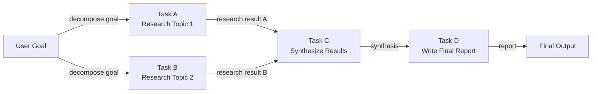

# DAG-based agents

## Definition

A DAG-based agent organizes its work as a **directed acyclic graph (DAG)**: a set of nodes (tasks or agent steps) connected by directed edges that encode dependencies between them. "Acyclic" means there are no circular dependencies—execution flows strictly forward from inputs to outputs. The key benefit over sequential pipelines is that **independent nodes can execute in parallel**, dramatically reducing wall-clock time for complex multi-step workflows.

In practice, each node in the DAG can be an LLM call, a tool invocation, a data transformation, or even a sub-agent. A node fires as soon as all its predecessors have completed successfully, passing their outputs as inputs. This model maps naturally to tasks like competitive analysis (research three companies in parallel, then synthesize), code review (check security, style, and tests concurrently, then report), or data pipelines (fetch multiple data sources in parallel, join them, then aggregate).

Dynamic DAG construction takes this further: instead of a fixed graph defined at design time, the agent builds or modifies the graph at runtime based on intermediate results. A planning agent might produce a task list whose dependencies are not known until it sees the data, then construct and execute the appropriate DAG on the fly. This combines the structured parallelism of DAGs with the adaptability of planning agents, at the cost of additional implementation complexity.

## How it works

### Graph definition and node types

A DAG is defined by a set of nodes and a set of directed edges. Each node carries a function (the work to do), an input specification (which upstream node outputs to accept), and an output specification (what it produces). Edges are defined as `(upstream_node, downstream_node)` pairs. Nodes with no incoming edges are entry points; nodes with no outgoing edges are exit points. Node functions can be synchronous or asynchronous—async nodes are essential for achieving real parallelism in I/O-bound workflows.

### Topological sort and scheduling

Before execution, the scheduler computes a **topological ordering** of the graph: a linear sequence of nodes such that every node appears after all its predecessors. If multiple nodes are at the same depth (no dependency on each other), they can be dispatched concurrently. The standard algorithm is Kahn's algorithm, which processes nodes layer by layer. At runtime, a queue holds nodes whose dependencies have all been satisfied; workers pull from the queue and execute nodes, then enqueue newly unblocked downstream nodes.

### Parallel execution

Independent nodes—those with no shared dependencies—execute in parallel using threads, async coroutines, or a process pool. The degree of parallelism is bounded by the structure of the DAG: a fully sequential chain offers no parallelism, while a wide fan-out followed by a fan-in aggregation can run dozens of tasks concurrently. In agent workflows, this is especially valuable for tasks like bulk web searches, multi-source data fetches, or independent sub-agent calls.

### Dynamic DAG construction

In dynamic mode, a planning step runs first and outputs a graph specification (e.g., a JSON list of nodes and edges). The scheduler instantiates the DAG, validates it for cycles, and begins execution. Dynamic DAGs must include cycle detection—typically via DFS—before scheduling begins. This pattern is more fragile than static DAGs because a malformed plan can produce an invalid graph, but it enables much richer adaptability.



## When to use / When NOT to use

| Use when | Avoid when |
|---|---|
| The workflow has multiple independent subtasks that can run in parallel | All tasks are strictly sequential with no parallelism opportunity |
| Execution time is a priority and tasks are I/O-bound | The dependency graph is simple enough that a linear pipeline suffices |
| Task dependencies are well-defined and can be specified upfront | Dynamic replanning is more important than parallel execution |
| You need fine-grained observability over which tasks passed or failed | Team lacks familiarity with graph scheduling concepts |
| The workflow resembles a data pipeline with fan-out and fan-in stages | Tasks are so fast that scheduling overhead exceeds the parallelism benefit |

## Comparisons

| Criterion | DAG-based agents | Sequential pipeline | Planner-Executor |
|---|---|---|---|
| Parallelism | Native — independent branches run concurrently | None | None by default |
| Flexibility / dynamic adaptation | Low-medium (fixed graph) | Low | High (replanning loop) |
| Implementation complexity | High (scheduler, cycle detection, async) | Very low | Medium |
| Auditability | High — graph structure is explicit | Medium | High — plan artifact is explicit |
| Failure handling | Per-node retry, partial re-runs possible | Restart from beginning | Replanning on failure |
| Best for | Wide, parallelizable workflows | Simple sequential tasks | Multi-step adaptive tasks |

## Code examples

```python
"""
Simple DAG execution engine with topological sort.

Nodes are Python callables. Edges encode dependencies.
Independent nodes execute concurrently using asyncio.
"""
from __future__ import annotations

import asyncio
from collections import defaultdict, deque
from dataclasses import dataclass, field
from typing import Any, Callable, Coroutine


# ---------------------------------------------------------------------------
# DAG data structures
# ---------------------------------------------------------------------------

@dataclass
class Node:
    """A single unit of work in the DAG."""
    name: str
    # func receives a dict of {upstream_node_name: result} for all predecessors
    func: Callable[..., Coroutine[Any, Any, Any]]
    depends_on: list[str] = field(default_factory=list)


class DAGExecutionError(Exception):
    pass


# ---------------------------------------------------------------------------
# DAG engine
# ---------------------------------------------------------------------------

class DAGExecutor:
    """
    Executes a DAG of async nodes respecting dependencies.
    Independent nodes are dispatched concurrently.
    """

    def __init__(self):
        self._nodes: dict[str, Node] = {}

    def add_node(self, node: Node) -> "DAGExecutor":
        self._nodes[node.name] = node
        return self

    def _validate(self) -> list[str]:
        """
        Kahn's topological sort algorithm.
        Returns an ordered list of node names, or raises on cycle detection.
        """
        in_degree: dict[str, int] = {n: 0 for n in self._nodes}
        dependents: dict[str, list[str]] = defaultdict(list)

        for node in self._nodes.values():
            for dep in node.depends_on:
                if dep not in self._nodes:
                    raise DAGExecutionError(f"Dependency '{dep}' not found in DAG.")
                in_degree[node.name] += 1
                dependents[dep].append(node.name)

        queue = deque(n for n, deg in in_degree.items() if deg == 0)
        order: list[str] = []

        while queue:
            current = queue.popleft()
            order.append(current)
            for downstream in dependents[current]:
                in_degree[downstream] -= 1
                if in_degree[downstream] == 0:
                    queue.append(downstream)

        if len(order) != len(self._nodes):
            raise DAGExecutionError("Cycle detected in DAG — cannot execute.")

        return order

    async def run(self) -> dict[str, Any]:
        """Execute the DAG and return a mapping of node_name -> result."""
        self._validate()

        results: dict[str, Any] = {}
        completed: set[str] = set()
        pending: dict[str, asyncio.Task] = {}
        in_degree: dict[str, int] = {n: len(self._nodes[n].depends_on) for n in self._nodes}

        async def execute_node(node: Node) -> Any:
            upstream = {dep: results[dep] for dep in node.depends_on}
            return await node.func(upstream)

        # Start nodes with no dependencies immediately
        ready = [n for n, deg in in_degree.items() if deg == 0]
        for name in ready:
            pending[name] = asyncio.create_task(execute_node(self._nodes[name]))

        # Build reverse adjacency for unblocking
        dependents: dict[str, list[str]] = defaultdict(list)
        for node in self._nodes.values():
            for dep in node.depends_on:
                dependents[dep].append(node.name)

        while pending:
            # Wait for any one task to finish
            done_tasks, _ = await asyncio.wait(
                pending.values(), return_when=asyncio.FIRST_COMPLETED
            )
            for task in done_tasks:
                # Find the node name for this task
                finished_name = next(n for n, t in pending.items() if t is task)
                results[finished_name] = task.result()
                completed.add(finished_name)
                del pending[finished_name]

                # Unblock downstream nodes
                for downstream in dependents[finished_name]:
                    in_degree[downstream] -= 1
                    if in_degree[downstream] == 0 and downstream not in completed:
                        pending[downstream] = asyncio.create_task(
                            execute_node(self._nodes[downstream])
                        )

        return results


# ---------------------------------------------------------------------------
# Example: Research DAG (mirrors the Mermaid diagram above)
# ---------------------------------------------------------------------------

async def research_topic_1(upstream: dict) -> str:
    await asyncio.sleep(0.1)  # Simulate async I/O (e.g., web search)
    return "Research result for Topic 1: renewable energy trends in Europe."

async def research_topic_2(upstream: dict) -> str:
    await asyncio.sleep(0.1)  # Runs in parallel with research_topic_1
    return "Research result for Topic 2: renewable energy adoption in Asia."

async def synthesize(upstream: dict) -> str:
    result_a = upstream["task_a"]
    result_b = upstream["task_b"]
    return f"Synthesis of:\n  A: {result_a}\n  B: {result_b}"

async def write_report(upstream: dict) -> str:
    synthesis = upstream["task_c"]
    return f"Final report based on synthesis:\n{synthesis}"


async def main():
    dag = DAGExecutor()
    dag.add_node(Node("task_a", research_topic_1, depends_on=[]))
    dag.add_node(Node("task_b", research_topic_2, depends_on=[]))
    dag.add_node(Node("task_c", synthesize, depends_on=["task_a", "task_b"]))
    dag.add_node(Node("task_d", write_report, depends_on=["task_c"]))

    import time
    start = time.perf_counter()
    results = await dag.run()
    elapsed = time.perf_counter() - start

    print(f"DAG completed in {elapsed:.3f}s (task_a and task_b ran in parallel)\n")
    for name, result in results.items():
        print(f"[{name}]\n{result}\n")


if __name__ == "__main__":
    asyncio.run(main())
```

## Practical resources

- [LangGraph Documentation](https://langchain-ai.github.io/langgraph/) — Production-grade graph execution framework for LLM agents, with first-class support for branching, parallel execution, and cycles.
- [LLM Compiler: Parallel Function Calling (Kim et al., 2023)](https://arxiv.org/abs/2312.04511) — Paper introducing DAG-based parallel tool calling for LLM agents, with significant latency improvements.
- [Apache Airflow DAG Concepts](https://airflow.apache.org/docs/apache-airflow/stable/core-concepts/dags.html) — Battle-tested DAG orchestration model in the data engineering world; many agent DAG engines borrow these concepts.
- [Prefect — Workflow Orchestration](https://docs.prefect.io/latest/concepts/flows/) — Modern workflow orchestration with built-in parallel task execution, applicable to agent workflows.

## See also

- [Planner-Executor architecture](/docs/agents/planner-executor)
- [AI agents](/docs/agents)
- [Airflow](/docs/mlops/data-engineering/airflow)
