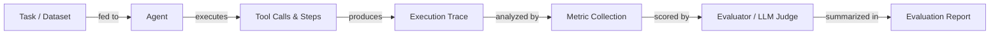

# Agent evaluation and testing

## Definition

Agent evaluation is the practice of measuring how well an AI agent completes tasks, uses tools correctly, stays within cost and latency budgets, and produces accurate outputs. Unlike static model evaluation—where you compare a fixed output against a reference—agent evaluation must account for multi-step trajectories, non-deterministic paths, intermediate tool calls, and the compounding effect of errors across steps. A single task can succeed through many different execution paths, making traditional accuracy scores insufficient on their own.

Rigorous evaluation is what separates a demo from a production system. Without it, you cannot know whether a prompt change improved or regressed behavior, whether a new tool definition is being used correctly, or whether latency is acceptable under real load. Evaluation should happen at multiple levels: unit-level testing of individual tools, integration-level testing of full agent runs, and regression testing against a golden dataset of representative tasks.

A mature evaluation strategy combines automated metrics (task completion rate, accuracy, latency, cost, tool usage efficiency) with human review for edge cases and subjective quality. Benchmarks such as AgentBench and SWE-bench provide standardized task sets for comparing across models and frameworks, while frameworks like LangSmith, Ragas, and DeepEval provide infrastructure for running evaluations at scale and tracking results over time.

## How it works



### Task and dataset preparation

A good evaluation dataset contains representative tasks drawn from real or realistic user requests, each with expected outcomes or reference answers. Tasks should cover happy paths, edge cases, adversarial inputs, and multi-step workflows. For agent evaluation specifically, each task should specify the expected final answer, and optionally the expected sequence of tool calls. Dataset quality is the single biggest lever on evaluation quality—garbage in, garbage out.

### Execution and trace collection

The agent runs each task in the dataset, and every step—LLM calls, tool invocations, memory reads, and outputs—is captured as a structured trace. Traces record inputs, outputs, timestamps, token counts, and errors for each span. This is the raw material for all downstream metrics and is also invaluable for debugging failures. Determinism can be improved by fixing random seeds and temperature, but some variability should be expected and accounted for by running multiple trials per task.

### Metric collection

Core metrics for agent evaluation include: **task completion rate** (did the agent finish the task successfully?), **accuracy** (is the final answer correct?), **latency** (end-to-end wall time), **cost** (total tokens × price), and **tool usage efficiency** (were tools called the right number of times with correct arguments?). Secondary metrics include step count, retry rate, hallucination rate, and faithfulness to retrieved context. Metrics are computed per task and aggregated across the dataset.

### Evaluation and scoring

Many metrics—especially correctness for open-ended outputs—require a judge. An LLM judge (e.g. GPT-4 or Claude) receives the task, the agent's answer, and optionally a reference answer, and scores quality on a rubric. This is sometimes called "LLM-as-a-judge" and is the backbone of frameworks like Ragas and DeepEval. For deterministic tasks (code execution, SQL queries, structured extraction), rule-based checks are more reliable and cheaper. Human review should be used to calibrate LLM judges and to catch systematic biases.

### Reporting and regression tracking

Evaluation results are aggregated into a report and stored alongside the agent version, prompt version, and model version. This enables regression tracking: you can compare the current agent against a baseline and detect regressions before deploying. Dashboards in tools like LangSmith surface metric trends over time, helping teams catch subtle degradations that individual test runs would miss.

## When to use / When NOT to use

| Use when | Avoid when |
|---|---|
| Comparing two agent versions or prompts before deploying | Skipping evaluation because the task "looks right" in a demo |
| Building a regression suite to catch prompt-breaking changes | Running evaluation only once at project start and never again |
| Measuring cost and latency to meet SLAs | Using a single metric (e.g. only accuracy) to judge overall quality |
| Validating tool call behavior and argument correctness | Using a dataset of only easy, clean tasks with no edge cases |
| Onboarding a new model to check capability transfer | Treating LLM-judge scores as ground truth without human calibration |

## Comparisons

| Criterion | LangSmith | DeepEval | Ragas |
|---|---|---|---|
| **Ease of use** | Tight LangChain integration, quick setup for LangChain users; steeper for others | Clean Python API, minimal boilerplate, easy to add to any pipeline | Optimized for RAG pipelines; straightforward for retrieval tasks |
| **Metrics coverage** | Tracing, custom evaluators, dataset management; fewer built-in LLM metrics | 20+ built-in metrics (hallucination, faithfulness, tool correctness, toxicity) | RAG-focused metrics (faithfulness, answer relevance, context recall, precision) |
| **Tracing integration** | First-class: full trace capture, span visualization, run comparison | Trace capture via decorators; less native visualization | No built-in tracing; integrates via LangSmith or W&B |
| **Pricing** | Free tier + paid hosted plans; self-hostable | Open source; cloud dashboard available | Open source; no hosted dashboard |
| **Customization** | Custom evaluators via Python or prompt templates | Extend by subclassing metric classes | Custom metrics via Python; strong NLP metric library support |

## Pros and cons

| Pros | Cons |
|---|---|
| Catches regressions before they reach users | Building a good dataset is time-consuming |
| Provides objective evidence for prompt/model decisions | LLM judges can be biased or inconsistent |
| Enables cost and latency budgeting | Non-determinism requires multiple trials, increasing cost |
| Scales to large datasets with automation | Agent traces can be large and expensive to store |
| Integrates into CI/CD for continuous quality gates | Metric choice is hard and domain-specific |

## Code examples

```python
# Agent evaluation with DeepEval
# pip install deepeval langchain-openai

from deepeval import evaluate
from deepeval.metrics import (
    TaskCompletionMetric,
    ToolCorrectnessMetric,
    HallucinationMetric,
)
from deepeval.test_case import LLMTestCase, ToolCall
from langchain_openai import ChatOpenAI
from langchain.agents import AgentExecutor, create_openai_tools_agent
from langchain_core.prompts import ChatPromptTemplate
from langchain_core.tools import tool


# --- Define a simple tool for the agent ---
@tool
def get_weather(city: str) -> str:
    """Return the current weather for a city."""
    # In production this would call a real API
    return f"The weather in {city} is sunny and 22°C."


# --- Build a minimal agent ---
llm = ChatOpenAI(model="gpt-4o-mini", temperature=0)
prompt = ChatPromptTemplate.from_messages([
    ("system", "You are a helpful assistant. Use tools when needed."),
    ("human", "{input}"),
    ("placeholder", "{agent_scratchpad}"),
])
agent = create_openai_tools_agent(llm, [get_weather], prompt)
agent_executor = AgentExecutor(agent=agent, tools=[get_weather], verbose=False)


def run_agent(user_input: str) -> tuple[str, list[ToolCall]]:
    """Run the agent and return (final_answer, tool_calls)."""
    result = agent_executor.invoke({"input": user_input})
    # In a real setup, parse the intermediate steps for tool call records
    actual_output = result["output"]
    tool_calls_used = [
        ToolCall(name="get_weather", input_parameters={"city": "Paris"})
    ]  # Extracted from result["intermediate_steps"] in production
    return actual_output, tool_calls_used


# --- Build DeepEval test cases from an evaluation dataset ---
dataset = [
    {
        "input": "What is the weather in Paris?",
        "expected_output": "The weather in Paris is sunny and 22°C.",
        "expected_tools": [
            ToolCall(name="get_weather", input_parameters={"city": "Paris"})
        ],
        "context": ["get_weather tool returns current conditions"],
    },
    {
        "input": "Tell me the weather in London.",
        "expected_output": "The weather in London is sunny and 22°C.",
        "expected_tools": [
            ToolCall(name="get_weather", input_parameters={"city": "London"})
        ],
        "context": ["get_weather tool returns current conditions"],
    },
]

test_cases = []
for item in dataset:
    actual_output, tool_calls_used = run_agent(item["input"])

    test_case = LLMTestCase(
        input=item["input"],
        actual_output=actual_output,
        expected_output=item["expected_output"],
        tools_called=tool_calls_used,
        expected_tools=item["expected_tools"],
        context=item["context"],
    )
    test_cases.append(test_case)

# --- Define metrics ---
task_completion = TaskCompletionMetric(
    threshold=0.7,
    model="gpt-4o-mini",
    include_reason=True,
)
tool_correctness = ToolCorrectnessMetric()  # Checks tool name + args match
hallucination = HallucinationMetric(
    threshold=0.3,
    model="gpt-4o-mini",
)

# --- Run evaluation ---
results = evaluate(
    test_cases=test_cases,
    metrics=[task_completion, tool_correctness, hallucination],
)

# --- Print summary ---
for tc, result in zip(test_cases, results.test_results):
    print(f"Input: {tc.input}")
    for metric_result in result.metrics_data:
        status = "PASS" if metric_result.success else "FAIL"
        print(f"  [{status}] {metric_result.name}: {metric_result.score:.2f}")
        if metric_result.reason:
            print(f"         Reason: {metric_result.reason}")
    print()
```

## Practical resources

- [DeepEval documentation](https://docs.confident-ai.com/) — Comprehensive guide to DeepEval metrics, test cases, and CI/CD integration for LLM and agent evaluation.
- [Ragas documentation](https://docs.ragas.io/) — Ragas framework for evaluating RAG pipelines and agent faithfulness, with metrics like answer relevance and context recall.
- [LangSmith documentation](https://docs.smith.langchain.com/) — LangSmith's evaluation, tracing, and dataset management features for LangChain-based agents.
- [AgentBench paper and leaderboard](https://github.com/THUDM/AgentBench) — Benchmark for evaluating LLM agents across diverse real-world tasks including web, coding, and OS environments.
- [SWE-bench](https://www.swebench.com/) — Benchmark measuring agent ability to resolve real GitHub issues in software engineering repositories.

## See also

- [Agents](/docs/agents)
- [Agent debugging and observability](/docs/agents/debugging)
- [Evaluation metrics](/docs/evaluation-metrics)
- [Benchmarks](/docs/benchmarks)
