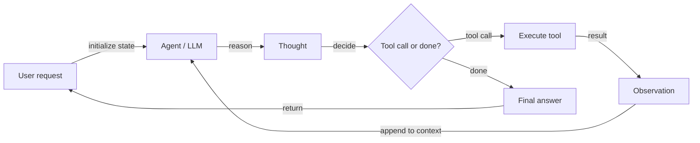
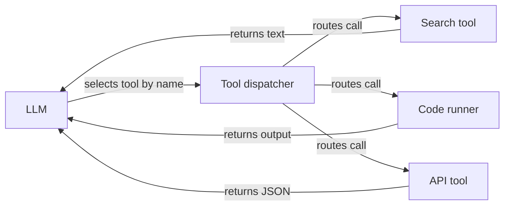

# AI agents

## Definition

An **AI agent** is a system that perceives its environment (e.g. user input, tool outputs), reasons (possibly with an LLM), and takes actions (e.g. calling APIs, writing code) to achieve goals. Agents often use tools and loops of thought–action–observation to solve tasks that require more than a single LLM call.

More formally: **an agent is an autonomous program that talks to an AI model to perform goal-based operations using the tools and context it has, and is capable of autonomous decision-making grounded in truth.** Agents bridge the gap between a one-off prototype (e.g. in AI Studio) and a scalable application: you define tools, give the agent access to them, and it decides when to call which tool and how to combine results to satisfy the user's goal.

The defining characteristic of an agent — as opposed to a simple chain or pipeline — is **autonomy in deciding the next action**. The agent is not following a fixed script; it uses the LLM to reason about the current state and select the most appropriate action. This makes agents powerful for open-ended tasks but also harder to predict and debug than deterministic pipelines. [Multi-agent](/docs/agents/multi-agent-systems) and [subagent](/docs/subagents) setups extend single agents with coordination patterns and hierarchical delegation.

## How it works

### Agent reasoning loop



### Tool registration and dispatch



Typical loop: receive task → plan or reason → choose action (e.g. tool call) → observe result → repeat until done or limit. The **user** sends a request; the **agent** (backed by an LLM) produces a **thought** (reasoning) and a **decision**: either call a **tool** (e.g. search, API, code runner) and get an **observation**, or return a **final answer**. The observation is fed back into the agent for the next step. LLMs provide reasoning and tool selection; frameworks (LangChain, LlamaIndex, Google ADK) handle orchestration, tool registration, and message passing.

## When to use / When NOT to use

| Scenario | Use agents | Don't use agents |
|---|---|---|
| Multi-step tasks requiring multiple tools | Yes — agents naturally handle complex tool chains | No — a simple chain or pipeline is cheaper and more predictable |
| Tasks with unknown number of steps in advance | Yes — agents decide dynamically how many steps are needed | No — if steps are fixed, use a hardcoded pipeline |
| Research and synthesis across many sources | Yes — agents can search, read, and integrate iteratively | No — if the data is already structured, a batch query suffices |
| Safety-critical tasks without human oversight | No — agents can make unexpected decisions | Yes — keep humans in the loop for high-stakes actions |
| Low-latency, simple, single-step responses | No — agent overhead adds latency | Yes — a direct LLM call is faster |

## Comparisons

| Approach | Autonomy | Tool use | Steps | Predictability | Cost |
|---|---|---|---|---|---|
| Direct LLM call | None | No | 1 | High | Low |
| Chain / pipeline | Low (fixed flow) | Possible | Fixed | High | Low–medium |
| Agent (single) | High (dynamic) | Yes | Dynamic | Medium | Medium–high |
| Multi-agent | Very high | Yes | Dynamic per agent | Low–medium | High |

## Pros and cons

| Pros | Cons |
|---|---|
| Flexible — can use many tools and handle open-ended tasks | Unpredictable — can loop, get stuck, or take unexpected paths |
| Handles multi-step tasks with dynamic branching | Latency and cost from multiple LLM calls |
| Enables automation of complex workflows | Requires well-designed tools, schemas, and safety guardrails |
| Scales from prototype to production with the right framework | Debugging requires inspecting long thought–action traces |

## Code examples

```python
# Conceptual agent loop (pseudocode)
def agent_loop(task: str, tools: dict, llm) -> str:
    messages = [{"role": "user", "content": task}]
    for _ in range(10):  # max iterations
        response = llm.invoke(messages, tools=list(tools.values()))
        if response.tool_calls:
            for call in response.tool_calls:
                tool_fn = tools[call["name"]]
                result = tool_fn(**call["arguments"])
                messages.append({"role": "tool", "content": str(result)})
        else:
            return response.content  # final answer
    return "Max iterations reached."

# LangChain example with a real tool
from langchain_openai import ChatOpenAI
from langchain.agents import AgentExecutor, create_tool_calling_agent
from langchain_community.tools import DuckDuckGoSearchRun
from langchain import hub

llm = ChatOpenAI(model="gpt-4o-mini")
tools = [DuckDuckGoSearchRun()]
prompt = hub.pull("hwchase17/openai-tools-agent")
agent = create_tool_calling_agent(llm, tools, prompt)
executor = AgentExecutor(agent=agent, tools=tools, verbose=True)
result = executor.invoke({"input": "What are the latest developments in RAG?"})
print(result["output"])
```

## Practical resources

- [From Prototypes to Agents with ADK – Google Codelabs](https://codelabs.developers.google.com/your-first-agent-with-adk#0) — Build your first agent with Google's Agent Development Kit (ADK)
- [LangChain – Agents](https://python.langchain.com/docs/concepts/agents/) — Agent concepts, tool use, and ReAct-style orchestration
- [LlamaIndex – Agents](https://docs.llamaindex.ai/en/stable/module_guides/deploying/agents/) — Agent and query engine guides
- [OpenAI Assistants API](https://platform.openai.com/docs/assistants/overview) — Managed agents with built-in tools (code interpreter, file search)
- [Anthropic – Build with Claude: Agents](https://docs.anthropic.com/en/docs/build-with-claude/tool-use) — Claude tool use and agentic patterns

## See also

- [Multi-agent systems](/docs/agents/multi-agent-systems)
- [Subagents](/docs/subagents)
- [Autonomous agents](/docs/autonomous-agents)
- [ReAct](/docs/reasoning-patterns/react)
- [RDD](/docs/reasoning-patterns/rdd)
