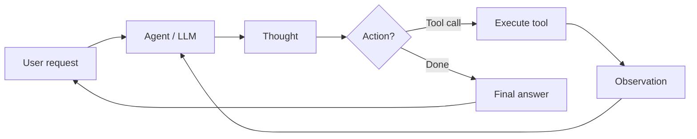

# AI agents

## Definition

An **AI agent** is a system that perceives its environment (e.g. user input, tool outputs), reasons (possibly with an LLM), and takes actions (e.g. calling APIs, writing code) to achieve goals. Agents often use tools and loops of thought–action–observation.

More formally: **an agent is an autonomous program that talks to an AI model to perform goal-based operations using the tools and context it has, and is capable of autonomous decision-making grounded in truth.** Agents bridge the gap between a one-off prototype (e.g. in AI Studio) and a scalable application: you define tools, give the agent access to them, and it decides when to call which tool and how to combine results to satisfy the user's goal.

## How it works

Typical loop: receive task → plan or reason → choose action (e.g. tool call) → observe result → repeat until done or limit. The **user** sends a request; the **agent** (backed by an LLM) produces a **thought** (reasoning) and a **decision**: either call a **tool** (e.g. search, API, code runner) and get an **observation**, or return a **final answer**. The observation is fed back into the agent for the next step. LLMs provide reasoning and tool selection; frameworks (LangChain, LlamaIndex, Google ADK) handle orchestration, tool registration, and message passing. [Multi-agent](/docs/agents/multi-agent-systems) and [subagent](/docs/subagents) setups extend this with multiple agents or a parent delegating to children.



```python
# Conceptual agent loop (pseudocode)
def agent_loop(task):
    state = {"messages": [user_message(task)]}
    while not done(state):
        response = llm.invoke(state["messages"])
        if response.tool_calls:
            for call in response.tool_calls:
                result = tools.execute(call)
                state["messages"].append(tool_result(result))
        else:
            return response.content
    return state
```

## Use cases

Agents are a fit when the task requires multiple steps, tool use, or decisions that go beyond a single LLM call.

- Task automation (scheduling, data pipelines, form filling)
- Code generation and editing with access to files and APIs
- Research assistants that search, summarize, and cite
- Multi-step workflows that combine tools and human-in-the-loop

## Pros and cons

| Pros | Cons |
|------|------|
| Flexible, can use many tools | Unpredictable, can loop or fail |
| Handles multi-step tasks | Latency and cost from many LLM calls |
| Enables automation | Needs good tool design and safety |
| Scale from prototype to production | Requires monitoring and guardrails |

## External documentation

- [From Prototypes to Agents with ADK – Google Codelabs](https://codelabs.developers.google.com/your-first-agent-with-adk#0) — Build your first agent with Google's Agent Development Kit (ADK)
- [LangChain – Agents](https://python.langchain.com/docs/concepts/agents/) — Agent concepts and tool use
- [LlamaIndex – Agents](https://docs.llamaindex.ai/en/stable/module_guides/deploying/agents/) — Agent and query engine guides
- [OpenAI Assistants API](https://platform.openai.com/docs/assistants/overview) — Managed agents with tools

## See also

- [Multi-agent systems](/docs/agents/multi-agent-systems)
- [Subagents](/docs/subagents)
- [ReAct](/docs/reasoning-patterns/react)
- [RDD](/docs/reasoning-patterns/rdd)
