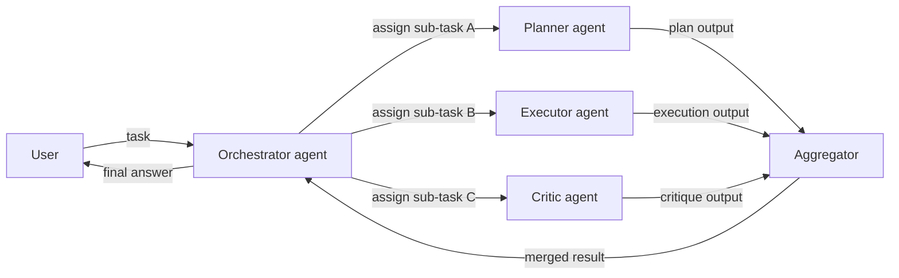
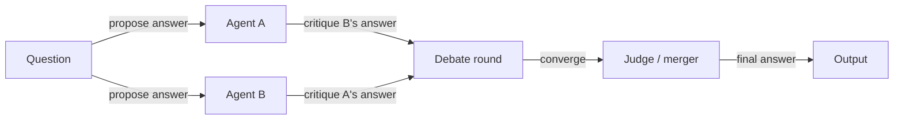

# Multi-agent systems

## Definition

Multi-agent systems (MAS) involve multiple AI agents that interact to solve tasks: collaboration (divide work, share state), debate (argue and refine answers), or specialized roles (planner, executor, critic). Rather than a single monolithic agent trying to do everything, MAS assigns distinct responsibilities to different agents and composes their outputs.

They extend single [agents](/docs/agents) when one model or one loop is insufficient: for example, one agent for [RAG](/docs/rag) retrieval, another for generation, and another for critique and fact-checking. Each agent can use a different model, a different set of tools, and a different system prompt tuned for its role. This modularity makes individual agents simpler, more reliable, and easier to swap or upgrade.

[Subagents](/docs/subagents) are a hierarchical form where a root agent delegates to children; multi-agent systems can also be flat (peer-to-peer) or mesh-structured, where agents communicate with each other without a central orchestrator. The right topology — hierarchical, flat, or hybrid — depends on whether the workflow has a natural decomposition into independent or sequentially dependent sub-tasks.

## How it works

### Orchestrated (hierarchical) topology



### Debate / review topology



The **user** sends a task to an **orchestrator** (which can be an LLM or a fixed workflow). The orchestrator assigns work to **Agent 1**, **Agent 2**, etc., each with its own role, tools, and optionally model. Agents may share a common state, pass messages, or be invoked in sequence or in parallel. Their outputs are **aggregated** (combined, voted, or summarized) and returned. MAS are useful when you want **modularity**, **specialization**, **reusability**, and **structured control flow** across complex multi-step tasks.

## When to use / When NOT to use

| Scenario | Use MAS | Don't use MAS |
|---|---|---|
| Task decomposes cleanly into distinct roles | Yes — planner + executor + critic is a natural split | No — if the task is single-role, one agent suffices |
| High-confidence needed via debate/review | Yes — debate pattern filters errors through disagreement | No — single-agent is fine for well-understood domains |
| Different subtasks need different tools/models | Yes — each agent uses only what it needs | No — one agent with all tools is simpler if roles overlap heavily |
| Rapid prototyping or simple pipelines | No — MAS overhead adds complexity | Yes — start with a single agent and add complexity as needed |
| Strong real-time latency requirements | No — parallel agents add coordination overhead | Yes — single-agent is faster for tight latency budgets |

## Comparisons

| Pattern | Structure | Communication | Autonomy | Best for |
|---|---|---|---|---|
| Single agent | Monolithic | None | High per agent | Simple or moderate tasks |
| Hierarchical MAS | Tree (root → children) | Root delegates | Medium per agent | Structured workflows |
| Flat / peer-to-peer MAS | Mesh or ring | Direct messaging | High | Collaborative reasoning |
| Debate / review | Parallel + merge | Critique-based | Medium | High-confidence generation |
| Subagent (strict hierarchy) | Tree (root owns goal) | Controlled delegation | Low per subagent | Complex, long-horizon tasks |

## Pros and cons

| Pros | Cons |
|---|---|
| Modular — each agent has a clear, testable responsibility | Coordination overhead (latency, tokens, state sync) |
| Specialized agents outperform generalist agents on their role | Harder to debug than a single agent trace |
| Reusable — same agent in different workflows | Communication protocol design is non-trivial |
| Debate patterns can significantly improve accuracy | Risk of cascading errors across agents |

## Code examples

```python
from langchain_openai import ChatOpenAI
from langchain_core.messages import HumanMessage, SystemMessage

llm = ChatOpenAI(model="gpt-4o-mini")

def planner_agent(task: str) -> str:
    """Break a task into a numbered plan."""
    response = llm.invoke([
        SystemMessage(content="You are a planning agent. Break the task into 3–5 clear steps."),
        HumanMessage(content=task),
    ])
    return response.content

def executor_agent(plan: str) -> str:
    """Execute the plan and produce a draft output."""
    response = llm.invoke([
        SystemMessage(content="You are an execution agent. Follow the plan and produce a detailed output."),
        HumanMessage(content=f"Plan:\n{plan}"),
    ])
    return response.content

def critic_agent(draft: str) -> str:
    """Review the draft and suggest improvements."""
    response = llm.invoke([
        SystemMessage(content="You are a critic agent. Identify flaws and suggest concrete improvements."),
        HumanMessage(content=f"Draft:\n{draft}"),
    ])
    return response.content

# Orchestrate
task = "Write a short guide on how to get started with RAG."
plan = planner_agent(task)
print("Plan:\n", plan)

draft = executor_agent(plan)
print("\nDraft:\n", draft)

critique = critic_agent(draft)
print("\nCritique:\n", critique)
```

## Practical resources

- [From Prototypes to Agents with ADK – Google Codelabs](https://codelabs.developers.google.com/your-first-agent-with-adk#0) — ADK supports composing multiple agents into a multi-agent system
- [LangChain – Multi-agent orchestration](https://python.langchain.com/docs/concepts/multi_agent/) — Multi-agent patterns including supervisor and swarm topologies
- [Microsoft AutoGen](https://microsoft.github.io/autogen/) — Framework for building multi-agent conversational systems

## See also

- [Agents](/docs/agents)
- [Subagents](/docs/subagents)
- [Autonomous agents](/docs/autonomous-agents)
- [ReAct](/docs/reasoning-patterns/react)
