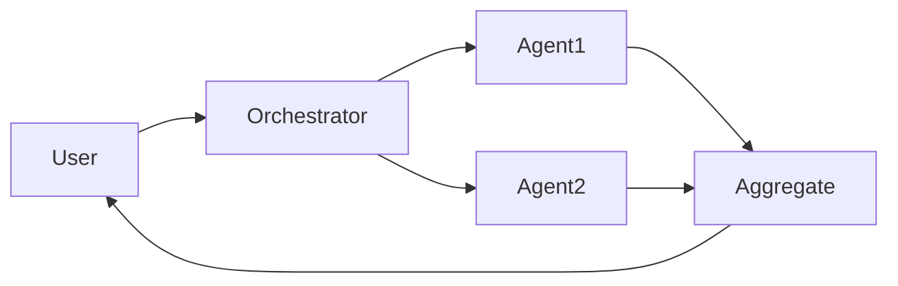

# Multi-agent systems

## Definition

Multi-agent systems involve multiple AI agents that interact to solve tasks: collaboration (divide work, share state), debate (argue and refine answers), or specialized roles (planner, executor, critic).

They extend single [agents](/docs/agents) when one model or one loop is insufficient: e.g. one agent for [RAG](/docs/rag) retrieval, another for generation, another for critique. [Subagents](/docs/subagents) are a hierarchical form where a root agent delegates to children; here we focus on flat or peer-to-peer multi-agent patterns.

## How it works

The **user** sends a task to an **orchestrator** (which can be an LLM or a fixed workflow). The orchestrator assigns work to **Agent1**, **Agent2**, etc., each with its own role, tools, and optionally model. Agents may share a common state, pass messages, or be invoked in sequence/parallel. Their outputs are **aggregated** (e.g. combined, voted, or summarized) and returned to the user. Design choices include role assignment, communication protocol, and conflict resolution. MAS are useful when you want **modularity** (each agent has a clear responsibility), **specialization** (different models or tools per role), **reusability** (same agent in different workflows), and **structured control flow**.

## Use cases

Multi-agent systems help when a single agent is not enough: you need distinct roles, debate, or modular pipelines.

- Orchestrating planner, executor, and critic agents for complex tasks
- Debate or review flows where multiple agents refine an answer
- Specialized pipelines (e.g. one agent for retrieval, one for generation)

## External documentation

- [From Prototypes to Agents with ADK – Google Codelabs](https://codelabs.developers.google.com/your-first-agent-with-adk#0) — ADK supports composing multiple agents into a multi-agent system
- [LangChain – Multi-agent](https://python.langchain.com/docs/concepts/multi_agent/) — Multi-agent orchestration patterns

## See also

- [Agents](/docs/agents)
- [Subagents](/docs/subagents)
- [Autonomous agents](/docs/autonomous-agents)
