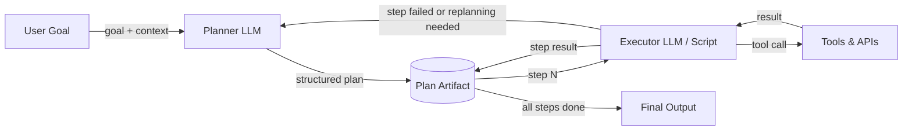

# Planner-Executor architecture

## Definition

The Planner-Executor architecture separates the concern of *deciding what to do* from the concern of *doing it*. A **Planner** LLM receives a high-level goal and produces a structured, step-by-step plan—a sequence of subtasks that together accomplish the goal. An **Executor** LLM (or a deterministic program) then works through the plan one step at a time, invoking tools and producing results. The two components communicate through a shared plan artifact rather than through a single monolithic prompt.

This separation of concerns addresses a fundamental limitation of single-agent ReAct loops: when a task is complex, asking one LLM to simultaneously reason about strategy, choose the next action, and handle low-level tool details leads to mistakes and hallucinations. By delegating high-level decomposition to the Planner and low-level execution to the Executor, each component can be optimized, prompted, and monitored independently. The Planner can use a more capable model; the Executor can be a faster, cheaper model or even a non-LLM program.

Plan refinement and replanning are critical extensions of the basic architecture. Real-world tasks rarely unfold as expected: a tool call might fail, a web page might return unexpected data, or an intermediate result might reveal that the original plan was wrong. A robust Planner-Executor system monitors execution results and re-invokes the Planner when replanning is needed. This feedback loop turns a brittle pipeline into an adaptive agent.

## How it works

### Planner

The Planner receives the user's goal along with available tools and any relevant context. It outputs a structured plan—typically a JSON list of step objects, each describing a subtask, the expected input/output, and optionally which tool to use. A good planning prompt includes the tool schemas so the Planner can reference them accurately. The Planner does not invoke any tools itself; it only reasons about the sequence of operations needed. Temperature should generally be low to produce deterministic, well-structured plans.

### Plan artifact

The plan is the contract between Planner and Executor. It is a machine-readable document (JSON or structured text) that encodes the sequence of steps, their dependencies, and their expected outcomes. Storing the plan as an explicit artifact—rather than keeping it implicit in the model's chain-of-thought—makes the system auditable, pausable, and resumable. A human-in-the-loop approval step can be inserted here, allowing users to review and edit the plan before execution begins.

### Executor

The Executor reads the plan one step at a time, resolves any input references to previous step outputs, calls the appropriate tools, and records the result. The Executor may be a second LLM (useful when steps require natural-language reasoning), a deterministic script (useful for structured steps like API calls), or a hybrid. After each step, the result is written back to the plan artifact so subsequent steps can reference it. If a step fails, the Executor flags it and optionally triggers replanning.

### Replanning loop

When execution diverges from the plan—due to tool failures, unexpected outputs, or changed conditions—control returns to the Planner with the partial execution record. The Planner revises the remaining steps given the new information. Replanning can be triggered automatically (e.g., on any step failure) or after each step for maximum adaptability. Limiting replanning iterations prevents infinite loops.



## When to use / When NOT to use

| Use when | Avoid when |
|---|---|
| The task requires multiple sequential steps that are hard to enumerate upfront | The task is simple enough for a single LLM call or a ReAct loop |
| You want human review or approval before execution begins | Latency is critical and the extra planner call is unacceptable |
| Execution steps have clear dependencies and can be validated individually | The plan structure would be trivial and adds unnecessary complexity |
| You need to audit what the agent did and why each step was taken | The task is exploratory and cannot be planned upfront at all |
| Replanning on failure is important for reliability | Tool APIs are so unreliable that no plan survives first contact |

## Comparisons

| Criterion | Planner-Executor | Single ReAct agent | DAG-based agents |
|---|---|---|---|
| Separation of concerns | High — planning and execution are distinct | None — one agent does both | High — each node is a separate unit |
| Adaptability / replanning | Moderate — replanning adds a round trip | High — agent adjusts on every step | Low — DAG structure is typically fixed |
| Auditability | High — plan artifact is explicit | Low — reasoning is in-context only | High — graph structure is explicit |
| Parallelism | None by default | None | Native — independent branches run in parallel |
| Complexity to implement | Medium | Low | High |
| Best for | Multi-step tasks with sequential dependencies | Exploratory, dynamic tasks | Tasks with known parallelizable subtasks |

## Code examples

```python
"""
Planner-Executor implementation using the OpenAI API.

The Planner produces a JSON plan; the Executor steps through it,
calling mock tools and writing results back. Replanning is triggered
on step failure.
"""
from __future__ import annotations

import json
import os
from typing import Any

from openai import OpenAI  # pip install openai

client = OpenAI(api_key=os.environ.get("OPENAI_API_KEY", "sk-placeholder"))

# ---------------------------------------------------------------------------
# Mock tools
# ---------------------------------------------------------------------------

def web_search(query: str) -> str:
    """Mock web search tool."""
    return f"[Search result for '{query}': Found 5 relevant pages about {query}.]"

def summarize_text(text: str) -> str:
    """Mock summarizer tool."""
    return f"[Summary of: {text[:40]}...]"

def write_report(sections: list[str]) -> str:
    """Mock report writer tool."""
    return f"[Report written with {len(sections)} sections.]"

TOOLS: dict[str, Any] = {
    "web_search": web_search,
    "summarize_text": summarize_text,
    "write_report": write_report,
}

# ---------------------------------------------------------------------------
# Planner
# ---------------------------------------------------------------------------

PLANNER_SYSTEM = """
You are a planning assistant. Given a goal and available tools, produce a JSON plan.
The plan is a list of steps. Each step has:
  - "id": int (1-indexed)
  - "description": str (what this step does)
  - "tool": str (tool name from the available list, or "none")
  - "input": str (what to pass to the tool, may reference prior steps as {step_N_result})
  - "depends_on": list[int] (ids of steps that must complete first)

Return ONLY valid JSON — no markdown, no prose.
Available tools: web_search, summarize_text, write_report
"""

def create_plan(goal: str, context: str = "") -> list[dict]:
    """Call the Planner LLM to create a structured plan for the given goal."""
    user_msg = f"Goal: {goal}\n\nAdditional context: {context}" if context else f"Goal: {goal}"
    response = client.chat.completions.create(
        model="gpt-4o-mini",
        temperature=0,
        response_format={"type": "json_object"},
        messages=[
            {"role": "system", "content": PLANNER_SYSTEM},
            {"role": "user", "content": user_msg},
        ],
    )
    raw = response.choices[0].message.content
    parsed = json.loads(raw)
    # Handle both {"steps": [...]} and bare [...]
    return parsed.get("steps", parsed) if isinstance(parsed, dict) else parsed


# ---------------------------------------------------------------------------
# Executor
# ---------------------------------------------------------------------------

def resolve_input(template: str, results: dict[int, str]) -> str:
    """Replace {step_N_result} placeholders with actual results."""
    for step_id, result in results.items():
        template = template.replace(f"{{step_{step_id}_result}}", result)
    return template

def execute_plan(plan: list[dict]) -> dict[int, str]:
    """
    Execute each step sequentially, respecting dependencies.
    Returns a mapping of step_id -> result string.
    """
    results: dict[int, str] = {}

    for step in plan:
        step_id = step["id"]
        tool_name = step.get("tool", "none")
        raw_input = step.get("input", "")
        resolved_input = resolve_input(raw_input, results)

        print(f"  Step {step_id}: {step['description']}")

        if tool_name != "none" and tool_name in TOOLS:
            try:
                result = TOOLS[tool_name](resolved_input)
            except Exception as exc:
                # Signal failure for potential replanning
                result = f"ERROR: {exc}"
                print(f"    [FAILED] {result}")
        else:
            result = f"[No tool — step noted: {resolved_input}]"

        results[step_id] = result
        print(f"    Result: {result}\n")

    return results


# ---------------------------------------------------------------------------
# Planner-Executor orchestration with simple replanning
# ---------------------------------------------------------------------------

def run_planner_executor(goal: str, max_replan_attempts: int = 2) -> str:
    """
    Full Planner-Executor loop with replanning on failure.
    Returns the result of the last step as the final output.
    """
    attempt = 0
    context = ""

    while attempt <= max_replan_attempts:
        print(f"\n--- Planning (attempt {attempt + 1}) ---")
        plan = create_plan(goal, context=context)
        print(f"Plan has {len(plan)} steps.")

        print("\n--- Executing ---")
        results = execute_plan(plan)

        # Check for failures
        failures = {sid: r for sid, r in results.items() if r.startswith("ERROR")}
        if not failures:
            # Return the result of the last step
            last_id = max(results.keys())
            return results[last_id]

        # Build replanning context
        context = (
            f"Previous plan failed at steps: {list(failures.keys())}. "
            f"Errors: {failures}. Please revise the plan to avoid these failures."
        )
        attempt += 1

    return "Max replanning attempts reached. Could not complete goal."


if __name__ == "__main__":
    goal = "Research the latest trends in renewable energy and write a brief report."
    final = run_planner_executor(goal)
    print(f"\nFinal output:\n{final}")
```

## Practical resources

- [Plan-and-Solve Prompting (Wang et al., 2023)](https://arxiv.org/abs/2305.04091) — Paper showing that separating planning from solving improves reasoning accuracy over standard chain-of-thought.
- [LangGraph — Plan-and-Execute Agent](https://langchain-ai.github.io/langgraph/tutorials/plan-and-execute/plan-and-execute/) — Official LangGraph tutorial implementing a Planner-Executor loop with replanning.
- [LLM Compiler (Kim et al., 2023)](https://arxiv.org/abs/2312.04511) — Extends Planner-Executor with parallel execution of independent plan steps.
- [Anthropic — Building Effective Agents](https://www.anthropic.com/research/building-effective-agents) — Practical guidance on agent architectures including orchestrator-subagent patterns.

## See also

- [AI agents](/docs/agents)
- [DAG-based agents](/docs/agents/dag-agents)
- [Chain-of-thought reasoning](/docs/reasoning-patterns/cot)
