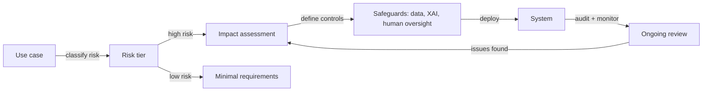

# AI ethics

## Definition

AI ethics is the field concerned with the moral principles, governance structures, and practical standards that guide how AI systems are designed, deployed, and overseen. Core principles include fairness (avoiding discrimination), transparency (making systems understandable to those affected), accountability (assigning clear responsibility for outcomes), and privacy (respecting individuals' data rights). These principles are operationalized through codes of conduct, impact assessments, audit processes, and increasingly through binding regulation.

Ethical AI is not just about preventing harm — it is also about actively promoting beneficial outcomes for diverse stakeholders. This includes ensuring that the benefits of AI are equitably distributed, that affected communities have meaningful recourse when things go wrong, and that AI development does not concentrate power in ways that undermine democratic institutions or individual autonomy. Ethics provides the normative framework within which technical safety and fairness work operates.

In practice, AI ethics connects directly to [AI safety](/docs/ai-safety) on risk and alignment, to [bias in AI](/docs/bias-in-ai) on fairness outcomes, and to [explainable AI](/docs/xai) on transparency requirements. Regulation is rapidly operationalizing ethics into law: the EU AI Act introduces tiered risk classification, mandatory transparency obligations, and prohibited practices, making ethics and impact assessments legally required for high-risk applications. Organizations must now translate abstract principles into concrete design decisions, [evaluation practices](/docs/evaluation-metrics), and deployment controls.

## How it works

### Principle-to-practice translation

Ethical principles become actionable through structured processes. An impact assessment identifies who is affected by a system, what could go wrong, how severe the harm would be, and what mitigations are available. Ethics review boards (internal or external) evaluate proposed systems against organizational and regulatory standards before deployment.

### Regulatory compliance



### Governance structures

Organizations implement governance through responsible AI policies, model cards, datasheets for datasets, and documentation of design decisions and accountability chains. Human-in-the-loop mechanisms preserve meaningful oversight for consequential decisions. Stakeholder engagement ensures that affected communities have input into systems that affect them.

## When to use / When NOT to use

| Use when | Avoid when |
|----------|------------|
| Designing or deploying AI in regulated or high-stakes domains (healthcare, hiring, credit) | The system makes no consequential decisions and affects no people directly |
| Required to comply with regulation (EU AI Act, GDPR, sector-specific rules) | The application is a pure research prototype with no path to deployment |
| Launching a public-facing AI product or service | All outputs are reviewed by qualified humans before any action is taken |
| Managing third-party AI tools that affect customers or employees | The tool is purely internal and outcomes are fully reversible |

## Comparisons

| Concept | Scope | Main output |
|---------|-------|-------------|
| AI ethics | Principles, governance, values | Policies, impact assessments, accountability frameworks |
| AI safety | Technical alignment and risk | Robustness techniques, guardrails, monitoring systems |
| Bias in AI | Fairness across groups | Fairness audits, debiasing methods, metric reports |
| Explainable AI | Interpretability | Explanations, feature attribution, audit tools |

## Pros and cons

| Pros | Cons |
|------|------|
| Reduces legal and reputational risk | Ethics reviews can slow development cycles |
| Builds user and public trust | Principles are often vague and hard to operationalize |
| Creates accountability and audit trails | Fairness metrics can conflict with each other and with accuracy |
| Encourages proactive harm prevention | Global regulatory fragmentation increases compliance complexity |

## Code examples

### Generating a simple model card (Python)

```python
from dataclasses import dataclass, asdict
import json

@dataclass
class ModelCard:
    model_name: str
    version: str
    intended_use: str
    out_of_scope_use: str
    training_data: str
    evaluation_metrics: list[str]
    known_limitations: str
    ethical_considerations: str
    contact: str

card = ModelCard(
    model_name="loan-approval-classifier",
    version="1.2.0",
    intended_use="Assist loan officers in reviewing consumer loan applications.",
    out_of_scope_use="Fully automated loan decisions without human review.",
    training_data="Internal loan data 2015-2023; balanced by income bracket and region.",
    evaluation_metrics=["accuracy", "F1", "demographic_parity", "equalized_odds"],
    known_limitations="Underperforms for applicants with non-traditional credit histories.",
    ethical_considerations="Reviewed by ethics board Q1 2024. Fairness audited across gender and race.",
    contact="ai-governance@example.com",
)

print(json.dumps(asdict(card), indent=2))
```

## Practical resources

- [EU AI Act](https://digital-strategy.ec.europa.eu/en/policies/regulatory-framework-artificial-intelligence) — EU regulatory framework with risk tiers and compliance requirements
- [OECD – AI principles](https://oecd.ai/en/ai-principles) — International principles on trustworthy AI
- [Google – Responsible AI practices](https://ai.google/responsibility/responsible-ai-practices/) — Practical guidance on applying ethics in AI development
- [Model Cards for Model Reporting (Mitchell et al.)](https://arxiv.org/abs/1810.03993) — Foundational paper on transparency documentation
- [AI Now Institute](https://ainowinstitute.org/) — Research on the social implications of AI

## See also

- [AI safety](/docs/ai-safety)
- [Bias in AI](/docs/bias-in-ai)
- [Explainable AI](/docs/xai)
