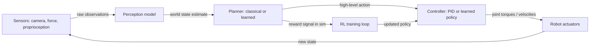

# AI and robotics

## Definition

AI in robotics is the application of machine learning, perception, and planning algorithms to enable physical systems — robot arms, mobile platforms, humanoids, drones — to sense their environment, reason about it, and take purposeful actions. Unlike software AI, robotic systems must operate in the physical world with all its unpredictability: sensor noise, unknown object configurations, deformable materials, and the hard constraint that a collision or fall has real consequences. AI brings data-driven learning to the parts of robotics that are too complex to hand-engineer.

The field spans three coupled problems. **Perception** is the task of turning raw sensor streams — cameras, depth sensors, force-torque sensors, proprioceptive encoders — into structured estimates of the world state: object poses, semantic scene labels, contact forces, and robot joint positions. Modern perception pipelines borrow heavily from [computer vision](/docs/cv) and [multimodal AI](/docs/multimodal-ai). **Planning** converts a world state estimate and a high-level goal into a sequence of actions: which object to grasp, which path to follow through a cluttered environment, which subgoal to accomplish next. **Control** executes planned actions by converting high-level commands into actuator signals — joint torques, motor velocities — that stably and precisely move the robot.

[Reinforcement learning](/docs/rl) and imitation learning are the two dominant paradigms for training robotic policies from data. RL optimizes a policy by trial-and-error against a reward signal, usually in simulation where resets are cheap and safe. Imitation learning learns from expert demonstrations — either via behavior cloning (supervised learning on state-action pairs) or inverse RL (inferring the reward function from demonstrations). A central challenge is **sim-to-real transfer**: policies trained in simulation often fail on real hardware due to dynamics mismatch, rendering differences, and sensor noise — addressed through domain randomization, system identification, and sim-to-real adaptation techniques.

## How it works

### Sensing and state estimation

Sensors provide raw observations. RGB-D cameras give color and depth; force-torque sensors measure contact; joint encoders give proprioceptive state. Perception models (often neural networks) process these into task-relevant representations: a 6-DoF object pose, a semantic point cloud, or a compact latent state. State estimation filters integrate sensor measurements over time to produce stable estimates.

### Planning and policy execution



### Sim-to-real transfer

Training entirely in simulation requires bridging the gap to real hardware. Domain randomization varies physical parameters (friction, mass, lighting, texture) during training so the policy learns to be robust to variation. System identification measures real-world parameters and builds more accurate simulation models. Residual learning and fine-tuning on small amounts of real-world data can close remaining gaps.

## When to use / When NOT to use

| Use when | Avoid when |
|----------|------------|
| Tasks are too complex to program with explicit rules (grasping novel objects, unstructured navigation) | The task is fully deterministic and expressible as a classical motion plan |
| Learning from demonstration is feasible and cheaper than manual programming | Real-world data collection or simulation setup is prohibitively expensive |
| Environment variability requires adaptive, data-driven behavior | Safety certification requires fully interpretable, verified behavior |
| Simulation can capture enough of the task dynamics for RL training | Sim-to-real gap is too large to close without prohibitive real-world data |

## Comparisons

| Approach | Strengths | Limitations |
|----------|-----------|-------------|
| Classical motion planning (MoveIt, RRT) | Deterministic, interpretable, safe | Brittle to clutter and uncertainty; hard to program perception |
| Imitation learning (behavior cloning) | Fast to bootstrap from demonstrations | Covariate shift; fails on unseen states |
| Model-free RL | Can discover non-obvious strategies | Sample inefficient; requires dense reward; long training |
| Model-based RL | More sample efficient with a world model | World model errors compound; harder to implement |
| End-to-end (raw sensors → actions) | No manual feature engineering | Harder to debug; less modular; large data needs |

## Pros and cons

| Pros | Cons |
|------|------|
| Enables robots to handle unstructured, real-world variability | Sim-to-real gap can make simulation-trained policies brittle on hardware |
| Learning from demonstration dramatically reduces programming effort | Data collection for real-robot training is slow and expensive |
| RL can discover strategies that exceed human-programmed baselines | Safety and reliability guarantees are hard to provide for learned policies |
| Foundation models are being applied to give robots generalizable skills | Physical deployment risks (collisions, falls) require extensive testing |

## Code examples

### Simulated environment with Gymnasium (Python)

```python
import gymnasium as gym
import numpy as np

# Use a robotic manipulation environment
env = gym.make("FetchReach-v3", render_mode="human")
obs, info = env.reset(seed=42)

print(f"Observation keys: {list(obs.keys())}")
print(f"Action space: {env.action_space}")

# Random policy rollout
total_reward = 0.0
for step in range(50):
    action = env.action_space.sample()  # Replace with learned policy
    obs, reward, terminated, truncated, info = env.step(action)
    total_reward += reward
    if terminated or truncated:
        obs, info = env.reset()

print(f"Total reward over 50 steps: {total_reward:.2f}")
env.close()
```

## Practical resources

- [Spinning Up in Deep RL (OpenAI)](https://spinningup.openai.com/) — Hands-on introduction to RL algorithms for control
- [Google DeepMind – Robotics research](https://deepmind.google/research/robotics/) — Papers on RT-2, grasping, and general-purpose robot learning
- [Gymnasium – Robotics environments](https://robotics.farama.org/) — Standard RL benchmark environments for robot manipulation
- [Stanford CS336 / CS231A](https://web.stanford.edu/class/cs231a/) — Visual geometry and robot perception
- [LeRobot (Hugging Face)](https://github.com/huggingface/lerobot) — Open-source real-robot imitation learning and RL framework

## See also

- [Reinforcement learning](/docs/rl)
- [Computer vision](/docs/cv)
