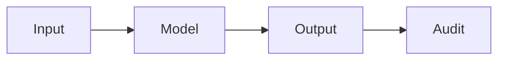

# AI safety

## Definition

AI safety addresses risks from advanced AI: misuse, unintended behavior, and alignment (systems doing what we intend). It includes robustness, interpretability, and value alignment.

It overlaps with [AI ethics](/docs/ai-ethics) (governance, fairness) and [bias in AI](/docs/bias-in-ai) (unfair outcomes). For [LLMs](/docs/llms) and [agents](/docs/agents), alignment (e.g. RLHF, constitutional AI) and guardrails are the main levers; [explainable AI](/docs/xai) supports auditing and debugging.

## How it works

**Input** is processed by the **model** to produce **output**. **Audit** (testing, monitoring, red-teaming) checks that outputs are safe, aligned, and robust. Research and practice focus on: **alignment** (RLHF, constitutional AI, scalable oversight) so models follow intent; **robustness** (adversarial testing, distribution shift) so they behave under edge cases; **monitoring** in production to detect misuse or drift. Safety is considered across the lifecycle from design and data to training, evaluation, and deployment. Formal methods and interpretability ([XAI](/docs/xai)) support the audit step.

## Use cases

AI safety is relevant for any high-stakes or public-facing system: alignment, robustness, and monitoring from design to deployment.

- Auditing and red-teaming high-stakes or public-facing models
- Alignment and guardrails for LLMs and agents (e.g. RLHF, constitutional AI)
- Robustness testing and monitoring in production

## External documentation

- [Anthropic – Safety](https://www.anthropic.com/research) — Research on AI safety and alignment
- [OpenAI – Safety and responsibility](https://openai.com/safety)

## See also

- [AI ethics](/docs/ai-ethics)
- [Explainable AI](/docs/xai)
- [Bias in AI](/docs/bias-in-ai)
