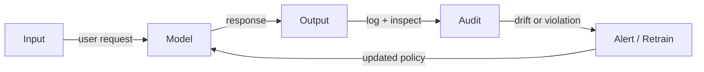

# AI safety

## Definition

AI safety is the field of research and practice concerned with ensuring that AI systems behave as intended, remain under meaningful human control, and do not cause unintended harm. It addresses three broad categories of risk: misuse (deliberate misuse by bad actors), misalignment (systems pursuing goals their designers did not intend), and accidents (unintended behavior in novel situations). The field spans technical research and governance, drawing on computer science, philosophy, economics, and policy.

Alignment is the core technical challenge: ensuring a system's goals and behaviors reliably match what its designers and users want. Key approaches include Reinforcement Learning from Human Feedback (RLHF), constitutional AI, and scalable oversight — methods that try to encode human values into model behavior and correct deviations. Robustness research complements this by ensuring systems behave reliably under adversarial inputs, distribution shift, and edge cases.

AI safety overlaps closely with [AI ethics](/docs/ai-ethics) on governance and fairness, and with [bias in AI](/docs/bias-in-ai) on unfair or harmful outcomes. [Explainable AI](/docs/xai) supports the auditing side of safety by making model decisions inspectable. For [LLMs](/docs/llms) and [agents](/docs/agents), alignment techniques and guardrails are the main active levers; safety work is considered across the full lifecycle from dataset design and training through evaluation and production monitoring.

## How it works

### Alignment and value specification

The alignment pipeline starts with defining what behavior is desired, then using training signals to push the model toward those behaviors. RLHF trains a reward model from human preference data, then uses it to fine-tune the base model via reinforcement learning. Constitutional AI encodes principles as explicit rules the model critiques itself against. Both methods are iterative: the model is evaluated, corrected, and re-evaluated.

### Robustness and adversarial testing

Robustness work stress-tests models against inputs designed to cause failures: adversarial prompts, distribution-shifted data, edge cases, and red-team attacks. Red-teaming involves systematically trying to elicit unsafe or misaligned outputs, often using both automated tools and human testers with domain expertise.

### Monitoring and auditing



Production monitoring checks that outputs stay within expected distributions, detects misuse patterns, and triggers alerts or retraining when drift or policy violations are observed. Formal methods and [XAI](/docs/xai) tools support the audit step by providing explanations and invariant checks.

## When to use / When NOT to use

| Use when | Avoid when |
|----------|------------|
| Deploying models in high-stakes domains (healthcare, finance, law) | The system is low-stakes, reversible, and human-reviewed at every step |
| Building or evaluating LLMs and autonomous agents | You have a simple rule-based system with no learned behavior |
| Regulated applications requiring auditable, aligned behavior | Adding safety overhead is blocked by infeasible compute or latency constraints |
| Red-teaming or auditing a model before public release | The model is already constrained to a narrow, fully observable action space |

## Comparisons

| Concept | Focus | Key methods |
|---------|-------|-------------|
| AI safety | Alignment, robustness, misuse prevention | RLHF, constitutional AI, red-teaming, monitoring |
| AI ethics | Governance, fairness, accountability | Impact assessments, regulations, codes of conduct |
| Bias in AI | Fairness across demographic groups | Fairness metrics, debiasing, data audits |
| Explainable AI | Interpretability of model decisions | SHAP, LIME, attention visualization |

## Pros and cons

| Pros | Cons |
|------|------|
| Reduces risk of harmful or misaligned outputs | Alignment techniques add training cost and complexity |
| Supports regulatory compliance and trust | Safety constraints can reduce model capability or fluency |
| Enables auditable, correctable systems | Red-teaming is resource-intensive and hard to fully automate |
| Applicable across the full model lifecycle | No method guarantees safety for highly capable or novel models |

## Code examples

### Red-team prompt evaluation with the OpenAI moderation API (Python)

```python
from openai import OpenAI

client = OpenAI()

def check_safety(text: str) -> dict:
    """Screen text for policy violations using the moderation endpoint."""
    response = client.moderations.create(input=text)
    result = response.results[0]
    return {
        "flagged": result.flagged,
        "categories": {k: v for k, v in result.categories.__dict__.items() if v},
    }

# Example: check a model output before surfacing to users
model_output = "Here are instructions for bypassing authentication..."
safety = check_safety(model_output)

if safety["flagged"]:
    print(f"Output flagged: {safety['categories']}")
    # Suppress or substitute the response
else:
    print("Output passed safety check.")
```

## Practical resources

- [Anthropic – Safety research](https://www.anthropic.com/research) — Papers on alignment, RLHF, and constitutional AI
- [OpenAI – Safety and responsibility](https://openai.com/safety) — OpenAI's approach to safety and deployment policies
- [DeepMind – Safety](https://deepmind.google/research/safety/) — Research on specification, robustness, and assurance
- [Center for AI Safety](https://www.safe.ai/) — Resources on AI risk and safety standards
- [NIST AI Risk Management Framework](https://airc.nist.gov/Home) — Practical framework for managing AI risk

## See also

- [AI ethics](/docs/ai-ethics)
- [Explainable AI](/docs/xai)
- [Bias in AI](/docs/bias-in-ai)
