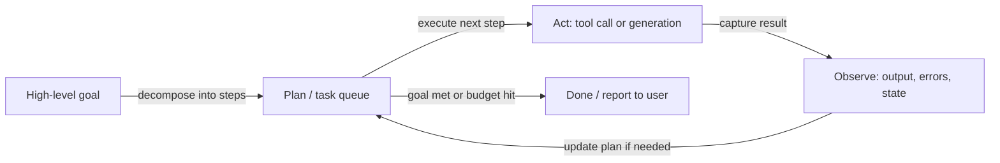
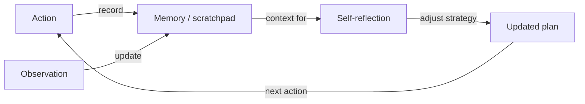

# Autonomous agents

## Definition

Autonomous agents pursue goals over extended horizons with limited human input. They plan, use tools, and adapt when the environment or task changes (e.g. coding agents, research assistants). Unlike single-turn agents that complete a task in one short loop, autonomous agents maintain state across many iterations and make independent decisions about when to proceed, when to retry, and when to ask for clarification.

They sit at the "high autonomy" end of the [agents](/docs/agents) spectrum: instead of one user turn and one response, they run long loops (plan → act → observe → replan) until the goal is met or a budget/step limit is hit. This requires not only effective tool use but also **memory** (tracking what has been tried and what worked), **planning** (decomposing the goal into a task sequence), and **self-reflection** (detecting when an approach is failing and trying something different).

[Subagents](/docs/subagents) and [reasoning patterns](/docs/reasoning-patterns) (e.g. ReAct, ToT) are often used inside autonomous agents to structure individual planning and action steps. Safety and oversight are critical concerns at this level of autonomy: autonomous agents can take irreversible actions (deleting files, sending emails, executing code) and must be designed with approval gates, rollback mechanisms, and human-in-the-loop checkpoints.

## How it works

### Plan–act–observe loop



### Memory and replanning



The agent starts from a **goal** (e.g. "implement feature X"). It **plans** (possibly breaking into steps or sub-tasks), then **acts** (tool calls, code edits, search). The **observe** step captures results (tool outputs, errors, state changes) and feeds back into **plan** for the next iteration. The loop combines planning, memory (what was tried, what worked), tool use, and often reflection (e.g. self-critique or error analysis). It runs until a stopping condition: task done, step/budget limit reached, or a human-in-the-loop check is triggered.

## When to use / When NOT to use

| Scenario | Use autonomous agents | Don't use autonomous agents |
|---|---|---|
| Long-horizon coding tasks (implement, test, iterate) | Yes — adapts to test failures and compiles errors | No — for single-file edits, a simple agent suffices |
| Research tasks requiring iterative information gathering | Yes — searches, reads, and synthesizes over many steps | No — if the answer is a single retrieval |
| Data pipelines that must adapt to schema changes | Yes — detects and handles unexpected input formats | No — deterministic pipelines are more reliable when schemas are stable |
| Safety-critical or irreversible actions | No — high autonomy + irreversibility is dangerous | Yes — require human approval before destructive actions |
| Simple, predictable, single-step tasks | No — autonomy overhead is unnecessary | Yes — a direct LLM call or simple chain is faster and cheaper |

## Comparisons

| Agent type | Horizon | Human input | Planning | Memory | Safety concern |
|---|---|---|---|---|---|
| Single-turn agent | Short (1 loop) | Per request | None | None | Low |
| ReAct agent | Medium (N steps) | Per request | Implicit | Context window | Low–medium |
| Subagent system | Medium–long | Root level | Delegated | Per subagent | Medium |
| Autonomous agent | Long (open-ended) | Minimal / checkpoints | Explicit | Persistent | High |

## Pros and cons

| Pros | Cons |
|---|---|
| Handles open-ended, long-horizon tasks without step-by-step instruction | Hard to predict or bound behavior |
| Adapts dynamically to errors and environment changes | Can take irreversible or unintended actions |
| Significantly reduces manual intervention for complex workflows | Debugging requires inspecting long, multi-step traces |
| Can compose subagents and reasoning patterns for subtasks | Cost scales with the number of steps and tool calls |

## Code examples

```python
from openai import OpenAI

client = OpenAI()

SYSTEM = """You are an autonomous research agent. 
For each task:
1. Identify what information you need.
2. Use tools to gather it step by step.
3. Reflect on what you've found and whether you need more.
4. Produce a final answer when you are confident.
Always explain your reasoning before taking each action."""

def autonomous_agent(goal: str, max_steps: int = 8) -> str:
    messages = [
        {"role": "system", "content": SYSTEM},
        {"role": "user", "content": f"Goal: {goal}"},
    ]
    memory = []

    for step in range(max_steps):
        response = client.chat.completions.create(
            model="gpt-4o-mini",
            messages=messages,
        )
        reply = response.choices[0].message.content
        messages.append({"role": "assistant", "content": reply})
        memory.append(f"Step {step + 1}: {reply[:200]}")

        # Check if agent believes it's done
        if any(phrase in reply.lower() for phrase in ["final answer:", "in conclusion:", "task complete"]):
            return reply

        # Simulate an observation / environment response
        messages.append({
            "role": "user",
            "content": "Continue. What is your next step based on what you've found so far?",
        })

    return messages[-2]["content"]  # last agent message

result = autonomous_agent("Explain the key components of a production RAG system.")
print(result)
```

## Practical resources

- [From Prototypes to Agents with ADK – Google Codelabs](https://codelabs.developers.google.com/your-first-agent-with-adk#0) — Build and deploy autonomous agents with Google's ADK
- [LangChain – Autonomous agents](https://python.langchain.com/docs/concepts/agents/) — Long-running agent patterns with memory and planning
- [AutoGPT](https://github.com/Significant-Gravitas/AutoGPT) — Reference open-source autonomous agent with planning and memory
- [SWE-agent](https://github.com/princeton-nlp/SWE-agent) — Autonomous coding agent that solves GitHub issues

## See also

- [Agents](/docs/agents)
- [Subagents](/docs/subagents)
- [Multi-agent systems](/docs/agents/multi-agent-systems)
- [Reasoning patterns](/docs/reasoning-patterns)
