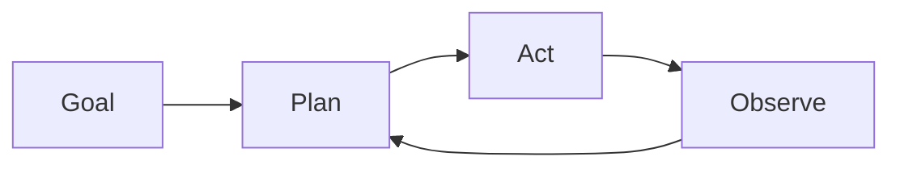

# Autonomous agents

## Definition

Autonomous agents pursue goals over extended horizons with limited human input. They plan, use tools, and adapt when the environment or task changes (e.g. coding agents, research assistants).

They sit at the “high autonomy” end of the [agents](/docs/agents) spectrum: instead of one user turn and one response, they run long loops (plan → act → observe → replan) until the goal is met or a limit is hit. [Subagents](/docs/subagents) and [reasoning patterns](/docs/reasoning-patterns) (e.g. ReAct, ToT) are often used inside autonomous agents to structure planning and action.

## How it works

The agent starts from a **goal** (e.g. “implement feature X”). It **plans** (possibly breaking into steps or sub-tasks), then **acts** (tool calls, code edits, search). The **observe** step captures results (tool outputs, errors, state) and feeds back into **plan** for the next iteration. The loop combines planning, memory (what was tried, what worked), tool use, and often reflection (e.g. self-critique). It runs until a stopping condition: task done, step/budget limit, or human-in-the-loop check. Safety and oversight (e.g. approval gates, rollback) are important when autonomy is high.

## Use cases

Autonomous agents are a fit for long-horizon, multi-step work where the system must plan, act, and adapt without step-by-step human input.

- Long-horizon coding agents that plan, edit, and test
- Research assistants that gather sources, summarize, and iterate
- Data pipelines that adapt when inputs or schemas change

## External documentation

- [From Prototypes to Agents with ADK – Google Codelabs](https://codelabs.developers.google.com/your-first-agent-with-adk#0)
- [LangChain – Autonomous agents](https://python.langchain.com/docs/concepts/agents/)

## See also

- [Agents](/docs/agents)
- [Subagents](/docs/subagents)
- [Reasoning patterns](/docs/reasoning-patterns)
