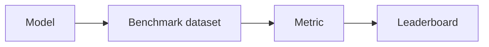

# Benchmarks

## Definition

Benchmarks are standardized datasets and evaluation protocols (e.g. GLUE, SuperGLUE for NLP; MMLU for broad knowledge; HumanEval for code). They enable comparison across models and over time.

They rely on [evaluation metrics](/docs/evaluation-metrics) and fixed splits so results are comparable. Overfitting to benchmarks is a known issue; supplement with out-of-distribution and human eval when deploying [LLMs](/docs/llms) or production systems.

## How it works

A **model** is run on a **benchmark dataset** (fixed prompts or inputs, standard split). **Metrics** (e.g. accuracy, pass@k) are computed per task and often averaged; results are reported on a **leaderboard** or in papers. Protocols define what inputs to use, how to parse outputs, and which [metrics](/docs/evaluation-metrics) to report. Reusing the same benchmark across time lets the community track progress. Care is needed: models can overfit to benchmark quirks, and benchmarks may not reflect real-world quality—use them as one signal among others.

## Use cases

Benchmarks give a common yardstick to compare models and methods; use them together with task-specific and human evaluation.

- Comparing NLP models (e.g. GLUE, SuperGLUE, MMLU)
- Evaluating code generation (e.g. HumanEval) or reasoning
- Tracking model and method progress over time

## External documentation

- [Papers with Code – Leaderboards](https://paperswithcode.com/)
- [MMLU (Hendrycks et al.)](https://arxiv.org/abs/2009.03300) — Broad knowledge benchmark
- [HumanEval](https://github.com/openai/human-eval) — Code generation benchmark

## See also

- [Evaluation metrics](/docs/evaluation-metrics)
- [LLMs](/docs/llms)
