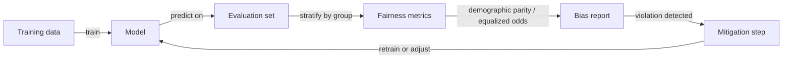

# Bias in AI

## Definition

Bias in AI refers to systematic errors or unfair outcomes that arise from AI systems and disproportionately affect certain groups of people — typically along lines of race, gender, age, socioeconomic status, or other protected attributes. These biases can produce tangible harms: loan applications unjustly denied, resumes filtered out based on name, medical diagnoses missed for underrepresented populations, or facial recognition failing for darker skin tones. Understanding bias requires looking at the full pipeline, from data collection and labeling through model training to deployment and feedback loops.

Bias enters systems at multiple stages. Historical bias in training data encodes past discrimination — if a company historically hired fewer women in engineering, a model trained on that data will replicate the pattern. Measurement bias occurs when the proxies used in data collection are unequally accurate across groups; for example, using zip code as a proxy for creditworthiness encodes residential segregation. Label bias occurs when human annotators bring their own assumptions to tasks like toxicity detection or sentiment labeling. Representation bias arises when certain groups are simply underrepresented in training data, leading to worse performance for those groups.

Bias sits at the intersection of [AI ethics](/docs/ai-ethics) and [AI safety](/docs/ai-safety). [Evaluation metrics](/docs/evaluation-metrics) provide the quantitative tools to detect and measure bias, while [explainable AI](/docs/xai) can help identify where in a model's reasoning bias manifests. In regulated domains — hiring, lending, healthcare, criminal justice — bias detection and mitigation are legal requirements, not optional best practices. Bias audits should be conducted before deployment and monitored continuously in production.

## How it works

### Sources of bias

Bias enters pipelines through skewed or unrepresentative training data, proxy variables that correlate with protected attributes, biased human labels, and feedback loops where model outputs influence future data collection. Each source requires different detection and mitigation strategies.

### Detection with fairness metrics



### Mitigation strategies

Mitigation strategies fall into three categories. **Pre-processing** methods modify the training data: reweighting samples, resampling underrepresented groups, or collecting additional representative data. **In-processing** methods modify the training objective: adding fairness constraints, using adversarial debiasing where an auxiliary classifier tries to predict protected attributes from the model's representations. **Post-processing** methods adjust model outputs: setting group-specific decision thresholds to equalize rates across groups without retraining.

## When to use / When NOT to use

| Use when | Avoid when |
|----------|------------|
| Model decisions affect people in regulated or sensitive domains (hiring, lending, healthcare) | The model's output has no impact on people or their opportunities |
| Deploying at scale where small error-rate disparities cause large aggregate harm | You have no access to demographic data needed for stratified evaluation |
| Auditing a model before or after deployment | The ground truth labels are themselves too biased to serve as fair references |
| Required by regulation to demonstrate non-discrimination | All predictions are reviewed by experts who can override incorrect decisions |

## Comparisons

| Fairness metric | What it measures | When to use |
|----------------|-----------------|-------------|
| Demographic parity | Equal positive prediction rates across groups | When equal representation is the goal |
| Equalized odds | Equal TPR and FPR across groups | When consequences of errors should be equal |
| Calibration | Predicted probabilities match actual rates per group | When score values are used for decisions |
| Individual fairness | Similar individuals get similar predictions | When case-by-case consistency is required |

## Pros and cons

| Pros | Cons |
|------|------|
| Reduces discriminatory harm to affected groups | Fairness metrics are mathematically incompatible — satisfying one often violates another |
| Builds legal and ethical compliance evidence | Mitigation can reduce overall accuracy |
| Enables proactive detection before deployment | Requires demographic data that may be unavailable or sensitive |
| Supports transparent reporting and accountability | Feedback loop bias is hard to detect without longitudinal monitoring |

## Code examples

### Computing demographic parity with scikit-learn (Python)

```python
import numpy as np
from sklearn.metrics import confusion_matrix

def demographic_parity_difference(y_pred: np.ndarray, groups: np.ndarray) -> float:
    """
    Compute demographic parity difference between two groups.
    Returns the difference in positive prediction rates.
    A value of 0 indicates perfect parity.
    """
    unique_groups = np.unique(groups)
    rates = {}
    for g in unique_groups:
        mask = groups == g
        rates[g] = y_pred[mask].mean()

    values = list(rates.values())
    diff = max(values) - min(values)
    print(f"Positive prediction rates by group: {rates}")
    print(f"Demographic parity difference: {diff:.4f}")
    return diff

# Example usage
np.random.seed(42)
y_pred = np.random.randint(0, 2, size=1000)
groups = np.random.choice(["A", "B"], size=1000, p=[0.6, 0.4])

demographic_parity_difference(y_pred, groups)
```

## Practical resources

- [Fairness and Machine Learning (Barocas, Hardt, Narayanan)](https://fairmlbook.org/) — Comprehensive free textbook on fairness concepts and metrics
- [Google – Responsible AI – Fairness](https://ai.google.dev/responsible-ai) — Practical fairness guidance and tools
- [IBM AI Fairness 360](https://aif360.res.ibm.com/) — Open-source toolkit for bias detection and mitigation
- [Microsoft Fairlearn](https://fairlearn.org/) — Python library for fairness assessment and mitigation
- [NIST Special Publication on Bias in AI](https://www.nist.gov/artificial-intelligence) — US government guidance on AI bias

## See also

- [AI ethics](/docs/ai-ethics)
- [AI safety](/docs/ai-safety)
- [Evaluation metrics](/docs/evaluation-metrics)
