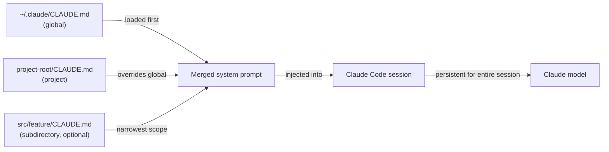

# CLAUDE.md configuration

## Definition

`CLAUDE.md` is a Markdown file that Claude Code reads automatically at the start of every session. Its contents are injected into the system prompt, giving the model persistent, project-aware instructions without requiring the developer to repeat them in every conversation. Think of it as the "onboarding document" that every session receives: it tells Claude what the project is, how it is structured, what conventions to follow, and what behaviors to avoid.

The file is intentionally written in plain Markdown rather than a proprietary format, which means it is human-readable, version-controllable, and editable by any developer on the team. Because it lives in the repository alongside the code, it evolves with the project: when the tech stack changes, when new conventions are adopted, or when a new developer joins and needs onboarding, the `CLAUDE.md` is the single source of truth for how Claude should behave in that codebase.

There are two distinct scopes for `CLAUDE.md` files. A **project-level** file lives in the root of the repository (or any subdirectory) and applies only to that project. A **global** file lives at `~/.claude/CLAUDE.md` and applies to every Claude Code session regardless of project. The two scopes are additive: both are loaded simultaneously, with project-level instructions taking precedence when they conflict with global ones.

## How it works

### File discovery and loading order

When Claude Code starts a session, it walks the directory tree upward from the current working directory looking for `CLAUDE.md` files. Files found in parent directories are loaded first (broadest scope), then files found in the current directory and its subdirectories (narrowest scope). The global file at `~/.claude/CLAUDE.md` is always loaded first, providing a baseline that project files can override. This hierarchical loading means a monorepo can have a root-level `CLAUDE.md` for shared conventions and per-package `CLAUDE.md` files for package-specific rules — both apply simultaneously during a session.

### Injection into the system prompt

The contents of all discovered `CLAUDE.md` files are concatenated and prepended to the system prompt before any conversation turn. This means Claude has access to the instructions on every single request, not just the first one. Because the instructions are part of the system prompt rather than the user message, they do not consume conversational context that would otherwise be used for code and tool results. The instructions persist for the entire session and are not summarized or compressed by the context management system.

### What belongs in CLAUDE.md

A well-written `CLAUDE.md` answers the questions a new team member would ask before touching the codebase: What is this project? What language and framework are used? How is the code organized? What are the testing and formatting conventions? Are there any patterns to follow or anti-patterns to avoid? Are there commands Claude should or should not run? The file should be specific enough to be actionable but concise enough that the model can internalize all of it. Avoid padding it with information Claude already knows (e.g., explaining what TypeScript is) and focus on project-specific facts.

### Keeping CLAUDE.md up to date

Because `CLAUDE.md` is injected on every request, outdated instructions actively hurt performance — Claude may follow obsolete conventions or use deprecated patterns. The recommended practice is to treat `CLAUDE.md` updates as part of normal development: when a major refactor changes the project structure, update the file in the same commit. Code review should include `CLAUDE.md` changes just like any other configuration change. Teams with CI pipelines can lint the file (e.g., check that referenced paths still exist) to catch stale entries early.



## When to use / When NOT to use

| Use when | Avoid when |
|---|---|
| You want Claude to always follow specific coding standards (e.g., use `const` over `let`, prefer functional components) | Instructions change frequently per-task — use in-session prompts for one-off requests |
| You need to provide tech-stack context that would otherwise require re-explanation (e.g., "we use Zod for schema validation, not Yup") | The file would contain secrets or credentials — use environment variables for those |
| You want to prevent Claude from running dangerous commands (e.g., "never run `DROP TABLE` or `rm -rf`") | The instructions are generic best practices Claude already follows by default |
| Your project has non-obvious architecture decisions that affect how code should be written | The project is a one-off script with no shared conventions worth documenting |
| You work across multiple projects and want a personal baseline style in your global `~/.claude/CLAUDE.md` | Different team members have conflicting preferences — resolve those in code review first |

## Code examples

```markdown
# CLAUDE.md — my-app project instructions

## Project overview
This is a full-stack web app: React + TypeScript frontend, Node.js + Express backend,
PostgreSQL database managed with Prisma ORM. The monorepo is structured as:

- `packages/web/` — React frontend (Vite, React Router v6, Tailwind CSS)
- `packages/api/` — Express REST API (TypeScript, Zod for request validation)
- `packages/shared/` — Shared TypeScript types used by both packages

## Tech stack conventions

### Frontend (packages/web)
- Use functional components with hooks only — no class components
- Prefer named exports over default exports for components
- State management: Zustand for global state, React Query for server state
- Styling: Tailwind utility classes; no inline styles or CSS modules
- Use `zod` schemas imported from `packages/shared` to validate API responses

### Backend (packages/api)
- All route handlers live in `src/routes/`; use Express Router, one file per resource
- Validate all request bodies and query params with Zod before accessing them
- Use Prisma's generated client — never write raw SQL unless Prisma cannot express the query
- Return errors as `{ error: string, code: string }` JSON objects, never as HTML

## Code style
- TypeScript strict mode is enabled — never use `any` or `// @ts-ignore`
- Use `const` by default; only use `let` when reassignment is required
- Prefer early returns over nested conditionals
- All async functions must handle errors with try/catch or `.catch()`
- Do not import from `../../..` more than two levels deep — use path aliases (`@web/`, `@api/`, `@shared/`)

## Testing
- Tests live alongside source files as `*.test.ts` — not in a separate `tests/` directory
- Use Vitest for all tests (not Jest)
- Write unit tests for all utility functions; integration tests for all API routes
- Run tests with: `pnpm test` (runs all packages) or `pnpm --filter @app/api test` (single package)

## Git conventions
- Use conventional commits: `feat:`, `fix:`, `chore:`, `docs:`, `refactor:`, `test:`
- One logical change per commit — do not bundle unrelated changes
- Branch names: `feat/description`, `fix/description`, `chore/description`

## Commands you may run freely
- `pnpm install`, `pnpm build`, `pnpm test`, `pnpm lint`, `pnpm format`
- `prisma generate`, `prisma migrate dev`, `prisma studio`
- `git status`, `git diff`, `git log`

## Commands to NEVER run without explicit user confirmation
- Any `prisma migrate reset` or `prisma db push --force-reset` — these destroy data
- Any `DROP TABLE`, `DELETE FROM` without a WHERE clause
- `rm -rf` on any directory other than `node_modules` or build artifacts
```

```bash
# Global CLAUDE.md at ~/.claude/CLAUDE.md (applies to all projects)
# Good for personal style preferences and safety rules that span every project

# Example global instructions:
cat ~/.claude/CLAUDE.md
```

```markdown
# Global Claude Code instructions (all projects)

## My personal defaults
- I prefer TypeScript over JavaScript in all new files
- Use single quotes for strings in JavaScript/TypeScript
- Explain what you are going to do before making large changes (more than 3 files)
- When writing commit messages, always use conventional commits format

## Safety rules (all projects)
- Never commit directly to `main` or `master` — always create a feature branch first
- Never run database migration commands without showing me the migration file first
- Ask before installing new dependencies — I want to review package size and license
```

## Practical resources

- [Claude Code documentation — CLAUDE.md](https://docs.anthropic.com/en/docs/claude-code/memory) — Official guide to CLAUDE.md file locations, loading order, and best practices.
- [Claude Code settings reference](https://docs.anthropic.com/en/docs/claude-code/settings) — Full settings reference including all configuration options alongside CLAUDE.md.
- [Claude Code quickstart](https://docs.anthropic.com/en/docs/claude-code/quickstart) — Getting started guide that covers initial CLAUDE.md setup.

## See also

- [Claude Code overview](/docs/claude-code)
- [Claude Code skills](/docs/claude-code/skills)
- [Context management](/docs/claude-code/context-management)
