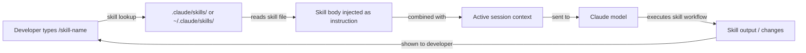

# Claude Code skills

## Definition

Skills are reusable, invocable prompt files that extend Claude Code's behavior beyond its defaults. A skill is a Markdown file with YAML frontmatter that defines a named command: when a developer types `/skill-name` inside a Claude Code session, the skill's content is injected as an instruction — effectively turning a common, complex, or team-specific workflow into a single slash command.

The mental model is similar to shell aliases or Makefile targets, but for AI-assisted workflows. Instead of repeating a long, carefully crafted prompt every time you want Claude to follow a specific process (code review checklist, release note generation, architecture documentation, security audit), you write it once as a skill, commit it to the repository, and invoke it with a short command. Skills are version-controlled, shareable, and composable with CLAUDE.md instructions.

Skills differ from CLAUDE.md instructions in an important way: CLAUDE.md is always active and applies to every interaction, while skills are opt-in and invoked explicitly. This makes skills appropriate for heavyweight or context-specific workflows that should not run on every request, whereas CLAUDE.md is better for lightweight conventions and constraints that should always be in effect.

## How it works

### Skill file format

A skill file is a `.md` file with YAML frontmatter. The frontmatter must include at minimum a `description` field that tells Claude what the skill does. The body of the file is the prompt that will be injected when the skill is invoked. The filename (without `.md`) becomes the slash command name: a file named `code-review.md` is invoked as `/code-review`. Skill names may contain hyphens but not spaces.

### Skill directories

Claude Code looks for skills in two locations. **Project skills** live in `.claude/skills/` relative to the project root and are available only when working in that project. **Global skills** live in `~/.claude/skills/` and are available in every Claude Code session. Project skills take precedence over global skills with the same name, allowing teams to override personal skills with project-specific versions. You can also point Claude Code at a custom skills directory via configuration.

### Skill invocation

Inside a Claude Code session, typing `/skill-name` triggers the skill. Claude Code finds the corresponding skill file, reads its body, and injects the content as a user instruction at that point in the conversation. The skill can reference context that already exists in the session (previously read files, earlier tool outputs) and can issue its own tool calls (read files, run commands) to gather additional information before producing output. Skills can accept inline arguments after the command name: `/generate-test src/utils/format.ts` passes the file path as context.

### Composing skills with CLAUDE.md

Skills and CLAUDE.md work together. CLAUDE.md establishes the project baseline (conventions, forbidden patterns, tech stack), and skills provide invocable workflows on top of that baseline. A `code-review` skill, for example, can instruct Claude to "check that all changes comply with the conventions in CLAUDE.md" — it does not need to repeat those conventions because they are already in the system prompt. This separation of concerns keeps each file focused and avoids duplication.



## When to use / When NOT to use

| Use when | Avoid when |
|---|---|
| You have a multi-step workflow you repeat regularly (e.g., writing changelogs, running a review checklist) | The task is truly one-off and will not be repeated — just type the prompt directly |
| You want to standardize a complex process across a team (e.g., security review, PR summary format) | The instructions belong in CLAUDE.md because they apply to every session, not just on demand |
| The workflow is context-dependent and benefits from accepting arguments (e.g., `/document src/api/users.ts`) | The skill would duplicate documentation that already exists in CLAUDE.md |
| You want to share prompting best practices across projects via your global skills directory | The workflow requires external tool integrations beyond what Claude's built-in tools support |
| You are building a skill library for your team and want version-controlled, reviewable prompt files | You need to trigger skills automatically — skills are manually invoked, not event-driven |

## Code examples

```markdown
<!-- File: .claude/skills/code-review.md -->
---
description: Perform a thorough code review on staged or recently changed files. Checks correctness, security, performance, test coverage, and project conventions.
---

You are conducting a code review. Follow these steps:

1. **Identify changed files**: Run `git diff --name-only HEAD` to list recently changed files.
   If there are staged changes, also run `git diff --cached --name-only`.

2. **Read each changed file** and the corresponding test file if it exists.

3. **Review for the following categories** (report findings under each heading):

   ### Correctness
   - Are there logic errors, off-by-one errors, or unhandled edge cases?
   - Does the code handle null/undefined inputs safely?

   ### Security
   - Is any user input used in SQL queries without parameterization? Flag immediately.
   - Are secrets or credentials hardcoded? Flag immediately.
   - Is authentication/authorization enforced on all new API routes?

   ### Performance
   - Are there N+1 query patterns in database access code?
   - Are expensive operations inside loops that could be moved outside?

   ### Test coverage
   - Do the tests cover the happy path, error paths, and edge cases?
   - Are there any new code paths with zero test coverage?

   ### Conventions
   - Does the code follow the project conventions in CLAUDE.md?
   - Are imports organized correctly? Are there unused imports?

4. **Summarize**: Provide an overall verdict (Approve / Request Changes / Needs Discussion)
   and a prioritized list of action items.
```

```markdown
<!-- File: .claude/skills/generate-changelog.md -->
---
description: Generate a changelog entry for changes since the last git tag. Follows Keep a Changelog format.
---

Generate a changelog entry for inclusion in CHANGELOG.md.

1. Run `git describe --tags --abbrev=0` to find the most recent tag.
2. Run `git log <tag>..HEAD --oneline` to list all commits since that tag.
3. Read the commit messages and group them into these categories:
   - **Added** — new features
   - **Changed** — changes to existing functionality
   - **Deprecated** — features that will be removed in a future release
   - **Removed** — features that were removed
   - **Fixed** — bug fixes
   - **Security** — security-related changes

4. Write the changelog entry in Keep a Changelog format:

   ## [Unreleased] - YYYY-MM-DD

   ### Added
   - ...

   ### Fixed
   - ...

Use concise, user-facing language. Omit chore/refactor/docs commits that don't affect users.
Output only the Markdown text — I will paste it into CHANGELOG.md manually.
```

```bash
# Invoke skills inside a Claude Code session

# Start a session
claude

# Trigger the code review skill (no arguments)
> /code-review

# Trigger the changelog skill
> /generate-changelog

# A skill that accepts an argument — document a specific file
> /document src/services/payment.ts

# List available skills (Claude will search .claude/skills/ and ~/.claude/skills/)
> /help

# Skills can be combined with regular instructions in the same turn
> /code-review and also check that the PR title follows conventional commits format
```

```markdown
<!-- File: ~/.claude/skills/explain-error.md (global skill, available in all projects) -->
---
description: Explain a compiler or runtime error in plain language and suggest fixes. Paste the error message after the command.
---

The user has provided an error message. Analyze it and respond with:

1. **Plain language explanation**: What does this error mean? Why does it occur?
2. **Most likely cause**: Given the error message and any stack trace, what is the most probable root cause?
3. **Suggested fixes**: Provide 2-3 concrete fixes, ranked by likelihood. Show code snippets where relevant.
4. **How to verify**: How can the developer confirm the fix worked?

If the error references a file path, read that file to provide more specific advice.
```

## Practical resources

- [Claude Code memory and skills documentation](https://docs.anthropic.com/en/docs/claude-code/memory) — Official reference for skill file format, directories, and invocation.
- [Claude Code settings](https://docs.anthropic.com/en/docs/claude-code/settings) — Configuration options including custom skill directory paths.
- [Anthropic Claude Code GitHub](https://github.com/anthropics/claude-code) — Source and community-contributed examples.
- [Claude Code slash commands reference](https://docs.anthropic.com/en/docs/claude-code/cli-reference) — Full list of built-in slash commands alongside the custom skill system.

## See also

- [Claude Code overview](/docs/claude-code)
- [CLAUDE.md configuration](/docs/claude-code/claude-md)
- [MCP plugins and integrations](/docs/claude-code/mcp-plugins)
