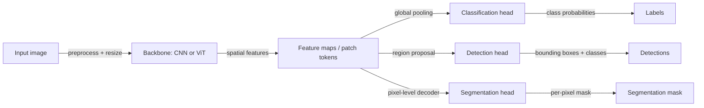

# Computer vision (CV)

## Definition

Computer vision is the field of AI that enables machines to extract meaningful information from images and video. The range of tasks spans from basic image classification (labeling an image as "cat" or "dog") to complex spatial understanding (detecting and segmenting every object in a scene), temporal reasoning (tracking objects across video frames), and generation (producing photorealistic images or videos from prompts). CV underlies a vast array of applications: medical imaging diagnostics, autonomous vehicles, satellite monitoring, industrial quality control, and augmented reality.

The core building blocks of modern CV are [convolutional neural networks (CNNs)](/docs/neural-networks/cnn) and vision transformers (ViTs). CNNs exploit the spatial structure of images through learnable convolution filters that detect local patterns like edges and textures, progressively building up to complex, high-level features. ViTs treat images as sequences of fixed-size patches and apply self-attention across them — the same mechanism used in language transformers — achieving strong performance especially at large scale. In practice, most production pipelines use a backbone pretrained on a large dataset (ImageNet, or a larger proprietary dataset) as a feature extractor, then add a lightweight task-specific head and fine-tune on the target domain.

CV increasingly overlaps with other modalities. [Multimodal AI](/docs/multimodal-ai) systems like CLIP and GPT-4V combine vision and language, enabling tasks such as visual question answering and image-conditioned text generation. Generative CV uses [diffusion models](/docs/diffusion-models) or GANs to synthesize images, create style transfers, or perform image editing from text instructions. Video understanding extends still-image CV to handle temporal dynamics, requiring architectures like 3D-CNNs or video transformers that process sequences of frames jointly.

## How it works

### Backbone feature extraction

The image is preprocessed (resized, normalized) and passed through a backbone network. CNNs apply successive convolutional layers, each producing feature maps at decreasing spatial resolution but increasing channel depth. ViTs divide the image into non-overlapping patches, project each into an embedding, and process the sequence with transformer blocks. The backbone outputs a rich spatial feature representation.

### Task heads



### Training and transfer learning

Backbones are pretrained on large datasets using supervised (ImageNet labels) or self-supervised objectives (MAE masked image modeling, CLIP contrastive learning). Fine-tuning attaches a task head and updates weights on the target dataset, often with a lower learning rate for backbone layers. Data augmentation (random crops, flips, color jitter, mixup) is essential to prevent overfitting.

## When to use / When NOT to use

| Use when | Avoid when |
|----------|------------|
| Input data is images, video, or 3D point clouds | Data is tabular or text-only — a language model or classical ML is more appropriate |
| Tasks involve perception: classifying, detecting, segmenting, or tracking visual objects | Ground truth labeling is infeasible or prohibitively expensive for your domain |
| You want to leverage pretrained visual backbones (transfer learning) | Real-time constraints are too tight for neural network inference on device |
| Generative tasks require producing or editing images | Symbolic or rules-based image processing would suffice (e.g., simple thresholding) |

## Comparisons

| Architecture | Best for | Typical use |
|-------------|----------|-------------|
| ResNet / EfficientNet (CNN) | Classification, transfer learning | Medical imaging, general classification |
| YOLO / Faster R-CNN | Real-time object detection | Autonomous vehicles, surveillance |
| Mask R-CNN | Instance segmentation | Robotics, medical segmentation |
| ViT / DINOv2 | Large-scale representation learning | Foundation models, cross-task features |
| Stable Diffusion | Image generation and editing | Creative tools, synthetic data |

## Pros and cons

| Pros | Cons |
|------|------|
| Pretrained backbones transfer well across domains | Requires large labeled datasets for fine-tuning in specialized domains |
| Strong ecosystem of open models (torchvision, timm, Ultralytics) | Inference can be compute-intensive for real-time or edge deployments |
| Vision transformers achieve state-of-the-art at scale | ViTs require more data to outperform CNNs; CNNs still competitive at small scale |
| Generative models enable synthetic data augmentation | Generated images may not match real distribution; evaluation is difficult |

## Code examples

### Object detection with Ultralytics YOLOv8 (Python)

```python
from ultralytics import YOLO
from PIL import Image

# Load a pretrained YOLOv8 model
model = YOLO("yolov8n.pt")  # nano variant — fast and lightweight

# Run inference on an image
results = model("https://ultralytics.com/images/bus.jpg")

# Print detections
for result in results:
    for box in result.boxes:
        cls_id = int(box.cls[0])
        conf = float(box.conf[0])
        xyxy = box.xyxy[0].tolist()
        label = model.names[cls_id]
        print(f"{label} ({conf:.2f}): {[round(c, 1) for c in xyxy]}")
```

## Practical resources

- [CS231n – Convolutional Neural Networks for Visual Recognition](https://cs231n.github.io/) — Stanford course, foundational curriculum for CV
- [PyTorch – Vision tutorials](https://pytorch.org/vision/stable/index.html) — Official tutorials and model zoo (torchvision)
- [Ultralytics YOLO docs](https://docs.ultralytics.com/) — Practical guide to real-time object detection
- [timm – PyTorch Image Models](https://timm.fast.ai/) — Library with 400+ pretrained vision models
- [Papers with Code – Computer Vision](https://paperswithcode.com/area/computer-vision) — Benchmarks and state-of-the-art models

## See also

- [CNN](/docs/neural-networks/cnn)
- [Multimodal AI](/docs/multimodal-ai)
- [Diffusion models](/docs/diffusion-models)
