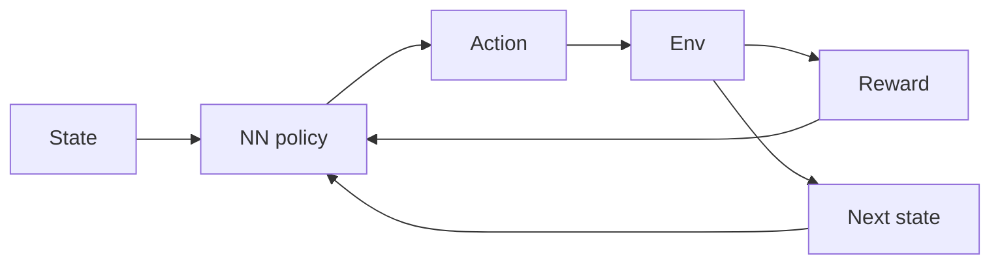

# Deep reinforcement learning (DRL)

## Definition

Deep RL combines reinforcement learning with deep neural networks to handle high-dimensional state and action spaces. Examples: DQN, A3C, PPO, SAC.

[Neural networks](/docs/neural-networks) approximate the value function and/or policy so [RL](/docs/rl) can scale to raw pixels, high-D controls, and large discrete actions. Training is unstable without tricks (experience replay, target networks, advantage estimation); modern algorithms (PPO, SAC) are widely used in robotics and [LLM](/docs/llms) alignment (RLHF, DPO).

## How it works

The **state** (e.g. image, vector) is fed into a **neural network policy** (or value network) that outputs an **action**. The **env** returns **reward** and **next state**; the agent uses this experience to update the policy (e.g. policy gradient or Q-learning with function approximation). **Experience replay** (store transitions, sample batches) and **target networks** (slow-moving copy of the network) stabilize training. **Advantage estimation** (e.g. GAE) reduces variance in policy gradients. PPO and SAC are common for continuous control; DQN and variants for discrete actions.

## Use cases

Deep RL is used when the decision problem is complex and you can learn from trial and error (simulation or real environment).

- High-dimensional control (e.g. robotics, autonomous driving)
- Game AI and simulation (e.g. DQN, PPO in complex environments)
- LLM alignment via policy optimization (e.g. RLHF, DPO)

## External documentation

- [Spinning Up in Deep RL (OpenAI)](https://spinningup.openai.com/)
- [Stable-Baselines3 – DRL algorithms](https://stable-baselines3.readthedocs.io/)

## See also

- [RL](/docs/rl)
- [Neural networks](/docs/neural-networks)
