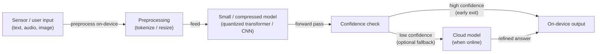

# Edge reasoning

## Definition

Edge reasoning refers to performing AI inference and lightweight reasoning on **edge devices** — smartphones, IoT gateways, industrial sensors, in-vehicle computers, smart cameras, and wearables — rather than routing data to a cloud server for processing. The goal is to achieve acceptably intelligent behavior while respecting the hard constraints of edge hardware: limited DRAM (typically 2–16 GB), battery-constrained compute, intermittent or no internet connectivity, and strict latency requirements measured in milliseconds rather than seconds.

The distinction from [local inference](/docs/local-inference) is scope and hardware class: local inference typically targets developer laptops, workstations, or on-premises servers with ample memory and dedicated GPUs. Edge reasoning operates on far more constrained hardware — a microcontroller with 256 KB of RAM, an NPU inside a phone's SoC (Apple Neural Engine, Qualcomm Hexagon), or a low-power ARM device with no discrete GPU. Achieving useful reasoning on such hardware requires a combination of small or distilled [LLMs](/docs/llms), aggressive [quantization](/docs/quantization) and [pruning](/docs/pruning), hardware-aware runtimes (TFLite, ONNX Runtime Mobile, Core ML), and reasoning strategies such as early exit and speculative decoding.

Applications range from offline-capable voice assistants and wearables to autonomous vehicles that must respond without a cloud round-trip, privacy-first health monitors that keep sensitive biometric data on-device, and industrial equipment that needs to classify faults at the edge of a factory floor with no reliable network.

## How it works

### Edge inference pipeline



### Reasoning strategies at the edge


### Key techniques

**Model distillation** — train a small student to mimic a large teacher; see [knowledge distillation](/docs/knowledge-distillation). **Quantization** — INT8 or INT4 weights and activations reduce memory and compute; see [quantization](/docs/quantization). **Structured pruning** — remove channels or heads for hardware-efficient sparsity; see [pruning](/docs/pruning). **Early exit** — attach classifiers at intermediate layers; exit when confidence is sufficient to avoid running all layers. **Speculative decoding** — small on-device draft model generates tokens that a larger model verifies, amortizing verification cost.

## When to use / When NOT to use

| Scenario | Use edge reasoning | Do NOT use edge reasoning |
|----------|-------------------|-----------------------------|
| Offline or unreliable connectivity environments | Yes — no cloud dependency | |
| Ultra-low latency (sub-100ms response) | Yes — no network round-trip | |
| Privacy-sensitive data that must stay on-device | Yes — data never transmitted | |
| Bandwidth-constrained deployments (IoT, remote sensors) | Yes — process locally, send only results | |
| Frontier model quality needed for complex reasoning | | Cloud LLMs are far more capable |
| Model requires more memory than device DRAM | | Local inference on a GPU server is needed |
| Frequent model updates needed | | Cloud models can be updated without device pushes |

## Pros and cons

| Pros | Cons |
|------|------|
| Low latency — no round-trip to cloud | Smaller models; less capable than large cloud LLMs |
| Works offline and in poor connectivity | Hardware constraints (memory, power, thermal budget) |
| Data stays on device for strong privacy | Trade-off between model size and reasoning quality |
| Lower bandwidth and cloud cost | Requires significant [quantization](/docs/quantization) and [compression](/docs/model-compression) effort |

## Code examples

```python
# Load a quantized model with TensorFlow Lite for on-device inference
import numpy as np
import tensorflow as tf

# Load .tflite model (e.g. MobileNetV3 or a distilled transformer)
interpreter = tf.lite.Interpreter(model_path="model_int8.tflite")
interpreter.allocate_tensors()

input_details = interpreter.get_input_details()
output_details = interpreter.get_output_details()

# Prepare input (e.g. a preprocessed sensor reading or tokenized text)
input_data = np.array([[0.1, 0.5, 0.3, 0.8]], dtype=np.float32)
interpreter.set_tensor(input_details[0]["index"], input_data)

# Run inference
interpreter.invoke()
output = interpreter.get_tensor(output_details[0]["index"])
predicted_class = np.argmax(output)
print(f"Predicted class: {predicted_class}")
```

## Tips for effective use

- Profile memory and latency on the actual target device early — desktop benchmarks rarely translate to edge hardware.
- Use hardware-specific runtimes (Core ML on Apple, SNPE on Qualcomm, TFLite on Android) for best performance.
- Design a graceful fallback: try on-device first, fall back to cloud if the model is under-confident or the task is too complex.
- Prefer structured pruning over unstructured for edge models — smaller dense matrices run faster on NPUs than sparse matrices.
- Evaluate accuracy on data representative of edge conditions (noisy sensors, varied lighting) not just lab benchmarks.

## Practical resources

- [TensorFlow Lite — On-device inference](https://www.tensorflow.org/lite/guide) — Model conversion, quantization, and deployment to mobile/embedded
- [ONNX Runtime — Mobile and edge](https://onnxruntime.ai/docs/tutorials/mobile/) — Cross-platform on-device inference
- [Apple — Core ML and MLX](https://developer.apple.com/machine-learning/) — On-device ML on Apple Silicon (iPhone, iPad, Mac)
- [Google — ML Kit](https://developers.google.com/ml-kit) — Ready-made ML APIs for Android and iOS
- [Qualcomm — AI Hub](https://aihub.qualcomm.com/) — Models optimized for Snapdragon NPU

## See also

- [Local inference](/docs/local-inference)
- [Model compression](/docs/model-compression)
- [Quantization](/docs/quantization)
- [Pruning](/docs/pruning)
- [Knowledge distillation](/docs/knowledge-distillation)
- [Reasoning patterns](/docs/reasoning-patterns)
