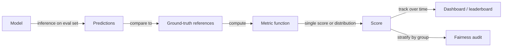

# Evaluation metrics

## Definition

Evaluation metrics are the quantitative tools that tell you how well a model performs on a given task — and whether it is improving, regressing, or meeting the bar required for deployment. The choice of metric directly shapes what you optimize for during training and what you report when comparing models. Using the wrong metric can create blind spots: a model with 99% accuracy on a class-imbalanced dataset may perform worse than a random baseline on the minority class; a high BLEU score does not guarantee that a translation is fluent or faithful.

Metrics vary by task family. For **classification**, the workhorse metrics are accuracy, precision, recall, F1, and AUC-ROC — each capturing a different tradeoff between false positives and false negatives. For **generation** tasks (translation, summarization, text generation), n-gram overlap metrics like BLEU and ROUGE measure surface-level similarity to reference outputs; BERTScore and learned metrics (e.g., FActScore) assess semantic fidelity. For **retrieval**, precision@k, recall@k, and MRR (Mean Reciprocal Rank) measure how well a system surfaces relevant documents. For **LLMs** evaluated on open-ended generation, automated metrics are often insufficient — human preference ratings (collected through pairwise comparisons) remain the gold standard for quality, tone, and helpfulness.

Evaluation connects directly to [benchmarks](/docs/benchmarks) — standardized datasets and protocols that enable reproducible comparison across models — and to [bias in AI](/docs/bias-in-ai), where fairness metrics stratify standard metrics by demographic group to detect disparate performance. In production, evaluation does not end at model launch: A/B tests, monitoring dashboards, and periodic audits track metric drift and detect regressions or distribution shift over time.

## How it works

### Metric computation



### Classification metrics in depth

For binary classification, the confusion matrix (TP, TN, FP, FN) is the foundation. **Precision** = TP / (TP + FP) — when the model says positive, how often is it right? **Recall** = TP / (TP + FN) — of all actual positives, how many did the model catch? **F1** is their harmonic mean, balancing both. **AUC-ROC** measures the model's ranking ability across all thresholds, invariant to class imbalance. For multi-class problems, macro-averaging treats all classes equally; micro-averaging weights by class frequency.

### Generation metrics in depth

BLEU counts n-gram overlaps between a model output and one or more references, penalizing outputs shorter than the reference (brevity penalty). ROUGE-L measures the longest common subsequence. Both are fast and deterministic but reward surface overlap, not semantic correctness. **BERTScore** uses pretrained embeddings to compare meaning. **Human evaluation** (crowdsourced pairwise comparisons or expert ratings on dimensions like fluency, factuality, and helpfulness) provides the most reliable signal for open-ended generation but is slow and expensive.

## When to use / When NOT to use

| Use when | Avoid when |
|----------|------------|
| Training or comparing models where a clear ground truth exists | No reliable ground truth is available and human judgment is needed instead |
| Tracking quality over time in production monitoring | A single aggregate metric would hide important subgroup failures |
| Auditing for fairness or safety by stratifying metrics across groups | The metric doesn't match the product goal (e.g. optimizing BLEU when users care about fluency) |
| Running automated [benchmark](/docs/benchmarks) evaluations for reproducible comparison | The task is so open-ended that automated metrics correlate poorly with human judgment |

## Comparisons

| Task | Common metrics | When human eval is needed |
|------|---------------|--------------------------|
| Binary classification | Accuracy, F1, AUC-ROC | Rarely — metrics are well-defined |
| Multi-label classification | Micro/macro F1, subset accuracy | When label taxonomy is ambiguous |
| Translation / summarization | BLEU, ROUGE, BERTScore | When fluency or factuality matters critically |
| Retrieval / RAG | Recall@k, MRR, NDCG | When relevance is subjective |
| Open-ended LLM generation | LLM-as-judge, human preference | Almost always for quality assessment |

## Pros and cons

| Pros | Cons |
|------|------|
| Automated metrics enable fast, cheap, reproducible evaluation | May not correlate with real user satisfaction or product goals |
| Enable systematic comparison across model versions and runs | A single metric can mask failures on important subgroups |
| Fairness metrics surface disparate performance before deployment | Gaming a metric is easier than improving the underlying quality |
| Production metrics catch drift and regressions in deployed systems | Human evaluation is expensive and hard to scale |

## Code examples

### Classification metrics with scikit-learn (Python)

```python
from sklearn.metrics import (
    classification_report,
    roc_auc_score,
    confusion_matrix,
)
import numpy as np

# Simulated predictions
np.random.seed(0)
y_true = np.random.randint(0, 2, size=200)
y_pred = np.where(np.random.rand(200) > 0.3, y_true, 1 - y_true)  # ~70% accurate
y_prob = np.clip(y_pred + np.random.randn(200) * 0.2, 0, 1)

print("Classification report:")
print(classification_report(y_true, y_pred, target_names=["negative", "positive"]))

print(f"AUC-ROC: {roc_auc_score(y_true, y_prob):.4f}")
print(f"Confusion matrix:\n{confusion_matrix(y_true, y_pred)}")
```

## Practical resources

- [Hugging Face – Evaluate library](https://huggingface.co/docs/evaluate/) — Unified library for 50+ metrics with consistent API
- [Papers with Code – Metrics](https://paperswithcode.com/task/image-classification) — Metric definitions tied to benchmark results
- [BERTScore paper (Zhang et al., 2019)](https://arxiv.org/abs/1904.09675) — Embedding-based generation evaluation
- [BLEU: a Method for Automatic Evaluation of Machine Translation](https://aclanthology.org/P02-1040/) — Original BLEU paper
- [Evaluation of Large Language Models (survey)](https://arxiv.org/abs/2307.03109) — Comprehensive overview of LLM evaluation approaches

## See also

- [Benchmarks](/docs/benchmarks)
- [Bias in AI](/docs/bias-in-ai)
