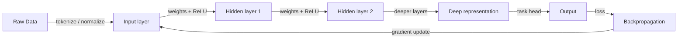

# Deep learning

## Definition

Deep learning uses neural networks with many layers to learn hierarchical representations from data. It has driven progress in vision, language, and other domains by scaling data and compute.

It extends [machine learning](/docs/fundamentals/machine-learning) by using differentiable, layered models (see [neural networks](/docs/neural-networks)) that learn features automatically instead of hand-crafted ones. Depth allows the model to build increasingly abstract representations (e.g. edges -> textures -> parts -> objects in vision).

The defining characteristic of deep learning is **end-to-end learning**: raw inputs (pixels, tokens, audio samples) are transformed through successive non-linear layers, and the entire pipeline is optimized jointly by gradient descent. This removes the need for domain-specific feature engineering that traditional ML relies on. The tradeoff is that deep models need substantially more data and compute — GPUs, TPUs, and large memory — and are harder to interpret than classical models.

## How it works



### Forward pass

**Data** is fed into the input layer. Each layer applies a linear transformation (matrix multiply + bias) followed by a nonlinearity (e.g. ReLU). Stacking layers produces progressively more abstract **representations**. The final layer maps to the task output (class scores, regression value, or token logits).

### Backward pass and optimization

The **loss** (e.g. cross-entropy for classification) is computed between predictions and targets. **Backpropagation** uses the chain rule to compute gradients of the loss with respect to every weight in the network. An optimizer (SGD, Adam) then updates the weights in the direction that reduces loss.

### Architectures

Architecture choice tailors connectivity to data type: [CNNs](/docs/neural-networks/cnn) exploit spatial locality for images; [RNNs](/docs/neural-networks/rnn) handle variable-length sequences; [Transformers](/docs/transformers) use global self-attention and now dominate both vision and language tasks at scale.

## When to use / When NOT to use

| Scenario | Use deep learning? | Notes |
|---|---|---|
| Large-scale image or video recognition | Yes | CNNs are the standard backbone |
| Text understanding or generation | Yes | Transformers set state-of-the-art across NLP |
| Small structured/tabular dataset | No | Gradient boosting typically outperforms |
| Need full model interpretability | No | Deep models are largely black boxes |
| Limited compute / edge deployment | With caution | Use quantization or distilled models |
| Speech and audio recognition | Yes | Deep models outperform classical signal processing |

## Comparisons

| Aspect | Classical ML | Deep Learning |
|---|---|---|
| Feature engineering | Manual | Automatic (end-to-end) |
| Data requirements | Low to medium | High |
| Compute requirements | Low | High (GPU/TPU) |
| Interpretability | High (e.g. trees) | Low |
| Performance on unstructured data | Moderate | Very high |

## Pros and cons

| Pros | Cons |
|---|---|
| Automatic feature learning | Data hungry |
| State-of-the-art on vision and language | Requires GPU/TPU |
| End-to-end optimization | Hard to interpret |
| Transfer learning reduces data needs | Long training times |

## Code examples

```python
# Feedforward network with PyTorch for image classification (MNIST)
import torch
import torch.nn as nn
import torch.optim as optim
from torchvision import datasets, transforms
from torch.utils.data import DataLoader

# Data loaders
transform = transforms.Compose([
    transforms.ToTensor(),
    transforms.Normalize((0.5,), (0.5,))
])
train_loader = DataLoader(
    datasets.MNIST('.', train=True, download=True, transform=transform),
    batch_size=64, shuffle=True
)
test_loader = DataLoader(
    datasets.MNIST('.', train=False, download=True, transform=transform),
    batch_size=1000
)

# Model definition
class MLP(nn.Module):
    def __init__(self):
        super().__init__()
        self.net = nn.Sequential(
            nn.Flatten(),
            nn.Linear(28 * 28, 256), nn.ReLU(),
            nn.Linear(256, 128),     nn.ReLU(),
            nn.Linear(128, 10),
        )

    def forward(self, x):
        return self.net(x)

device  = "cuda" if torch.cuda.is_available() else "cpu"
model   = MLP().to(device)
opt     = optim.Adam(model.parameters(), lr=1e-3)
loss_fn = nn.CrossEntropyLoss()

# Training
for epoch in range(3):
    model.train()
    for X, y in train_loader:
        X, y = X.to(device), y.to(device)
        opt.zero_grad()
        loss_fn(model(X), y).backward()
        opt.step()

# Evaluation
model.train(False)
correct = sum(
    (model(X.to(device)).argmax(1) == y.to(device)).sum().item()
    for X, y in test_loader
)
print(f"Test accuracy: {correct / len(test_loader.dataset):.2%}")
```

## Practical resources

- [Deep Learning (Goodfellow et al.)](https://www.deeplearningbook.org/) — Free online textbook covering theory in depth
- [PyTorch – Introduction](https://pytorch.org/tutorials/beginner/deep_learning_60min_blitz.html) — Hands-on 60-minute deep learning tutorial
- [fast.ai – Practical Deep Learning](https://course.fast.ai/) — Top-down course with real-world projects and code

## See also

- [Neural networks](/docs/neural-networks)
- [Transformers](/docs/transformers)
- [Frameworks (PyTorch, TensorFlow)](/docs/frameworks/pytorch)
