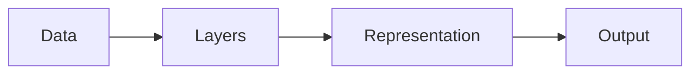

# Deep learning

## Definition

Deep learning uses neural networks with many layers to learn hierarchical representations from data. It has driven progress in vision, language, and other domains by scaling data and compute.

It extends [machine learning](/docs/fundamentals/machine-learning) by using differentiable, layered models (see [neural networks](/docs/neural-networks)) that learn features automatically instead of hand-crafted ones. Depth allows the model to build increasingly abstract representations (e.g. edges → textures → parts → objects in vision).

## How it works

**Data** is fed into the first **layer**; each layer applies a linear transformation followed by a nonlinearity (e.g. ReLU). Stacking layers produces a **representation** (embedding) that becomes more abstract in deeper layers. The final layer maps to the **output** (e.g. class scores or tokens). Training uses **backpropagation** to compute gradients and **gradient descent** to update weights. Architectures (CNNs for images, RNNs for sequences, [Transformers](/docs/transformers) for both) tailor the connectivity and operations to the data and task.

## Use cases

Deep learning is the default for perception and generation when data is abundant and tasks are complex.

- Image recognition, object detection, and segmentation (vision)
- Speech recognition, machine translation, and text generation (language)
- Game playing, robotics control, and simulation (reinforcement learning)

## External documentation

- [Deep Learning (Goodfellow et al.)](https://www.deeplearningbook.org/) — Free online book
- [PyTorch – Introduction](https://pytorch.org/tutorials/beginner/deep_learning_60min_blitz.html) — Hands-on deep learning

## See also

- [Neural networks](/docs/neural-networks)
- [Transformers](/docs/transformers)
- [Frameworks (PyTorch, TensorFlow)](/docs/frameworks/pytorch)
