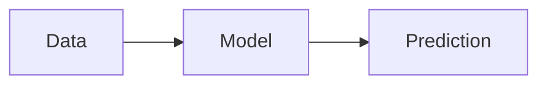

# AI fundamentals

## Definition

AI fundamentals cover the core ideas behind artificial intelligence: what we mean by learning, representation, and generalization. This includes supervised and unsupervised learning, optimization, and the relationship between data, models, and objectives.

These ideas underpin both classical [machine learning](/docs/fundamentals/machine-learning) and [deep learning](/docs/fundamentals/deep-learning). Understanding them helps you choose the right paradigm, interpret results, and reason about limits (e.g. data requirements, bias, robustness).

## How it works

In practice, **data** is collected or labeled; a **model** (e.g. a function or network) is chosen; and an objective (loss or reward) is optimized so the model fits the data. The result is a **prediction** (or action) on new inputs. The pipeline relies on mathematical foundations — probability, linear algebra, optimization — and evaluation on held-out data to ensure generalization rather than memorization.

## Use cases

Core ML ideas apply wherever you have data and a well-defined prediction or optimization goal.

- Building classifiers (e.g. spam detection, sentiment analysis) from labeled data
- Learning representations for recommendation systems or search
- Framing decision-making as prediction or optimization (e.g. forecasting, control)

## External documentation

- [Google ML crash course](https://developers.google.com/machine-learning/crash-course) — Introduction to ML concepts
- [MIT 6.S191 – Introduction to Deep Learning](http://introtodeeplearning.com/) — Lectures and materials

## See also

- [Machine learning](/docs/fundamentals/machine-learning)
- [Deep learning](/docs/fundamentals/deep-learning)
- [Neural networks](/docs/neural-networks)
