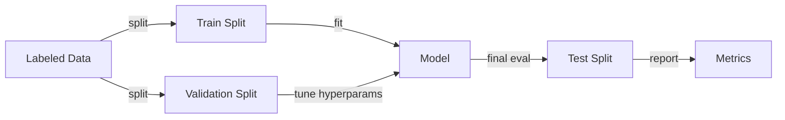

# Machine learning

## Definition

Machine learning (ML) is the study of algorithms that improve with experience (data). Key paradigms include **supervised learning** (learning from labeled examples), **unsupervised learning** (finding structure without labels), and **reinforcement learning** (learning from rewards).

ML is preferred over hand-coded rules when the problem is too complex to specify explicitly or when data is abundant. It sits between classical AI (symbolic rules) and [deep learning](/docs/fundamentals/deep-learning) (large neural networks); many real-world systems combine ML models with pipelines and business logic.

The power of ML comes from its ability to generalize: a model trained on a subset of examples can make accurate predictions on new, unseen data. This generalization is only possible when the training distribution is representative of the real world, the model is appropriately regularized to avoid memorizing noise, and evaluation is performed rigorously on held-out data. Understanding the bias-variance tradeoff, cross-validation, and proper feature engineering are therefore as important as algorithm choice.

## How it works



### Training

You choose a representation (e.g. linear model, tree, or neural network) and an objective (loss for supervised/unsupervised, reward for RL). An optimizer (e.g. gradient descent, or a tree-fitting algorithm) updates the model parameters to minimize the loss on training data.

### Validation and hyperparameter tuning

After initial training, performance is measured on the **validation** set. Hyperparameters (learning rate, tree depth, regularization strength) are adjusted based on validation results. Cross-validation provides more reliable estimates when data is limited.

### Test evaluation

The **test split** is touched only once, at the end, to give an unbiased estimate of generalization. Metrics such as accuracy, F1, AUC, or RMSE are reported based on task type. The trained **model** is deployed for inference on new inputs.

## When to use / When NOT to use

| Scenario | Use ML? | Notes |
|---|---|---|
| Structured/tabular data with clear target | Yes | Decision trees, gradient boosting, linear models excel here |
| Complex unstructured data (images, raw text) | Use deep learning | Classical ML needs hand-crafted features |
| Very small dataset (< 100 examples) | With caution | Prefer simple models and cross-validation |
| Need model interpretability (e.g. regulations) | Yes | Linear models and decision trees are auditable |
| Rules can be fully specified by domain experts | No | Rule-based systems are more predictable |
| Reward-based interactive task (games, control) | Use RL | Supervised ML requires labeled pairs |

## Comparisons

| Paradigm | Labels required | Data type | Typical algorithms | Example task |
|---|---|---|---|---|
| Supervised learning | Yes | Any | Logistic regression, SVM, XGBoost, neural net | Spam detection, image classification |
| Unsupervised learning | No | Any | K-means, DBSCAN, PCA, autoencoders | Customer segmentation, anomaly detection |
| Reinforcement learning | No (uses rewards) | Sequential/interactive | Q-learning, PPO, SAC | Game playing, robotic control |

## Pros and cons

| Pros | Cons |
|---|---|
| Generalizes from examples without explicit rules | Requires quality labeled data |
| Scales well with more data | Brittle outside training distribution |
| Large library of interpretable algorithms (sklearn) | Feature engineering is still often needed |
| Efficient inference once trained | Can encode biases present in data |

## Code examples

```python
# Supervised learning with scikit-learn: gradient boosting on tabular data
from sklearn.datasets import load_breast_cancer
from sklearn.model_selection import train_test_split, cross_val_score
from sklearn.ensemble import GradientBoostingClassifier
from sklearn.preprocessing import StandardScaler
from sklearn.metrics import classification_report
import numpy as np

# Load dataset
X, y = load_breast_cancer(return_X_y=True)
X_train, X_test, y_train, y_test = train_test_split(
    X, y, test_size=0.2, random_state=42, stratify=y
)

# Scale features
scaler = StandardScaler()
X_train_sc = scaler.fit_transform(X_train)
X_test_sc = scaler.transform(X_test)

# Train gradient boosting classifier
clf = GradientBoostingClassifier(n_estimators=100, learning_rate=0.1, max_depth=3)
clf.fit(X_train_sc, y_train)

# Cross-validation estimate
cv_scores = cross_val_score(clf, X_train_sc, y_train, cv=5)
print(f"CV accuracy: {np.mean(cv_scores):.2%} ± {np.std(cv_scores):.2%}")

# Final evaluation on held-out test set
print(classification_report(y_test, clf.predict(X_test_sc)))
```

## Practical resources

- [Google ML crash course](https://developers.google.com/machine-learning/crash-course) — Interactive introduction to ML concepts with codelabs
- [Scikit-learn – User guide](https://scikit-learn.org/stable/user_guide.html) — Comprehensive guide to classical ML in practice
- [Hands-On Machine Learning (Géron)](https://www.oreilly.com/library/view/hands-on-machine-learning/9781098125967/) — Practical book covering both classical ML and deep learning

## See also

- [Deep learning](/docs/fundamentals/deep-learning)
- [Reinforcement learning](/docs/rl)
- [Evaluation metrics](/docs/evaluation-metrics)
