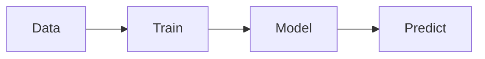

# Machine learning

## Definition

Machine learning (ML) is the study of algorithms that improve with experience (data). Key paradigms include **supervised learning** (learning from labeled examples), **unsupervised learning** (finding structure without labels), and **reinforcement learning** (learning from rewards).

ML is preferred over hand-coded rules when the problem is too complex to specify explicitly or when data is abundant. It sits between classical AI (symbolic rules) and [deep learning](/docs/fundamentals/deep-learning) (large neural networks); many real-world systems combine ML models with pipelines and business logic.

## How it works

**Train:** You choose a representation (e.g. linear model, tree, or neural network) and an objective (loss for supervised/unsupervised, reward for RL). An optimizer (e.g. gradient descent) updates the model parameters to minimize the loss or maximize the reward on the training data. **Model:** The result is a fitted model (weights, structure) that captures patterns in the data. **Predict:** At inference time, you feed new inputs into the model to get outputs (labels, scores, or actions). Evaluation uses train/validation/test splits to estimate generalization and avoid overfitting.

## Use cases

Classical ML shines when you have structured or tabular data and clear labels or targets.

- Spam classification, fraud detection, and other supervised classification tasks
- Recommendation systems and collaborative filtering
- Forecasting and time-series prediction

## External documentation

- [Google ML crash course](https://developers.google.com/machine-learning/crash-course)
- [Scikit-learn – User guide](https://scikit-learn.org/stable/user_guide.html) — Classical ML in practice

## See also

- [Deep learning](/docs/fundamentals/deep-learning)
- [Reinforcement learning](/docs/rl)
- [Evaluation metrics](/docs/evaluation-metrics)
