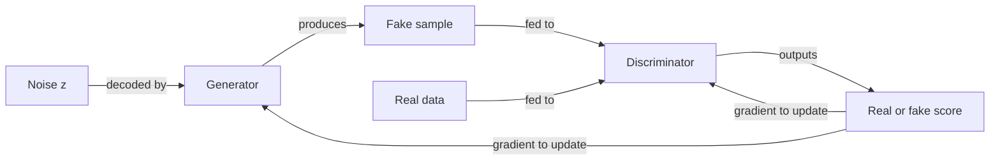

# Generative adversarial networks (GANs)

## Definition

Generative Adversarial Networks (GANs), introduced by Goodfellow et al. in 2014, train two neural networks in competition: a **generator** that produces synthetic samples from random noise, and a **discriminator** that tries to distinguish generated samples from real ones. This adversarial dynamic drives the generator to produce increasingly realistic outputs without requiring an explicit likelihood function or a predefined noise schedule.

The training objective is a min-max game: the generator minimizes the discriminator's ability to identify fakes while the discriminator maximizes its classification accuracy. At equilibrium (Nash equilibrium), the generator's outputs become indistinguishable from real data. In practice, achieving this equilibrium is difficult — training is prone to **mode collapse** (generator produces limited variety) and **discriminator/generator imbalance** (one side dominates too early).

GANs were the dominant generative approach before [diffusion models](/docs/diffusion-models) and remain relevant for style transfer, domain adaptation, and data augmentation. Compared to [VAEs](/docs/vaes), GANs typically produce sharper images at the cost of training instability and limited diversity. Architectural improvements (DCGAN, StyleGAN, BigGAN) and training techniques (spectral normalization, Wasserstein loss, progressive growing) have significantly improved stability and output quality.

## How it works

### Generator

Takes a random **noise vector z** (sampled from a Gaussian or uniform distribution) and maps it through a neural network (typically transposed convolutions for images) to produce a **fake sample** — e.g., an image.

### Discriminator

Receives either a **real sample** from the training data or a **fake sample** from the generator. It outputs a scalar score (real or fake probability). Its loss is a binary cross-entropy between predicted and true labels.

### Training loop



Training alternates: (1) update the discriminator to better distinguish real from fake, then (2) update the generator to better fool the discriminator. The generator never sees real data directly — it only receives gradient signal from the discriminator.

### Key variants

| Variant | Key innovation |
|---|---|
| DCGAN | Convolutional architecture for image generation |
| WGAN | Wasserstein distance loss for more stable training |
| StyleGAN | Style-based generator for high-quality faces |
| CycleGAN | Unpaired image-to-image translation |
| Conditional GAN | Condition generation on a class label or attribute |

## When to use / When NOT to use

| Scenario | Use GANs | Avoid GANs |
|---|---|---|
| Sharp, photorealistic image generation | Yes — GANs produce crisp, high-frequency details | No — if training stability is a priority, use diffusion |
| Style transfer and domain adaptation | Yes — CycleGAN excels at unpaired image translation | No — if you need diversity and coverage, diffusion is better |
| Data augmentation for rare classes | Yes — GANs can generate targeted synthetic samples | No — if mode collapse is a risk with limited data |
| Stable, reproducible training pipeline | No — GAN training is notoriously finicky | — |
| Density estimation or likelihood evaluation | No — GANs don't provide explicit likelihoods | — |

## Comparisons

| Model | Training | Sample quality | Diversity | Stability |
|---|---|---|---|---|
| GAN | Adversarial min-max | Sharp, high-res | Prone to mode collapse | Difficult |
| VAE | ELBO (reconstruction + KL) | Blurry, smooth | Good coverage | Stable |
| Diffusion | Denoising score matching | Very sharp, diverse | Excellent | Stable |
| Flow-based | Exact likelihood | Sharp | Good | Stable |

## Pros and cons

| Pros | Cons |
|---|---|
| Produces sharp, high-frequency image details | Mode collapse — generator may ignore parts of the data distribution |
| No explicit likelihood required | Discriminator/generator balance is hard to maintain |
| Highly flexible — many variants for different tasks | Evaluation is difficult; FID/IS are imperfect proxies |
| Fast inference (single forward pass) | Training is unstable; sensitive to hyperparameters |

## Code examples

Minimal DCGAN training on MNIST using PyTorch:

```python
import torch
import torch.nn as nn
from torchvision import datasets, transforms
from torch.utils.data import DataLoader

# Generator: noise → 28x28 image
class Generator(nn.Module):
    def __init__(self, latent_dim=100):
        super().__init__()
        self.net = nn.Sequential(
            nn.Linear(latent_dim, 256), nn.ReLU(),
            nn.Linear(256, 512), nn.ReLU(),
            nn.Linear(512, 28 * 28), nn.Tanh(),
        )
    def forward(self, z):
        return self.net(z).view(-1, 1, 28, 28)

# Discriminator: image → real/fake score
class Discriminator(nn.Module):
    def __init__(self):
        super().__init__()
        self.net = nn.Sequential(
            nn.Flatten(),
            nn.Linear(28 * 28, 512), nn.LeakyReLU(0.2),
            nn.Linear(512, 256), nn.LeakyReLU(0.2),
            nn.Linear(256, 1), nn.Sigmoid(),
        )
    def forward(self, x):
        return self.net(x)

latent_dim = 100
G, D = Generator(latent_dim), Discriminator()
opt_G = torch.optim.Adam(G.parameters(), lr=2e-4, betas=(0.5, 0.999))
opt_D = torch.optim.Adam(D.parameters(), lr=2e-4, betas=(0.5, 0.999))
bce = nn.BCELoss()

loader = DataLoader(
    datasets.MNIST(".", download=True, transform=transforms.ToTensor()),
    batch_size=128, shuffle=True
)

for epoch in range(5):
    for real, _ in loader:
        batch = real.size(0)
        real = real * 2 - 1  # Scale to [-1, 1]

        # --- Train discriminator ---
        z = torch.randn(batch, latent_dim)
        fake = G(z).detach()
        loss_D = bce(D(real), torch.ones(batch, 1)) + bce(D(fake), torch.zeros(batch, 1))
        opt_D.zero_grad(); loss_D.backward(); opt_D.step()

        # --- Train generator ---
        z = torch.randn(batch, latent_dim)
        loss_G = bce(D(G(z)), torch.ones(batch, 1))
        opt_G.zero_grad(); loss_G.backward(); opt_G.step()

    print(f"Epoch {epoch+1} | D loss: {loss_D.item():.3f} | G loss: {loss_G.item():.3f}")
```

## Practical resources

- [Generative Adversarial Networks (Goodfellow et al., 2014)](https://arxiv.org/abs/1406.2661) — Original GAN paper introducing the min-max framework
- [PyTorch – DCGAN tutorial](https://pytorch.org/tutorials/beginner/dcgan_faces_tutorial.html) — Official tutorial with convolutional GAN on CelebA
- [StyleGAN2 (Karras et al.)](https://arxiv.org/abs/1912.04958) — State-of-the-art architecture for high-resolution face synthesis
- [GAN Lab (interactive visualization)](https://poloclub.github.io/ganlab/) — Browser-based visualization of GAN training dynamics

## See also

- [Diffusion models](/docs/diffusion-models)
- [VAEs](/docs/vaes)
