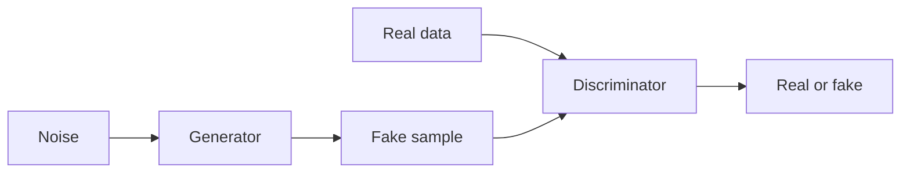

# Generative adversarial networks (GANs)

## Definition

GANs train a generator and a discriminator in a game: the generator produces samples; the discriminator tries to distinguish them from real data. Training pushes the generator toward realistic outputs.

They were the dominant generative approach before [diffusion models](/docs/diffusion-models). Compared to [VAEs](/docs/vaes), GANs often produce sharper images but training can be unstable (mode collapse, discriminator/generator balance). Still used for style transfer, data augmentation, and some image editing.

## How it works

**Generator:** Takes **noise** (random vector) and outputs a **fake sample** (e.g. image). **Discriminator:** Receives **real data** and **fake sample**, outputs **real or fake** (or a score). Training is a **min-max game**: the generator tries to maximize the discriminator’s loss (fool it), the discriminator tries to minimize it (tell real from fake). In practice you alternate gradient steps. Variants (DCGAN, StyleGAN, etc.) use better architectures and training tricks (e.g. spectral norm, progressive growing) for stability and quality.

## Use cases

GANs are used for generative and discriminative tasks when you want adversarial training and sharp samples (images, audio, data aug).

- Image generation and editing (e.g. StyleGAN, face synthesis)
- Data augmentation and synthetic data for training
- Domain adaptation and style transfer

## External documentation

- [Generative Adversarial Networks (Goodfellow et al.)](https://arxiv.org/abs/1406.2661)
- [PyTorch – DCGAN tutorial](https://pytorch.org/tutorials/beginner/dcgan_faces_tutorial.html)

## See also

- [Diffusion models](/docs/diffusion-models)
- [VAEs](/docs/vaes)
