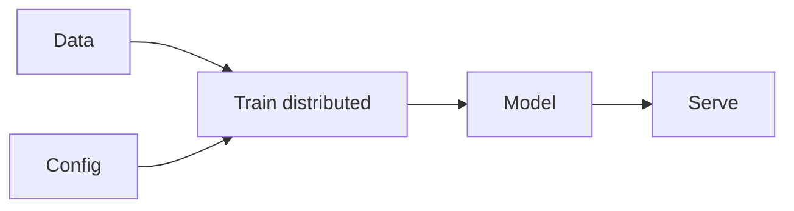

# Infrastructure

## Definition

AI infrastructure covers hardware (GPUs, TPUs, custom accelerators) and software (distributed training, serving, orchestration) for training and deploying large models.

Scale is driven by [LLMs](/docs/llms) and large vision models; training may use thousands of GPUs; serving uses [model compression](/docs/model-compression) (e.g. [quantization](/docs/quantization)) and batching to meet latency and cost. [Frameworks](/docs/frameworks/pytorch) (PyTorch, JAX, TensorFlow) provide the programming model; clouds and on-prem clusters provide the hardware and orchestration.

## How it works

**Data** and **config** (model, hyperparameters) feed into **train**: distributed training runs across many devices using data parallelism (replicate model, split data) and/or model parallelism (split model across devices). Frameworks (PyTorch, JAX) and orchestrators (SLURM, Kubernetes, cloud jobs) manage scheduling and communication. The trained **model** is then **served**: loaded on inference hardware, optionally [quantized](/docs/quantization), and exposed via an API. Serving uses batching, replication, and load balancing to meet throughput and latency; monitoring and versioning are part of the pipeline.

## Use cases

ML infrastructure covers training at scale and serving with the right latency, throughput, and reliability.

- Distributed training of large models across GPU/TPU clusters
- Serving models at scale with batching and replication
- End-to-end ML pipelines from data to deployment

## External documentation

- [PyTorch – Distributed training](https://pytorch.org/tutorials/beginner/distributed_overview.html)
- [Google Cloud – GPU and TPU](https://cloud.google.com/ai-platform/docs/get-started-with-tpu)

## See also

- [Local inference](/docs/local-inference)
- [Edge reasoning](/docs/edge-reasoning)
- [Model compression](/docs/model-compression)
- [Quantization](/docs/quantization)
- [Frameworks](/docs/frameworks/pytorch)
