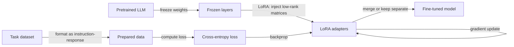

# Fine-tuning

## Definition

Fine-tuning continues training a pretrained model on task-specific or domain data. Full fine-tuning updates all parameters; parameter-efficient methods (e.g. LoRA, adapters) update a small subset to reduce cost.

Use it when you need stable, task-specific behavior or style (e.g. domain language, output format) and have enough labeled data. For frequently updated knowledge or one-off questions, [RAG](/docs/rag) or [prompt engineering](/docs/prompt-engineering) are often better. See [LLMs](/docs/llms) for the full training pipeline.

Parameter-efficient fine-tuning (PEFT) methods, especially **LoRA** (Low-Rank Adaptation), have made fine-tuning practical on consumer hardware. LoRA freezes the original model weights and injects trainable low-rank matrices into the attention projections; only these small matrices are updated and stored. The original model can be shared across many LoRA adapters, each specializing for a different task or domain. Quantized LoRA (QLoRA) combines 4-bit quantization with LoRA, enabling fine-tuning of 7B–70B models on a single consumer GPU. This dramatically lowers the barrier to domain adaptation compared to full fine-tuning.

## How it works



### Starting from a base model

You start from a **base model** (e.g. a pretrained [LLM](/docs/llms)) and a **dataset** of task examples. The dataset is formatted as instruction-response pairs (for instruction tuning) or as raw domain text (for continued pretraining).

### LoRA: low-rank adaptation

Instead of updating all parameters, LoRA adds trainable matrices A and B (where rank r << d) to weight matrices. Only A and B are trained; the original weights are frozen. This reduces trainable parameters by 99%+ while achieving near-full fine-tuning quality. Adapters can be merged into the base model at inference time for zero overhead.

### Validation and stopping

**Validation loss** on a held-out split guides early stopping. Overfitting is common with small datasets; techniques like gradient clipping, small learning rates (1e-4 to 1e-5), and short training (1–3 epochs) are standard practice.

## When to use / When NOT to use

| Scenario | Use fine-tuning? | Notes |
|---|---|---|
| Domain adaptation (legal, medical, code) | Yes | Few hundred examples can shift model behavior significantly |
| Consistent output format (JSON, tables) | Yes | More reliable than prompting alone |
| Frequently changing knowledge | No | RAG is cheaper and more up-to-date |
| One-off question answering | No | Few-shot prompting is sufficient |
| Reduce hallucination on known facts | Partially | Combine with RAG for best results |
| Budget constrained (< $50) | Yes (LoRA) | QLoRA makes it feasible on consumer hardware |

## Comparisons

| Method | Updates | Cost | Quality | When to use |
|---|---|---|---|---|
| Zero-shot prompting | None | Lowest | Baseline | General tasks |
| Few-shot prompting | None | Low | Good | Format guidance |
| Full fine-tuning | All params | Very high | Best | Large data, max performance |
| LoRA fine-tuning | ~0.1–1% params | Low to moderate | Near-full | Practical domain adaptation |
| RAG | None | Moderate (retrieval) | Good for knowledge | Live or large knowledge bases |

## Pros and cons

| Pros | Cons |
|---|---|
| Strong task-specific performance | Requires curated labeled data |
| LoRA/QLoRA is cheap and accessible | Risk of catastrophic forgetting |
| Baked-in behavior (no prompt engineering overhead) | Fine-tuned models can still hallucinate |
| Portable adapter files (MB not GB) | Eval is harder than prompting |

## Code examples

```python
# LoRA fine-tuning with Hugging Face PEFT and TRL (SFTTrainer)
# pip install transformers peft trl datasets bitsandbytes accelerate
from transformers import AutoTokenizer, AutoModelForCausalLM, BitsAndBytesConfig
from peft import LoraConfig, get_peft_model, TaskType
from trl import SFTTrainer, SFTConfig
from datasets import Dataset

# Small toy dataset — replace with your domain data
data = [
    {"text": "<|user|>What is LoRA?<|assistant|>LoRA is a parameter-efficient fine-tuning technique that injects trainable low-rank matrices into frozen model weights."},
    {"text": "<|user|>Why use LoRA?<|assistant|>LoRA reduces trainable parameters by 99%+ while achieving near-full fine-tuning quality, making it feasible on consumer GPUs."},
]
dataset = Dataset.from_list(data)

model_name = "facebook/opt-125m"  # tiny model for illustration; swap for llama-3, mistral, etc.
tokenizer  = AutoTokenizer.from_pretrained(model_name)
tokenizer.pad_token = tokenizer.eos_token

# Load model (add BitsAndBytesConfig for 4-bit QLoRA on larger models)
model = AutoModelForCausalLM.from_pretrained(model_name)

# LoRA configuration
lora_config = LoraConfig(
    task_type=TaskType.CAUSAL_LM,
    r=8,            # rank
    lora_alpha=32,
    target_modules=["q_proj", "v_proj"],
    lora_dropout=0.05,
)
model = get_peft_model(model, lora_config)
model.print_trainable_parameters()   # prints e.g. "trainable params: 0.05%"

# Train
training_args = SFTConfig(
    output_dir="./lora-output",
    num_train_epochs=3,
    per_device_train_batch_size=1,
    logging_steps=1,
    save_strategy="no",
    dataset_text_field="text",
    max_seq_length=128,
)
trainer = SFTTrainer(model=model, train_dataset=dataset, args=training_args)
trainer.train()
print("Fine-tuning complete.")
```

## Practical resources

- [Hugging Face – Fine-tune a pretrained model](https://huggingface.co/docs/transformers/training) — Comprehensive guide with Trainer API
- [OpenAI – Fine-tuning](https://platform.openai.com/docs/guides/fine-tuning) — API-based fine-tuning for GPT models
- [PEFT library docs](https://huggingface.co/docs/peft) — LoRA, adapters, and other PEFT methods

## See also

- [LLMs](/docs/llms)
- [Prompt engineering](/docs/prompt-engineering)
