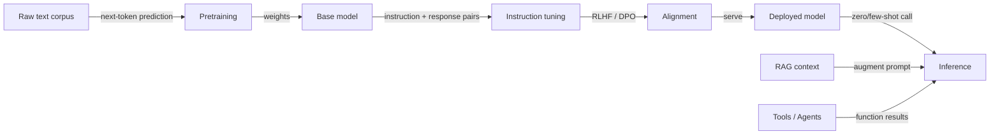

# Large language models (LLMs)

## Definition

Large language models are transformer-based models trained on massive text (and sometimes multimodal) data. They exhibit emergent abilities: few-shot learning, reasoning, and tool use when scaled and aligned (e.g. via RLHF).

A useful mental model: **pretraining** learns next-token prediction on huge corpora and gives the model broad knowledge and language ability. **Instruction tuning** (and similar) trains the model to follow user instructions and formats. **Alignment** (e.g. RLHF, DPO) shapes behavior to be helpful, honest, and safe. At inference time you can use the model zero-shot, few-shot, or augment it with retrieval (RAG) or tools (agents).

"Emergent abilities" is the key distinguishing property of LLMs: capabilities that are not explicitly trained but arise from scale. Chain-of-thought reasoning, multi-step arithmetic, code synthesis, and in-context learning from a handful of examples all appear above certain model sizes and data volumes. This makes LLMs fundamentally different from narrowly-trained task models — a single LLM can replace dozens of specialized classifiers through careful [prompt engineering](/docs/prompt-engineering), [fine-tuning](/docs/llms/fine-tuning), or [RAG](/docs/rag). The practical consequence is that LLM-powered applications require a different evaluation discipline: beyond accuracy, you must test for hallucination, refusal behavior, toxicity, and robustness to distribution shift.

## How it works



### Pretraining

The **base model** is trained on trillions of tokens using next-token prediction (cross-entropy loss). This phase is compute-intensive (thousands of GPU-days) and produces a model with broad world knowledge and language fluency.

### Instruction tuning and alignment

**Instruction tuning** uses (instruction, response) pairs so the model learns to follow prompts reliably. **Alignment** (RLHF, DPO, Constitutional AI) uses human feedback or AI-generated signals to reward helpful, honest, and safe responses and penalize harmful ones.

### Inference augmentation

At inference time, the deployed model can be called zero-shot, few-shot, or augmented. **RAG** injects retrieved documents into the prompt context. **Agents** give the model access to external tools (search, code execution, APIs) and loop until a task is complete.

## When to use / When NOT to use

| Scenario | Use LLM? | Notes |
|---|---|---|
| Natural language tasks (summarization, QA, chat) | Yes | LLMs are the default choice |
| Structured prediction (e.g. filling a SQL table) | With caution | Fine-tuned or prompted LLMs work; validate outputs |
| Strict determinism required (e.g. billing logic) | No | Use deterministic code; LLMs are probabilistic |
| Frequently updated knowledge base | Use RAG | Fine-tuning is expensive for fast-changing data |
| Narrow task with abundant labeled data | With caution | A smaller fine-tuned model may be cheaper and faster |
| Low-latency, high-throughput production | With caution | Profile cost per token; distilled models may suffice |

## Comparisons

| Approach | Best for | Data needed | Cost |
|---|---|---|---|
| Zero-shot prompting | Quick prototyping, general tasks | None | Low (API calls) |
| Few-shot prompting | Consistent format, rare tasks | A few examples | Low |
| RAG | Knowledge-intensive QA, live data | Retrieval corpus | Moderate |
| Fine-tuning | Domain adaptation, specific style | Hundreds to thousands | High (training) |

## Pros and cons

| Pros | Cons |
|---|---|
| Flexible, one model for many tasks | Cost and latency |
| Strong few-shot performance | Hallucination and bias |
| Enables agents and tool use | Requires careful evaluation |
| Rapidly improving with new releases | Nondeterministic outputs |

## Code examples

```python
# Zero-shot and few-shot prompting with the OpenAI SDK
from openai import OpenAI

client = OpenAI()  # OPENAI_API_KEY from environment

def call_llm(messages: list[dict], model: str = "gpt-4o-mini") -> str:
    response = client.chat.completions.create(
        model=model,
        messages=messages,
        temperature=0.0,
        max_tokens=256,
    )
    return response.choices[0].message.content.strip()

# Zero-shot example
zero_shot = call_llm([
    {"role": "system", "content": "Classify the sentiment of the input as positive or negative. Reply with one word."},
    {"role": "user",   "content": "The delivery was fast and the product quality exceeded my expectations!"},
])
print(f"Zero-shot: {zero_shot}")

# Few-shot example
few_shot_messages = [
    {"role": "system", "content": "Classify sentiment. Reply with one word."},
    {"role": "user",   "content": "Horrible service."},
    {"role": "assistant", "content": "Negative"},
    {"role": "user",   "content": "Best purchase I have ever made!"},
    {"role": "assistant", "content": "Positive"},
    {"role": "user",   "content": "It arrived late but the item is fine."},
]
few_shot = call_llm(few_shot_messages)
print(f"Few-shot: {few_shot}")
```

## Practical resources

- [OpenAI – Models overview](https://platform.openai.com/docs/models) — GPT model families and capabilities
- [Google AI for Developers](https://ai.google.dev/) — Gemini models, APIs, and guides
- [Anthropic – Models](https://www.anthropic.com/product) — Claude documentation and API
- [Hugging Face – NLP course](https://huggingface.co/learn/nlp-course/) — From transformers to fine-tuned LLMs

## See also

- [Fine-tuning](/docs/llms/fine-tuning)
- [Prompt engineering](/docs/prompt-engineering)
- [RAG](/docs/rag)
- [Agents](/docs/agents)
