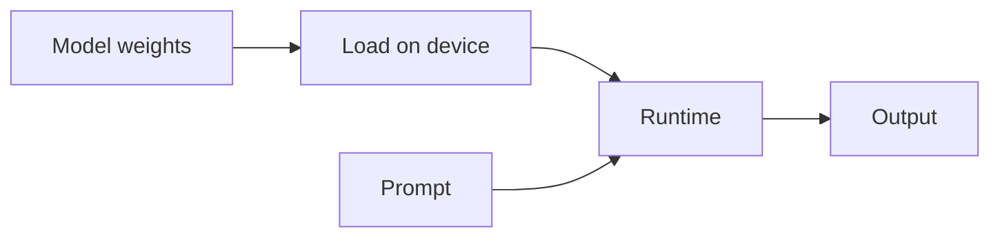

# Local inference

## Definition

Local inference means running [LLMs](/docs/llms), vision, or other models on your own hardware—a laptop, workstation, on-prem server, or edge device—instead of calling a cloud API. Data never leaves your environment, which supports **privacy**, **latency**, **cost control**, and **offline** use.

It relies on [model compression](/docs/model-compression) ([quantization](/docs/quantization), [pruning](/docs/pruning), [knowledge distillation](/docs/knowledge-distillation)) and efficient runtimes so models fit in limited memory and run without a GPU or with consumer GPUs. Tools like Ollama, LM Studio, llama.cpp, vLLM, and TensorFlow Lite enable local [inference](/docs/infrastructure) with minimal setup.

## How it works

You **obtain** model weights (e.g. GGUF, SafeTensors) from the Hub or a vendor. A **runtime** (Ollama, llama.cpp, vLLM, TFLite) **loads** the model onto CPU, GPU, or NPU and executes the forward pass. **Quantization** (INT8, INT4, GPTQ, AWQ) shrinks memory so larger models fit; **batching** and **KV cache** improve throughput when serving multiple requests. No network call to a cloud API—inference runs entirely on the local machine or cluster.

## Use cases

Local inference fits when privacy, latency, cost, or offline operation matters more than using the largest cloud model.

- Privacy-sensitive or regulated data (healthcare, legal, internal docs) that must not leave the network
- Low-latency or real-time apps (IDE, assistants) where round-trips to the cloud are unacceptable
- Cost control at scale or air-gapped / offline environments
- Development and testing without API keys or usage limits

## Pros and cons

| Pros | Cons |
|------|------|
| Data stays on your infrastructure | Smaller or quantized models; possible quality drop |
| No per-token API cost at inference time | You own hardware and ops (GPU, memory, updates) |
| Works offline and in restricted networks | Throughput and context length limited by hardware |
| Full control over model version and behavior | Need [quantization](/docs/quantization) and [compression](/docs/model-compression) for larger models |

## External documentation

- [Ollama](https://ollama.ai/) — Run LLMs locally with a simple API
- [llama.cpp](https://github.com/ggerganov/llama.cpp) — C++ inference for LLaMA and compatible models
- [vLLM](https://docs.vllm.ai/) — High-throughput server for local or on-prem LLM serving
- [TensorFlow Lite](https://www.tensorflow.org/lite) — On-device inference for mobile and edge

## See also

- [Quantization](/docs/quantization)
- [Model compression](/docs/model-compression)
- [Infrastructure](/docs/infrastructure)
- [Edge reasoning](/docs/edge-reasoning)
