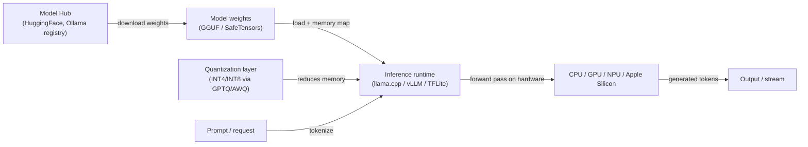
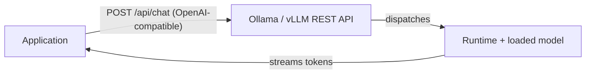

# Local inference

## Definition

Local inference means running [LLMs](/docs/llms), vision models, or other AI models entirely on your own hardware — a developer laptop, a workstation, an on-premises server, or an edge device — without sending data to a cloud API provider. Every token generated stays within your own environment, which directly supports **data privacy**, **reduced latency**, **predictable cost**, and **offline operation**.

The practical feasibility of local inference depends on [model compression](/docs/model-compression): full-precision (FP16/BF16) frontier models typically require 80–320 GB of GPU memory, putting them out of reach for most local hardware. [Quantization](/docs/quantization) (INT8, INT4, GPTQ, AWQ) reduces memory by 2–8x, making 7B–70B parameter models runnable on consumer or prosumer GPUs (16–48 GB VRAM) and even on CPU-only hardware via GGUF format. Runtimes like Ollama, LM Studio, llama.cpp, vLLM, and TensorFlow Lite handle model loading, memory management, and inference execution with minimal configuration.

Local inference is not a single technology but a stack: model weights (GGUF, SafeTensors, ONNX) + runtime (llama.cpp, Ollama, vLLM, TFLite) + optional serving layer (OpenAI-compatible REST API). This stack can be assembled to serve a single developer interactively or scale to an on-premises cluster serving hundreds of concurrent users, all without a cloud dependency.

## How it works

### Inference stack



### Serving layer (optional)



### Runtime comparison

| Runtime | Best for | Format | GPU required |
|---------|---------|--------|-------------|
| llama.cpp | Low-resource CPU/GPU inference | GGUF | No (CPU-capable) |
| Ollama | Developer-friendly local LLM serving | GGUF / Modelfile | No (CPU-capable) |
| vLLM | High-throughput on-prem server | HuggingFace / safetensors | Yes (CUDA) |
| TensorFlow Lite | Mobile and microcontroller inference | .tflite | No |
| LM Studio | GUI for local LLM exploration | GGUF | No (CPU-capable) |

## When to use / When NOT to use

| Scenario | Use local inference | Do NOT use local inference |
|----------|--------------------|-----------------------------|
| Data must not leave the network (healthcare, legal, finance) | Yes — data never leaves local hardware | |
| Low-latency assistant or IDE integration | Yes — no network round-trip | |
| Development and testing without API keys or usage limits | Yes — free and offline | |
| Air-gapped or restricted network environments | Yes — no external connectivity needed | |
| Needing frontier model quality (GPT-4o, Claude 3.7) | | Cloud APIs provide larger, more capable models |
| Unpredictable or bursty load patterns | | Cloud auto-scaling is more cost-effective |
| No GPU hardware available and low latency is critical | | Cloud inference is faster on underpowered hardware |

## Pros and cons

| Pros | Cons |
|------|------|
| Data stays on your infrastructure — strong privacy guarantee | Smaller or quantized models may have lower quality |
| No per-token API cost at inference time | You own hardware, ops, and model updates |
| Works offline and in restricted networks | Throughput and context length limited by hardware |
| Full control over model version and behavior | Need [quantization](/docs/quantization) and [compression](/docs/model-compression) for larger models |

## Code examples

```bash
# Install Ollama and run a local LLM
curl -fsSL https://ollama.ai/install.sh | sh

# Pull and run a model interactively
ollama run llama3.2

# Serve an OpenAI-compatible REST API (runs on localhost:11434 by default)
ollama serve &

# Call the API from Python using the OpenAI client
python3 - <<'EOF'
from openai import OpenAI

client = OpenAI(base_url="http://localhost:11434/v1", api_key="ollama")

response = client.chat.completions.create(
    model="llama3.2",
    messages=[{"role": "user", "content": "Explain quantization in one paragraph."}],
    stream=True,
)
for chunk in response:
    print(chunk.choices[0].delta.content or "", end="", flush=True)
EOF
```

## Tips for effective use

- Start with GGUF Q4_K_M quantization for a good accuracy-speed balance; step down to Q3 or Q2 only if memory is critically constrained.
- Use Ollama for developer machines and vLLM for on-premises servers serving multiple users concurrently.
- Pin model versions in your `Modelfile` or configuration to prevent silent quality changes on updates.
- Monitor token throughput and first-token latency — these reveal whether your hardware is the bottleneck or the model is over-quantized.
- For Apple Silicon (M1/M2/M3/M4), llama.cpp and Ollama use the Metal GPU backend automatically, providing near-GPU-class throughput.

## Practical resources

- [Ollama](https://ollama.ai/) — Run LLMs locally with a simple CLI and OpenAI-compatible API
- [llama.cpp](https://github.com/ggerganov/llama.cpp) — C++ inference engine for LLaMA and compatible models, GGUF format
- [vLLM](https://docs.vllm.ai/) — High-throughput LLM serving with continuous batching and PagedAttention
- [LM Studio](https://lmstudio.ai/) — GUI for discovering, downloading, and running local LLMs
- [TensorFlow Lite](https://www.tensorflow.org/lite) — On-device inference for mobile and edge

## See also

- [Quantization](/docs/quantization)
- [Model compression](/docs/model-compression)
- [Infrastructure](/docs/infrastructure)
- [Edge reasoning](/docs/edge-reasoning)
