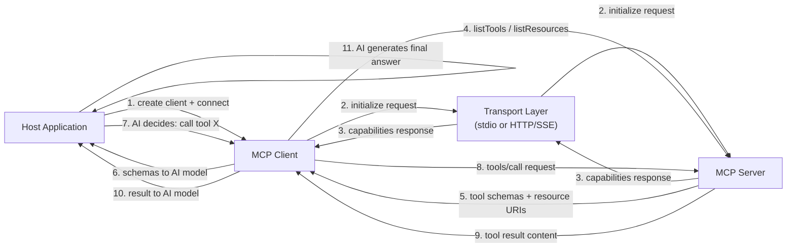

# Building MCP clients

## Definition

An **MCP client** is the component inside a host application that manages the connection to a single MCP server and translates the AI model's intent into protocol-level requests. The host application — a chat interface, a coding assistant, an autonomous agent — creates one client per server it wants to connect to. The client handles the entire protocol lifecycle: establishing the transport connection, completing the initialization handshake, discovering server capabilities, invoking tools on behalf of the AI, reading resources, and fetching prompts. From the host application's perspective, the client is the API surface to the server's world.

The client's role in the host application is that of an intelligent intermediary. It does not decide which tools to call — that is the AI model's responsibility. Instead, the client provides the AI with structured capability descriptions (tool schemas, resource URIs, prompt definitions), and then faithfully executes whatever the AI requests, returning results in a format the AI can reason over. A well-built client isolates all protocol complexity from the host application: the host simply asks "what can this server do?" and "call this tool with these arguments," and the client handles everything else.

Capability discovery is one of the client's most important responsibilities. After the initialization handshake, the client queries the server for its full capability manifest by calling `tools/list`, `resources/list`, and `prompts/list`. These responses include names, descriptions, input schemas, and URI templates — everything the AI model needs to understand how and when to use each capability. In dynamic environments (servers that change their tool set at runtime), clients can listen for `notifications/tools/list_changed` events and re-query the manifest on demand, ensuring the AI always operates with an up-to-date view of available capabilities.

## How it works

### Client initialization and the handshake

Creating an MCP client requires two things: a client identity (name and version) and a capabilities declaration. The capabilities declaration tells the server which protocol extensions the client supports — for example, whether it can handle resource subscriptions or prompt argument validation. After instantiation, the client is connected to a transport, which triggers the `initialize` request. The server responds with its own identity, protocol version, and capabilities. The client then sends an `initialized` notification to confirm the handshake is complete. Only after this sequence can the client make capability or invocation requests. The SDK handles all of this automatically when you call `client.connect(transport)`.

### Capability discovery

Once connected, the client discovers what the server offers. `client.listTools()` returns all tool definitions including their names, descriptions, and JSON Schema input specifications. `client.listResources()` returns static resource URIs and metadata. `client.listResourceTemplates()` returns URI templates for dynamic resources. `client.listPrompts()` returns prompt names and their argument definitions. In a typical AI application, discovery happens once at session start and the results are provided to the AI model as context — either injected into the system prompt or passed as structured data to a function-calling API. The tool schemas returned by `listTools()` map directly to the JSON Schema format used by most LLM function-calling APIs, which makes converting discovered MCP tools into LLM tool definitions straightforward.

### Tool invocation

Invoking a tool requires a tool name and an arguments object that satisfies the tool's input schema. `client.callTool({ name, arguments })` sends a `tools/call` request to the server and returns a response containing a `content` array of content blocks. Each block has a `type` field (`text`, `image`, or `resource`) and the corresponding data. Text blocks contain string results; image blocks contain base64-encoded image data with a MIME type; resource blocks embed a resource inline. The client's job is to pass these content blocks back to the AI model — typically as tool result messages in a conversation turn. If the response has `isError: true`, the client should surface this clearly so the AI can handle the error (retry, fall back, or report to the user).

### Resource reading

Resources are read via `client.readResource({ uri })`, which returns a `contents` array of resource content items. Each item has a URI, a MIME type, and either a `text` field (for text-based resources) or a `blob` field (for binary resources). Resources are used to provide the AI with large, structured context — file contents, database records, API responses — without going through the tool invocation round-trip. The client can subscribe to resource updates (`client.subscribeResource({ uri })`) and receive `notifications/resources/updated` events when the server determines the resource content has changed, enabling real-time context refresh.

### Transport selection

The transport choice depends on where the server runs. **stdio transport** (`StdioClientTransport`) is used when the server runs as a local child process — the client spawns the server process directly and communicates over its stdin/stdout. This is zero-configuration and ideal for development tools, local file system servers, and any server that should be scoped to a single user session. **SSE transport** (`SSEServerTransport` on the client side) is used for remote servers — the client connects to an HTTP endpoint and uses Server-Sent Events for streaming responses. This suits shared organizational servers, cloud-hosted capabilities, and production deployments where multiple client instances need to share the same server. The choice of transport is entirely transparent to the capability discovery and invocation APIs; you can switch transports without changing any other client code.



## When to use / When NOT to use

| Scenario | Build an MCP client | Consider alternatives |
|---|---|---|
| Connecting an AI application to one or more MCP servers | Required — this is the intended use case | Direct API calls if the server does not use MCP |
| Building a general-purpose AI assistant that should support community MCP servers | Best fit — any MCP server works automatically | Custom tool integrations if the tool set is fixed and small |
| Integrating AI into an application that already has service dependencies | MCP client per service provides uniform tool access | Provider-specific function calling if locked to one LLM provider |
| Developing tooling that runs locally on the user's machine | stdio transport requires an MCP client | Shell scripts or direct library calls if AI is not involved |
| Aggregating capabilities from multiple specialized servers | One client per server, host manages all clients | Single monolithic tool list if all tools live in one place |
| Consuming a server that uses HTTP/SSE for remote access | SSE transport client handles this natively | WebSocket or REST client if the server uses a non-MCP protocol |

## Code examples

### Complete MCP client — connect, discover, invoke, read

```typescript
import { Client } from "@modelcontextprotocol/sdk/client/index.js";
import { StdioClientTransport } from "@modelcontextprotocol/sdk/client/stdio.js";

async function main() {
  // -----------------------------------------------------------------------
  // 1. Create transport — spawns the server as a child process
  // -----------------------------------------------------------------------
  const transport = new StdioClientTransport({
    command: "node",
    args: ["./file-and-weather-server.js"], // Path to your MCP server
  });

  // -----------------------------------------------------------------------
  // 2. Create client and connect (triggers the initialize handshake)
  // -----------------------------------------------------------------------
  const client = new Client(
    { name: "demo-client", version: "1.0.0" },
    {
      capabilities: {
        // Declare which protocol extensions this client supports
        roots: { listChanged: true },
      },
    }
  );

  await client.connect(transport);
  console.log("Connected to MCP server");

  // -----------------------------------------------------------------------
  // 3. Discover capabilities
  // -----------------------------------------------------------------------
  const { tools } = await client.listTools();
  console.log(
    "\nAvailable tools:",
    tools.map((t) => `${t.name}: ${t.description}`)
  );

  const { resources } = await client.listResources();
  console.log(
    "\nAvailable resources:",
    resources.map((r) => r.uri)
  );

  const { prompts } = await client.listPrompts();
  console.log(
    "\nAvailable prompts:",
    prompts.map((p) => p.name)
  );

  // -----------------------------------------------------------------------
  // 4. Invoke a tool
  // -----------------------------------------------------------------------
  console.log("\n--- Calling get_weather tool ---");
  const weatherResult = await client.callTool({
    name: "get_weather",
    arguments: { city: "Tokyo", units: "celsius" },
  });

  // weatherResult.content is an array of content blocks
  if (!weatherResult.isError) {
    for (const block of weatherResult.content) {
      if (block.type === "text") {
        console.log("Weather result:", block.text);
      }
    }
  } else {
    console.error("Tool returned an error:", weatherResult.content);
  }

  // -----------------------------------------------------------------------
  // 5. Invoke another tool
  // -----------------------------------------------------------------------
  console.log("\n--- Calling list_directory tool ---");
  const dirResult = await client.callTool({
    name: "list_directory",
    arguments: { dir_path: "/tmp" },
  });

  if (!dirResult.isError) {
    const textBlock = dirResult.content.find((b) => b.type === "text");
    if (textBlock && textBlock.type === "text") {
      console.log("Directory listing:", textBlock.text);
    }
  }

  // -----------------------------------------------------------------------
  // 6. Read a resource
  // -----------------------------------------------------------------------
  console.log("\n--- Reading a resource ---");
  try {
    const resourceResult = await client.readResource({
      uri: "file:///etc/hostname",
    });

    for (const item of resourceResult.contents) {
      console.log(`Resource [${item.uri}]:`, "text" in item ? item.text : "(binary)");
    }
  } catch (err) {
    console.error("Resource read failed:", (err as Error).message);
  }

  // -----------------------------------------------------------------------
  // 7. Fetch a prompt
  // -----------------------------------------------------------------------
  console.log("\n--- Fetching a prompt ---");
  try {
    const promptResult = await client.getPrompt({
      name: "analyze_file",
      arguments: {
        file_path: "/tmp/example.txt",
        focus: "structure and formatting",
      },
    });

    console.log("Prompt messages:");
    for (const msg of promptResult.messages) {
      console.log(`  [${msg.role}]:`, JSON.stringify(msg.content).slice(0, 120) + "...");
    }
  } catch (err) {
    console.error("Prompt fetch failed:", (err as Error).message);
  }

  // -----------------------------------------------------------------------
  // 8. Clean up
  // -----------------------------------------------------------------------
  await client.close();
  console.log("\nClient disconnected.");
}

main().catch((err) => {
  console.error("Client error:", err);
  process.exit(1);
});
```

### Connecting to a remote server via SSE transport

```typescript
import { Client } from "@modelcontextprotocol/sdk/client/index.js";
import { SSEClientTransport } from "@modelcontextprotocol/sdk/client/sse.js";

async function connectRemote() {
  // Point to the SSE endpoint of your remote MCP server
  const transport = new SSEClientTransport(
    new URL("http://localhost:3000/sse")
  );

  const client = new Client(
    { name: "remote-client", version: "1.0.0" },
    { capabilities: {} }
  );

  await client.connect(transport);

  // From here, the API is identical to the stdio client example
  const { tools } = await client.listTools();
  console.log("Remote tools:", tools.map((t) => t.name));

  // Call a tool on the remote server
  const result = await client.callTool({
    name: "get_weather",
    arguments: { city: "Berlin" },
  });
  console.log(result.content);

  await client.close();
}

connectRemote().catch(console.error);
```

### Converting discovered MCP tools to LLM function-calling schemas

```typescript
import { Client } from "@modelcontextprotocol/sdk/client/index.js";
import { StdioClientTransport } from "@modelcontextprotocol/sdk/client/stdio.js";
import type { Tool } from "@modelcontextprotocol/sdk/types.js";

// Convert an MCP tool definition to OpenAI function-calling format
function mcpToolToOpenAIFunction(tool: Tool) {
  return {
    type: "function" as const,
    function: {
      name: tool.name,
      description: tool.description ?? "",
      parameters: tool.inputSchema,
    },
  };
}

async function getToolsForLLM(serverCommand: string, serverArgs: string[]) {
  const transport = new StdioClientTransport({
    command: serverCommand,
    args: serverArgs,
  });

  const client = new Client(
    { name: "llm-bridge", version: "1.0.0" },
    { capabilities: {} }
  );

  await client.connect(transport);

  const { tools } = await client.listTools();

  // Convert to OpenAI format — these can be passed directly to the Chat Completions API
  const openAITools = tools.map(mcpToolToOpenAIFunction);

  return { client, openAITools };
}

// Usage:
// const { client, openAITools } = await getToolsForLLM("node", ["./my-server.js"]);
// Pass openAITools to openai.chat.completions.create({ tools: openAITools, ... })
// When the LLM returns a tool call, use: client.callTool({ name, arguments })
```

## Practical resources

- [MCP TypeScript SDK — client API reference](https://github.com/modelcontextprotocol/typescript-sdk/tree/main/src/client) — Source and inline documentation for `Client`, all transport classes, and client-side types.
- [MCP client examples and integrations](https://modelcontextprotocol.io/clients) — A curated list of existing MCP client integrations across editors, AI platforms, and developer tools.
- [MCP protocol specification — client behavior](https://spec.modelcontextprotocol.io/specification/client/) — Authoritative reference for client responsibilities including initialization, capability negotiation, and request lifecycle.
- [MCP integration guide](https://modelcontextprotocol.io/docs/concepts/architecture) — Conceptual overview of how clients, servers, and host applications relate, with diagrams and decision guidance.

## See also

- [Model Context Protocol overview](/docs/mcp)
- [Building MCP servers](/docs/mcp/building-servers)
- [AI agents](/docs/agents)
