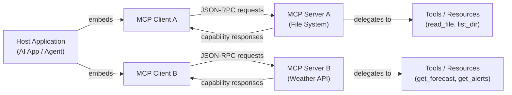

# Model Context Protocol (MCP)

## Definition

The **Model Context Protocol (MCP)** is an open standard that defines a uniform way for AI applications to connect to external tools, data sources, and services. Rather than building one-off integrations for each combination of AI model and external system, MCP provides a shared language: a host application speaks to an MCP server over a well-defined protocol, and the server exposes capabilities (tools, resources, prompts) that any compliant AI client can discover and use. MCP was introduced by Anthropic in late 2024 and immediately released as an open standard, inviting the broader ecosystem to adopt and extend it.

Before MCP, tool integration for AI applications was fragmented. Each provider had its own function-calling format; each integration had to be reimplemented for every new AI backend. A code-execution tool written for one model needed to be rewritten when switching providers, and a new data source required custom plumbing for every AI application that wanted to access it. MCP solves this by separating the concern of "how does an AI talk to a tool" (the protocol) from "which AI" and "which tool," so any MCP-compliant client can use any MCP-compliant server without additional glue code.

The practical impact is significant: developers can build an MCP server once — for a database, a file system, a REST API, a code runner — and every MCP-enabled AI application gains access to it. The protocol is transport-agnostic (running over stdio for local processes or HTTP/SSE for remote services), supports bidirectional communication, and includes a capability negotiation handshake so clients and servers can advertise exactly what they support.

## How it works

### Client-server architecture

MCP follows a strict client-server model with three distinct roles. The **host application** is the AI-facing application (a chat UI, a coding assistant, an autonomous agent) that embeds one or more MCP clients. Each **MCP client** maintains a 1:1 connection to a single **MCP server** and acts as the intermediary between the host and that server's capabilities. The **MCP server** is the process that owns and exposes the actual capabilities — it knows how to call a weather API, read a file, or query a database. This separation means a single host application can connect to many servers simultaneously, each providing a different set of tools.



### Transport layer

MCP is transport-agnostic: the same JSON-RPC 2.0 message format runs over two built-in transports. **stdio transport** is used for local servers — the host spawns the server as a child process and communicates over its standard input and standard output streams. This is the simplest deployment: no network, no ports, no authentication overhead. **HTTP with SSE (Server-Sent Events) transport** is used for remote or shared servers: the client sends requests as HTTP POST calls and receives streaming responses via an SSE endpoint. This enables centrally hosted servers that multiple clients can share, and supports deployment in cloud or container environments. A third transport type, **Streamable HTTP**, was introduced in the protocol spec as a more capable successor to HTTP/SSE for bidirectional streaming.

### Capabilities: tools, resources, and prompts

An MCP server exposes up to three types of capabilities. **Tools** are callable functions — analogous to function calling in LLM APIs — that the AI can invoke to take actions or retrieve information. Each tool has a name, a description, and a JSON Schema defining its input parameters. **Resources** are read-only, file-like data sources that the AI can access — a local file, a database record, a live API snapshot — identified by a URI. Resources are the MCP equivalent of context injection: they let the server provide the AI with structured data without requiring a tool call. **Prompts** are reusable prompt templates stored on the server; they allow server authors to define common interaction patterns (e.g., "summarize this file") that clients can surface directly to users.

### Capability negotiation and the session lifecycle

When a client connects to a server, the protocol begins with an `initialize` handshake. The client sends its protocol version and the capabilities it supports; the server responds with its protocol version and the capabilities it offers. This negotiation ensures that clients and servers with different feature sets can interoperate gracefully — a client that does not support prompts simply will not use them, even if the server offers them. After initialization, the client calls `tools/list`, `resources/list`, and `prompts/list` to discover what the server exposes. Discovery responses include full schemas, descriptions, and metadata. From that point, the client can invoke capabilities on behalf of the AI model as needed throughout the session.

## When to use / When NOT to use

| Scenario | MCP | Custom REST/API Integration | Native Function Calling |
|---|---|---|---|
| Building tools that should work across multiple AI providers | Best fit — write once, use with any MCP client | Each provider needs its own integration | Locked to a single provider's API format |
| Sharing tools across multiple AI applications in your organization | Best fit — one server, many clients | Requires duplicating integration code in each app | Not designed for cross-application sharing |
| Simple one-off tool in a single-provider application | Overkill — adds protocol overhead | Fine for simple cases | Easiest option |
| Exposing existing data sources (files, DBs) as AI context | Resources capability is purpose-built for this | Requires custom retrieval logic | No equivalent concept |
| Real-time streaming results from long-running operations | Supported via SSE transport | Requires custom streaming logic | Limited support |
| Air-gapped or highly restricted environments | stdio transport works with no network | Full control | Full control |

## Comparisons

### MCP vs OpenAI function calling

OpenAI function calling and MCP both allow AI models to invoke structured tools, but they operate at different levels. Function calling is an **API-level feature**: the tool schemas are passed in the request payload, tool implementations live in your application code, and the pattern is specific to OpenAI's API format. MCP is a **protocol-level standard**: tools live in separate server processes, the protocol handles discovery and invocation, and any compliant client can use any compliant server regardless of which AI provider powers the client. Function calling is the right choice for simple, in-process tools in a single-provider application; MCP is the right choice when you want portable, reusable tool servers that work across providers and applications.

### MCP vs LangChain tools

LangChain tools are a **framework abstraction**: they wrap Python callables in a standardized interface that the LangChain agent runtime understands. They are powerful within the LangChain ecosystem but do not define an interprocess communication protocol — a LangChain tool cannot be called by a non-LangChain application without additional plumbing. MCP is a **wire protocol**: it defines exactly how messages are serialized and transported between processes. An MCP server written in TypeScript can be called by a Python MCP client with no shared framework dependency. The two are not mutually exclusive — LangChain and other frameworks can implement MCP clients to use MCP servers.

### MCP vs direct REST API calls

Direct REST API calls offer maximum flexibility and no protocol overhead, but every new AI application must re-implement the same authentication, error handling, and result formatting for each API it calls. MCP provides a uniform envelope that abstracts over those differences: the AI application always makes the same `tools/call` request regardless of whether the server is hitting a weather API, a SQL database, or a GitHub repository. The trade-off is that MCP requires server infrastructure (a running server process), whereas a direct REST call is just an HTTP request.

## Code examples

### Minimal MCP server

```typescript
import { McpServer } from "@modelcontextprotocol/sdk/server/mcp.js";
import { StdioServerTransport } from "@modelcontextprotocol/sdk/server/stdio.js";
import { z } from "zod";

// Create the server instance with a name and version
const server = new McpServer({
  name: "demo-server",
  version: "1.0.0",
});

// Register a tool — the AI can call this to get the current time
server.tool(
  "get_current_time",
  "Returns the current UTC time in ISO 8601 format.",
  {}, // No input parameters required
  async () => ({
    content: [
      {
        type: "text",
        text: new Date().toISOString(),
      },
    ],
  })
);

// Register a tool with input parameters
server.tool(
  "add_numbers",
  "Adds two numbers together and returns the result.",
  {
    a: z.number().describe("The first number"),
    b: z.number().describe("The second number"),
  },
  async ({ a, b }) => ({
    content: [
      {
        type: "text",
        text: String(a + b),
      },
    ],
  })
);

// Start the server using stdio transport (runs as a child process)
const transport = new StdioServerTransport();
await server.connect(transport);
console.error("Demo MCP server running on stdio");
```

### Minimal MCP client

```typescript
import { Client } from "@modelcontextprotocol/sdk/client/index.js";
import { StdioClientTransport } from "@modelcontextprotocol/sdk/client/stdio.js";

// Create a transport that spawns the server as a child process
const transport = new StdioClientTransport({
  command: "node",
  args: ["./demo-server.js"],
});

// Create and connect the client
const client = new Client(
  { name: "demo-client", version: "1.0.0" },
  { capabilities: {} }
);

await client.connect(transport);

// Discover available tools
const { tools } = await client.listTools();
console.log("Available tools:", tools.map((t) => t.name));

// Call a tool
const result = await client.callTool({
  name: "add_numbers",
  arguments: { a: 21, b: 21 },
});

console.log("Result:", result.content);
// Output: [{ type: 'text', text: '42' }]

await client.close();
```

## Practical resources

- [Model Context Protocol specification](https://spec.modelcontextprotocol.io) — The authoritative protocol specification covering all message types, transports, and capability definitions.
- [MCP TypeScript SDK](https://github.com/modelcontextprotocol/typescript-sdk) — The official TypeScript/JavaScript SDK for building both MCP servers and clients, maintained by Anthropic.
- [modelcontextprotocol.io](https://modelcontextprotocol.io) — The official MCP website with quickstart guides, conceptual documentation, and a registry of community-built servers.
- [MCP server examples repository](https://github.com/modelcontextprotocol/servers) — A curated collection of reference MCP server implementations covering databases, file systems, web search, and more.

## See also

- [Building MCP servers](/docs/mcp/building-servers)
- [Building MCP clients](/docs/mcp/building-clients)
- [AI agents](/docs/agents)
- [Structured outputs](/docs/prompt-engineering/structured-outputs)
