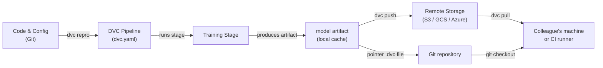

# Data Version Control (DVC)

## Definition

Data Version Control (DVC) is an open-source tool that extends Git to track large files, datasets, and model artifacts that cannot be stored efficiently in a Git repository. While Git records every change to source code, DVC stores a small pointer file (`.dvc`) in the repository and pushes the actual data bytes to a configurable remote storage backend — S3, GCS, Azure Blob, SSH, or even a local directory. This keeps the repository lightweight while preserving full reproducibility.

DVC goes beyond simple file versioning. It introduces the concept of **pipelines** — a DAG (Directed Acyclic Graph) of stages defined in a `dvc.yaml` file. Each stage specifies its command, its inputs (dependencies), and its outputs, so DVC can determine which stages need to re-run when inputs change. The result is a build system for ML: reproducible, incremental, and version-controlled alongside the code that produced it.

DVC integrates tightly with Git workflows. A `dvc.lock` file, committed to Git, captures the exact content hash of every input and output at the time a pipeline ran, so checking out a historical Git commit and running `dvc pull` restores the exact dataset and model artifacts that existed at that point in history.

## How it works



### Initializing a DVC repository

Running `dvc init` inside a Git repository creates a `.dvc/` directory that holds DVC's configuration and local cache. DVC registers a `.gitignore` entry for the cache folder and adds a few small tracking files that must be committed to Git. From this point, `dvc add <file>` creates a `.dvc` pointer file for any large file — the actual bytes go into the local cache and are never committed to Git. This two-layer approach means the repository stays fast to clone while DVC manages the heavy assets separately.

### Defining and running pipelines

A `dvc.yaml` file declares each pipeline stage with its command, input dependencies, and output artifacts. When you run `dvc repro`, DVC inspects the dependency graph, compares content hashes of all inputs against the `dvc.lock` snapshot, and re-runs only the stages whose inputs have changed. This is analogous to `make` but content-addressed rather than timestamp-based, so it is deterministic even across machines and CI runners. Pipelines can be parameterized via a `params.yaml` file, and DVC records which parameter values were used in each run.

### Remote storage and collaboration

A DVC remote is a storage location configured with `dvc remote add`. Teams typically configure a shared cloud bucket so all members pull the same data. `dvc push` uploads new or changed artifacts to the remote, and `dvc pull` downloads exactly the versions referenced by the current Git commit's `dvc.lock`. This workflow means onboarding a new team member to a project is `git clone` followed by `dvc pull` — a single command that materializes the correct dataset and model artifacts for that branch.

### Experiments

`dvc exp run` and `dvc exp show` provide a lightweight experiment-tracking layer on top of pipelines. Each experiment is a temporary Git stash of parameter changes and result metrics, which can be compared in a table and promoted to a full branch if promising. This is less feature-rich than dedicated tools like MLflow or W&B, but it has the advantage of requiring zero additional infrastructure — everything lives in the Git repository.

## When to use / When NOT to use

| Use when | Avoid when |
|---|---|
| Your datasets or model files are too large for Git (>100 MB) | All data fits comfortably in Git LFS and no pipelines are needed |
| You need reproducible ML pipelines tied to code versions | Your experiment tracking requirements exceed DVC's lightweight approach |
| Your team uses Git and wants a unified version-control workflow | You need a full UI for experiment management (prefer MLflow or W&B) |
| CI/CD pipelines need to pull exact data artifacts per branch | Data is extremely sensitive and cannot leave on-premises storage |
| You want to compare experiment results without a separate server | Project has no shared remote and collaboration is not a concern |

## Comparisons

| Criterion | DVC | Git LFS | MLflow Tracking |
|---|---|---|---|
| Primary purpose | Data + pipeline versioning | Large file versioning | Experiment tracking + model registry |
| Pipeline support | Yes (dvc.yaml DAG) | No | No (only logs runs) |
| Experiment comparison | Basic (dvc exp show) | No | Rich (UI + API) |
| Remote backends | S3, GCS, Azure, SSH, local | GitHub, GitLab LFS servers | Local, S3, Azure, SFTP |
| Server required | No | No | Optional (MLflow server) |
| Git integration | Core design principle | Core design principle | Optional (via mlflow.log_param) |

## Pros and cons

| Pros | Cons |
|---|---|
| No extra server required — everything in Git + object storage | Learning curve for teams unfamiliar with DAG-based pipelines |
| Reproducible pipelines with content-addressed caching | Large dvc.lock conflicts can be tricky in very active monorepos |
| Works with any cloud storage or even local directories | Experiment UI is minimal compared to MLflow / W&B |
| Lightweight — DVC is just a CLI tool | Does not handle distributed training orchestration |
| First-class CI/CD integration via CML | Remote storage costs are the team's responsibility to manage |

## Code examples

```bash
# --- DVC setup and basic data tracking ---

# 1. Initialize DVC inside an existing Git repository
git init my-ml-project && cd my-ml-project
dvc init
git add .dvc .dvcignore
git commit -m "Initialize DVC"

# 2. Configure a remote storage backend (AWS S3 example)
dvc remote add -d myremote s3://my-bucket/dvc-store
git add .dvc/config
git commit -m "Add DVC remote"

# 3. Track a large dataset — DVC creates data/train.csv.dvc
dvc add data/train.csv
git add data/train.csv.dvc data/.gitignore
git commit -m "Track training dataset with DVC"

# 4. Push data to the remote
dvc push

# --- Collaborator workflow ---

# 5. Clone the repo and pull the data artifacts
git clone https://github.com/org/my-ml-project
cd my-ml-project
dvc pull   # downloads data/train.csv from the configured remote
```

```yaml
# dvc.yaml — Define a two-stage pipeline: featurize -> train

stages:
  featurize:
    cmd: python src/featurize.py --input data/train.csv --output data/features.parquet
    deps:
      - src/featurize.py
      - data/train.csv
    outs:
      - data/features.parquet

  train:
    cmd: python src/train.py --features data/features.parquet --output models/
    deps:
      - src/train.py
      - data/features.parquet
      - params.yaml        # parameter file changes trigger re-run
    outs:
      - models/
    metrics:
      - reports/metrics.json:
          cache: false     # small metrics file — commit it to Git
```

```python
# src/train.py — DVC-compatible training script using joblib for model serialization
# Note: joblib is used here instead of pickle for safer serialization

import json
import argparse
from pathlib import Path

import yaml
import joblib
import numpy as np
import pandas as pd
from sklearn.ensemble import GradientBoostingClassifier
from sklearn.model_selection import train_test_split
from sklearn.metrics import accuracy_score


def main(features_path: str, output_dir: str) -> None:
    # Load parameters tracked by DVC from params.yaml
    params = yaml.safe_load(Path("params.yaml").read_text())["train"]

    # Load feature-engineered data produced by the featurize stage
    df = pd.read_parquet(features_path)
    X = df.drop(columns=["label"])
    y = df["label"]

    X_train, X_test, y_train, y_test = train_test_split(
        X, y, test_size=0.2, random_state=42
    )

    # Train with parameters sourced from params.yaml — DVC tracks these
    model = GradientBoostingClassifier(
        n_estimators=params["n_estimators"],
        max_depth=params["max_depth"],
        random_state=42,
    )
    model.fit(X_train, y_train)

    # Save the model artifact — DVC will cache and hash the output directory
    out = Path(output_dir)
    out.mkdir(parents=True, exist_ok=True)
    joblib.dump(model, out / "model.joblib")

    # Write metrics.json so DVC can track and compare across experiments
    accuracy = float(accuracy_score(y_test, model.predict(X_test)))
    Path("reports").mkdir(exist_ok=True)
    Path("reports/metrics.json").write_text(
        json.dumps({"accuracy": accuracy}, indent=2)
    )
    print(f"Accuracy: {accuracy:.4f}")


if __name__ == "__main__":
    parser = argparse.ArgumentParser()
    parser.add_argument("--features", required=True)
    parser.add_argument("--output", required=True)
    args = parser.parse_args()
    main(args.features, args.output)
```

## Practical resources

- [DVC official documentation](https://dvc.org/doc) — Comprehensive guide covering installation, pipelines, remotes, and experiments.
- [DVC Get Started tutorial](https://dvc.org/doc/start) — Hands-on walkthrough for setting up a DVC project from scratch.
- [Iterative blog: Git-based MLOps](https://iterative.ai/blog) — Articles on MLOps workflows combining DVC, CML, and MLEM.
- [DVC GitHub repository](https://github.com/iterative/dvc) — Source code and community issues.

## See also

- [CI/CD for ML](/docs/mlops/cicd)
- [Experiment tracking](/docs/mlops/experiment-tracking)
- [MLflow](/docs/mlops/mlflow)
