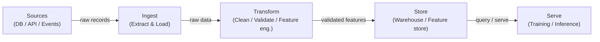

# Data pipelines

## Definition

A data pipeline is an automated sequence of steps that moves raw data from one or more sources to a destination where it can be consumed — by analysts, dashboards, or machine learning models. In the ML context, pipelines are not just about moving data: they ensure that data arrives in the right shape, at the right time, and with verifiable quality so that models train and serve predictably. Without reliable pipelines, every downstream artifact — features, trained models, predictions — is suspect.

Data pipelines sit at the foundation of every MLOps system. They encompass ingestion from heterogeneous sources (databases, APIs, event streams, files), transformation to produce clean and structured datasets or feature vectors, storage in data warehouses or feature stores, and serving to training jobs or online inference endpoints. The design choices made at the pipeline layer — batch vs. streaming, push vs. pull, schema-on-read vs. schema-on-write — propagate all the way to model latency, freshness, and reliability.

Data quality is the hidden contract between data engineers and model teams. Schema drift, null explosions, distribution shift, and duplicate records are among the most common causes of silent model degradation. Modern pipelines embed validation checkpoints (using tools like Great Expectations or dbt tests) to catch these issues before bad data reaches training or serving.

## How it works

### Batch vs. streaming

Batch pipelines process data in bounded chunks on a schedule — hourly, daily, or triggered by file arrival. They are simpler to build and reason about and are the right default when the downstream consumer (a nightly training job, a BI dashboard) does not require sub-minute freshness. Streaming pipelines process records as they arrive, enabling near-real-time features for online models. The trade-off is operational complexity: you must handle late arrivals, out-of-order events, and exactly-once semantics. Most mature ML platforms run both: batch for large-scale retraining and offline evaluation, streaming for online feature computation.

### ETL vs. ELT

Extract-Transform-Load (ETL) applies transformations before data lands in the destination store. This was the dominant pattern when storage was expensive and warehouses lacked compute. Extract-Load-Transform (ELT) loads raw data first, then transforms it inside a powerful warehouse or lakehouse (e.g. BigQuery, Snowflake, Databricks). ELT preserves raw history and enables ad-hoc exploration without re-ingestion — a major advantage in ML workloads where feature engineering evolves constantly. The choice is mostly driven by tooling, governance requirements, and whether the destination system can handle the transformation compute efficiently.

### Data quality and schema validation

Data quality checks should be embedded at every stage of the pipeline, not bolted on at the end. At ingestion, checks verify that source data conforms to the expected schema (column names, types, nullable constraints). At transformation, row-level checks assert business rules (non-negative prices, valid date ranges, referential integrity). At the serving layer, statistical checks detect distribution drift — the silent killer of deployed models. Schema validation can be done with tools like Pandera, Great Expectations, or dbt tests; distribution monitoring is typically handled by dedicated observability layers.



## When to use / When NOT to use

| Use when | Avoid when |
|----------|------------|
| Multiple data sources need to be consolidated for ML training | Data already lives in a single, clean table ready for direct use |
| Data must be refreshed on a schedule or in real time | Your analysis is a one-off exploration that will not be repeated |
| Quality guarantees (schema, completeness, freshness) are required by downstream models | The overhead of a full pipeline exceeds the value for a quick prototype |
| Transformations need to be versioned, tested, and reproducible | Data volume is trivial and a simple script in a notebook suffices |
| Multiple consumers (training, dashboards, APIs) share the same processed data | The source system already provides a clean, contracted API |

## Comparisons

| Criterion | Batch pipeline | Streaming pipeline |
|-----------|---------------|--------------------|
| Data freshness | Minutes to hours (schedule-driven) | Sub-second to seconds |
| Complexity | Low — bounded datasets, simple retries | High — late data, windowing, state |
| Cost | Predictable, bursty compute | Continuous compute, often higher baseline |
| Fault tolerance | Re-run the failed batch | Exactly-once or at-least-once semantics required |
| Typical ML use case | Offline training, nightly feature refresh | Online feature store, real-time scoring |

## Pros and cons

| Pros | Cons |
|------|------|
| Centralizes and standardizes data access across teams | Non-trivial initial investment to build and maintain |
| Enables reproducible, tested data transformations | Pipeline failures propagate to all downstream consumers |
| Embeds quality checks before bad data reaches models | Debugging distributed pipelines is complex |
| Supports versioning and lineage tracking | Streaming adds significant operational overhead |
| Decouples producers from consumers | Requires data governance and ownership discipline |

## Code examples

```python
"""
Simple batch data pipeline with pandas.
Reads raw CSV data, validates schema, applies transformations,
and writes a clean Parquet file ready for model training.
"""

import pandas as pd
import pandera as pa
from pandera import Column, DataFrameSchema, Check
from pathlib import Path


# --- Schema definition (contract between pipeline and consumers) ---
raw_schema = DataFrameSchema(
    {
        "user_id": Column(int, nullable=False),
        "event_ts": Column(str, nullable=False),
        "amount": Column(float, Check(lambda x: x >= 0), nullable=False),
        "category": Column(str, nullable=True),
    }
)

output_schema = DataFrameSchema(
    {
        "user_id": Column(int),
        "event_date": Column("datetime64[ns]"),
        "amount": Column(float),
        "category": Column(str),
        "log_amount": Column(float),
    }
)


def extract(source_path: str) -> pd.DataFrame:
    """Load raw data from CSV."""
    df = pd.read_csv(source_path)
    print(f"[extract] loaded {len(df):,} rows from {source_path}")
    return df


def validate(df: pd.DataFrame, schema: DataFrameSchema) -> pd.DataFrame:
    """Fail fast if data does not match the declared schema."""
    validated = schema.validate(df)
    print(f"[validate] schema check passed for {len(validated):,} rows")
    return validated


def transform(df: pd.DataFrame) -> pd.DataFrame:
    """Apply cleaning and feature engineering."""
    df = df.copy()

    # Parse timestamp column
    df["event_date"] = pd.to_datetime(df["event_ts"])
    df.drop(columns=["event_ts"], inplace=True)

    # Fill missing categories with a sentinel value
    df["category"] = df["category"].fillna("unknown")

    # Feature engineering: log-transform amount (handles skew)
    import numpy as np
    df["log_amount"] = np.log1p(df["amount"])

    # Drop duplicates based on user_id + date
    df.drop_duplicates(subset=["user_id", "event_date"], inplace=True)

    print(f"[transform] produced {len(df):,} clean rows")
    return df


def load(df: pd.DataFrame, dest_path: str) -> None:
    """Write clean data to Parquet for efficient downstream reads."""
    Path(dest_path).parent.mkdir(parents=True, exist_ok=True)
    df.to_parquet(dest_path, index=False)
    print(f"[load] wrote {len(df):,} rows to {dest_path}")


def run_pipeline(source: str, destination: str) -> None:
    """Orchestrate the full ETL pipeline."""
    raw = extract(source)
    validated_raw = validate(raw, raw_schema)
    clean = transform(validated_raw)
    validated_clean = validate(clean, output_schema)
    load(validated_clean, destination)
    print("[pipeline] completed successfully")


if __name__ == "__main__":
    run_pipeline(
        source="data/raw/events.csv",
        destination="data/processed/events.parquet",
    )
```

## Practical resources

- [The Data Engineering Cookbook (Andreas Kretz)](https://github.com/andkret/Cookbook) — Comprehensive open-source guide covering ingestion, storage, and processing patterns
- [dbt documentation](https://docs.getdbt.com/) — The standard for ELT transformations in SQL with built-in testing and lineage
- [Great Expectations](https://docs.greatexpectations.io/) — Data quality and validation framework that integrates with most pipeline tools
- [Pandera](https://pandera.readthedocs.io/) — Lightweight schema validation for pandas and Spark DataFrames in Python
- [Fundamentals of Data Engineering (O'Reilly)](https://www.oreilly.com/library/view/fundamentals-of-data/9781098108298/) — Book covering the full data engineering lifecycle from ingestion to serving

## See also

- [Apache Airflow](/docs/mlops/data-engineering/airflow)
- [Apache Spark](/docs/mlops/data-engineering/spark)
- [Apache Kafka](/docs/mlops/data-engineering/kafka)
- [MLOps](/docs/mlops)
