# Apache Kafka

## Definition

Apache Kafka is a distributed event streaming platform originally developed at LinkedIn and open-sourced in 2011. It is designed to handle high-throughput, low-latency, durable streams of events — log messages, user activity events, sensor readings, transactions — across a cluster of commodity hardware. Kafka acts as a persistent, replayable log: producers write events to named **topics**, and consumers read from those topics at their own pace, independently of one another. This decoupling of producers and consumers is the defining architectural property that makes Kafka so powerful as an integration backbone.

In the machine learning context, Kafka occupies two critical roles. First, it serves as the data backbone for **real-time feature pipelines**: raw events (clicks, transactions, sensor readings) flow through Kafka, are consumed by stream processors ([Apache Spark](/docs/mlops/data-engineering/spark) Structured Streaming, Apache Flink, or Kafka Streams), transformed into feature vectors, and written to an online feature store (e.g. Feast, Tecton) for low-latency model serving. Second, Kafka is used for **model serving pipelines**: prediction requests arrive as Kafka messages, a consumer applies the model and produces prediction events to a results topic, enabling asynchronous, decoupled inference at scale.

Kafka's durability guarantees — messages are persisted to disk and replicated across brokers — mean that consumer groups can replay the event log from any offset, enabling backfills of feature stores when new feature definitions are deployed, and supporting exactly-once semantics for critical ML pipelines.

## How it works

### Topics and partitions

A **topic** is a named, ordered, immutable log of events. Topics are divided into **partitions** — the unit of parallelism in Kafka. Each partition is an ordered, append-only sequence of records stored on disk and replicated across multiple brokers for fault tolerance. The number of partitions determines the maximum parallelism of consumers: within a consumer group, each partition is assigned to exactly one consumer instance. Choosing the right partition count is a critical capacity decision — too few limits throughput, too many increases broker overhead.

### Producers

A **producer** is a client that publishes records to one or more topics. Records consist of an optional key, a value (typically serialized as JSON, Avro, or Protobuf), an optional timestamp, and optional headers. When a key is present, Kafka uses consistent hashing to route all records with the same key to the same partition — ensuring ordering for a given entity (e.g. all events for a given `user_id` land in the same partition). Producers configure acknowledgment semantics: `acks=0` (fire and forget), `acks=1` (leader acknowledgment), or `acks=all` (full ISR replication — highest durability).

### Consumers and consumer groups

A **consumer** reads records from one or more partitions. Consumers organize into **consumer groups**: each record is delivered to exactly one consumer within a group, enabling horizontal scaling of processing. Different consumer groups can read the same topic independently — a feature pipeline consumer group, a monitoring consumer group, and a replay consumer group can all consume the same raw events without interfering with each other. Consumer offsets (the position in each partition) are committed back to Kafka, providing fault tolerance: if a consumer crashes, another instance picks up from the last committed offset.

### Kafka in real-time ML pipelines

Kafka is typically positioned between raw event sources and downstream ML systems. Raw events arrive from application backends or IoT devices into a raw topic. A stream processor (Spark Structured Streaming, Flink, or Kafka Streams) consumes these events, computes features (rolling aggregates, entity lookups, embeddings), and writes the results to a feature topic or directly to an online feature store. The feature store serves low-latency reads to the model serving layer. Prediction results can in turn be written back to a Kafka topic for consumption by monitoring systems, downstream applications, or retraining triggers.

```mermaid
flowchart LR
  Producer["Producer\n(App / IoT / DB CDC)"] -- "publish events" --> Topic["Kafka Topic\n(partitioned, replicated)"]
  Topic -- "consume raw events" --> StreamProcessor["Stream Processor\n(Spark / Flink / Kafka Streams)"]
  StreamProcessor -- "write features" --> FeatureStore["Online Feature Store\n(Feast / Redis)"]
  FeatureStore -- "low-latency read" --> ModelServer["Model Server\n(REST / gRPC)"]
  ModelServer -- "publish predictions" --> PredictionTopic["Prediction Topic"]
  PredictionTopic -- "consume" --> Consumer["Consumer\n(Monitoring / Downstream app)"]
```



## When to use / When NOT to use

| Use when | Avoid when |
|----------|------------|
| You need high-throughput, durable event streaming (millions of events/sec) | Your use case is simple task queuing with a modest message rate |
| Multiple independent consumer groups must read the same event stream | You need complex routing logic, message priorities, or dead-letter queues out of the box |
| You need to replay historical events for backfilling feature stores | Operational complexity of a Kafka cluster is not justified by the workload |
| Real-time feature computation for online ML serving is required | Messages are large (> a few MB) — Kafka is optimized for small, frequent records |
| Event ordering per entity (e.g. per user) must be preserved | Your team needs a fully managed message broker with minimal ops burden (consider SQS, Pub/Sub) |

## Comparisons

| Criterion | Apache Kafka | RabbitMQ |
|-----------|-------------|----------|
| Throughput | Extremely high — millions of messages/sec per cluster | Moderate — hundreds of thousands/sec |
| Latency | Low (single-digit ms) but optimized for throughput, not minimal latency | Very low — sub-millisecond in some configurations |
| Message persistence | Messages retained for a configurable period (days/weeks); fully replayable | Messages deleted after acknowledgment by default; replay not native |
| Consumer model | Pull-based; consumers track their own offsets; multiple groups read independently | Push-based; broker routes messages; each message delivered to one consumer |
| Complexity | High — broker cluster, ZooKeeper (pre-3.x) or KRaft, schema registry, monitoring | Moderate — simpler to operate; good for traditional task queues |
| Best ML use case | Real-time feature pipelines, event sourcing, log aggregation | Task queues for async ML jobs (e.g. preprocessing requests) |

## Pros and cons

| Pros | Cons |
|------|------|
| Extremely high throughput and horizontal scalability | Significant operational complexity — cluster, replication, monitoring |
| Durable, replayable log enables backfills and auditability | Not suited for very small or infrequent message workloads |
| Decouples producers and consumers — each scales independently | Schema evolution requires a schema registry (Confluent Schema Registry) |
| Multiple consumer groups can read the same topic independently | Tuning partition counts, replication factors, and retention requires expertise |
| Strong ecosystem: Kafka Connect, Kafka Streams, ksqlDB, Confluent Cloud | Operational overhead historically higher than hosted alternatives (SQS, Pub/Sub) |

## Code examples

```python
"""
Kafka producer and consumer example using kafka-python.

Scenario: a feature pipeline for real-time ML scoring.
  - Producer: simulates user events (clicks) and publishes to Kafka.
  - Consumer: reads events, computes a simple feature, and logs predictions.

Requires: kafka-python >= 2.0
  pip install kafka-python

Start a local Kafka broker before running (e.g. via Docker):
  docker run -d -p 9092:9092 --name kafka \
    -e KAFKA_CFG_NODE_ID=0 \
    -e KAFKA_CFG_PROCESS_ROLES=controller,broker \
    -e KAFKA_CFG_LISTENERS=PLAINTEXT://:9092,CONTROLLER://:9093 \
    -e KAFKA_CFG_ADVERTISED_LISTENERS=PLAINTEXT://localhost:9092 \
    -e KAFKA_CFG_LISTENER_SECURITY_PROTOCOL_MAP=CONTROLLER:PLAINTEXT,PLAINTEXT:PLAINTEXT \
    -e KAFKA_CFG_CONTROLLER_QUORUM_VOTERS=0@kafka:9093 \
    -e KAFKA_CFG_CONTROLLER_LISTENER_NAMES=CONTROLLER \
    bitnami/kafka:latest
"""

import json
import time
import random
import threading
from datetime import datetime

from kafka import KafkaProducer, KafkaConsumer
from kafka.admin import KafkaAdminClient, NewTopic


BROKER = "localhost:9092"
EVENTS_TOPIC = "user-events"
PREDICTIONS_TOPIC = "predictions"


# ---------------------------------------------------------------------------
# Topic creation (idempotent)
# ---------------------------------------------------------------------------

def ensure_topics() -> None:
    """Create Kafka topics if they do not already exist."""
    admin = KafkaAdminClient(bootstrap_servers=BROKER)
    existing = admin.list_topics()
    topics_to_create = [
        NewTopic(name=t, num_partitions=3, replication_factor=1)
        for t in [EVENTS_TOPIC, PREDICTIONS_TOPIC]
        if t not in existing
    ]
    if topics_to_create:
        admin.create_topics(new_topics=topics_to_create, validate_only=False)
        print(f"[admin] created topics: {[t.name for t in topics_to_create]}")
    admin.close()


# ---------------------------------------------------------------------------
# Producer: simulate user click events
# ---------------------------------------------------------------------------

def run_producer(num_events: int = 20, delay: float = 0.5) -> None:
    """
    Publish synthetic user-click events to the events topic.
    Each event carries a user_id (used as the partition key for ordering),
    a page_id, and a timestamp.
    """
    producer = KafkaProducer(
        bootstrap_servers=BROKER,
        # Serialize Python dicts to JSON bytes
        value_serializer=lambda v: json.dumps(v).encode("utf-8"),
        # Key is UTF-8 encoded string (user_id) — ensures per-user ordering
        key_serializer=lambda k: k.encode("utf-8"),
        # Wait for full ISR replication before confirming (highest durability)
        acks="all",
        retries=3,
    )

    for i in range(num_events):
        user_id = f"user_{random.randint(1, 5)}"
        event = {
            "event_id": i,
            "user_id": user_id,
            "page_id": random.choice(["home", "product", "checkout", "search"]),
            "dwell_time_sec": round(random.uniform(1.0, 120.0), 2),
            "timestamp": datetime.utcnow().isoformat(),
        }
        future = producer.send(
            topic=EVENTS_TOPIC,
            key=user_id,    # Partition key — all events for a user go to same partition
            value=event,
        )
        record_metadata = future.get(timeout=10)
        print(
            f"[producer] sent event {i:02d} | user={user_id} | "
            f"partition={record_metadata.partition} offset={record_metadata.offset}"
        )
        time.sleep(delay)

    producer.flush()
    producer.close()
    print("[producer] finished")


# ---------------------------------------------------------------------------
# Consumer: compute features and produce a mock prediction
# ---------------------------------------------------------------------------

def score_event(event: dict) -> float:
    """
    Trivial scoring function — in production this calls a model server
    or retrieves features from an online feature store.
    """
    # Higher dwell time on 'product' or 'checkout' pages → higher purchase probability
    base = event["dwell_time_sec"] / 120.0
    multiplier = {"checkout": 1.5, "product": 1.2, "search": 0.9, "home": 0.7}.get(
        event["page_id"], 1.0
    )
    return min(round(base * multiplier, 4), 1.0)


def run_consumer(max_messages: int = 20) -> None:
    """
    Consume user events, compute a purchase-probability score,
    and publish the prediction to the predictions topic.
    """
    consumer = KafkaConsumer(
        EVENTS_TOPIC,
        bootstrap_servers=BROKER,
        group_id="ml-feature-pipeline",            # Consumer group for offset tracking
        value_deserializer=lambda b: json.loads(b.decode("utf-8")),
        auto_offset_reset="earliest",              # Start from beginning if no committed offset
        enable_auto_commit=True,
        consumer_timeout_ms=5000,                  # Stop after 5 s of inactivity
    )

    prediction_producer = KafkaProducer(
        bootstrap_servers=BROKER,
        value_serializer=lambda v: json.dumps(v).encode("utf-8"),
        key_serializer=lambda k: k.encode("utf-8"),
    )

    count = 0
    for message in consumer:
        if count >= max_messages:
            break

        event = message.value
        score = score_event(event)

        prediction = {
            "event_id": event["event_id"],
            "user_id": event["user_id"],
            "purchase_probability": score,
            "scored_at": datetime.utcnow().isoformat(),
        }

        prediction_producer.send(
            topic=PREDICTIONS_TOPIC,
            key=event["user_id"],
            value=prediction,
        )
        print(
            f"[consumer] event={event['event_id']:02d} user={event['user_id']} "
            f"page={event['page_id']} score={score:.4f}"
        )
        count += 1

    consumer.close()
    prediction_producer.flush()
    prediction_producer.close()
    print(f"[consumer] processed {count} messages")


# ---------------------------------------------------------------------------
# Main: run producer and consumer concurrently
# ---------------------------------------------------------------------------

if __name__ == "__main__":
    ensure_topics()

    # Start consumer in a background thread so it reads while producer writes
    consumer_thread = threading.Thread(target=run_consumer, args=(20,))
    consumer_thread.start()

    # Give the consumer a moment to initialize
    time.sleep(1.0)

    # Run producer in the main thread
    run_producer(num_events=20, delay=0.3)

    consumer_thread.join()
    print("[main] pipeline demo complete")
```

## Practical resources

- [Apache Kafka documentation](https://kafka.apache.org/documentation/) — Official reference covering brokers, producers, consumers, Kafka Streams, and Kafka Connect
- [Confluent Developer — Kafka tutorials](https://developer.confluent.io/tutorials/) — Hands-on tutorials for producers, consumers, schema registry, and ksqlDB
- [Kafka: The Definitive Guide, 2nd edition (O'Reilly)](https://www.oreilly.com/library/view/kafka-the-definitive/9781492043072/) — Comprehensive book covering internals, operations, and stream processing
- [kafka-python library](https://kafka-python.readthedocs.io/) — Python client documentation with producer, consumer, and admin API reference
- [Feast — Open source feature store](https://docs.feast.dev/) — Feature store that integrates with Kafka for real-time feature ingestion

## See also

- [Data pipelines](/docs/mlops/data-engineering)
- [Apache Spark](/docs/mlops/data-engineering/spark)
- [MLOps monitoring](/docs/mlops/monitoring)
