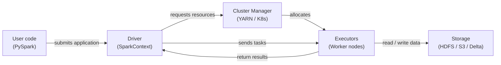

# Apache Spark

## Definition

Apache Spark is an open-source, distributed computing engine designed for large-scale data processing. It was created at UC Berkeley's AMPLab in 2009 and donated to the Apache Software Foundation, where it became the dominant framework for big data analytics. Spark executes computations in memory across a cluster of machines, dramatically outperforming disk-based predecessors like Hadoop MapReduce for iterative workloads — a property that makes it especially well-suited to machine learning.

Spark provides a unified API across four primary workloads: batch processing, SQL analytics, streaming (Structured Streaming), and machine learning (MLlib). This unification means teams can use a single cluster and a single programming model for the entire ML data pipeline — from raw log ingestion and feature engineering at petabyte scale all the way to distributed model training with MLlib. PySpark, the Python API, is the most widely used interface in the data science community.

The programming model is built around transformations and actions on distributed collections. Transformations (map, filter, join, groupBy) are lazy — they build an execution plan but do not run until an action (count, collect, write) is called. Spark's optimizer (Catalyst) rewrites and optimizes this plan before execution, often outperforming hand-tuned SQL. The result is an expressive, high-level API that scales from a laptop (local mode) to thousands of cores without code changes.

## How it works

### RDDs and DataFrames

Resilient Distributed Datasets (RDDs) are Spark's low-level abstraction: immutable, fault-tolerant, partitioned collections of records distributed across a cluster. RDDs support arbitrary transformations in Python, Scala, or Java but offer no schema information, so the optimizer has limited visibility into the data. **DataFrames** (and their typed counterpart, Datasets in Scala/Java) add a named schema on top of RDDs and expose a SQL-like API. The Catalyst optimizer can apply predicate pushdown, column pruning, and join reordering to DataFrame queries in ways that are not possible with raw RDDs. In practice, use DataFrames unless you need functionality that only RDDs expose.

### Spark SQL

Spark SQL lets you query DataFrames with standard SQL syntax, mixing SQL and DataFrame API calls in the same program. It connects to Hive metastore, Delta Lake, Iceberg, and other table formats, enabling Spark to act as a query engine over a data lakehouse. In ML pipelines, Spark SQL is used for feature aggregation queries — rolling windows, user-level aggregations, and join operations across large tables — that would be prohibitively slow on a single machine.

### MLlib

MLlib is Spark's distributed machine learning library. It provides algorithms for classification, regression, clustering, collaborative filtering, and feature engineering, all implemented to run in parallel across the cluster. The Pipeline API (`pyspark.ml`) mirrors scikit-learn's design: `Transformer` steps (scalers, encoders) and `Estimator` steps (model fitting) are chained into a `Pipeline` object that can be fit and serialized. MLlib is best used when training data is too large to fit in memory on a single machine, or when you need distributed hyperparameter tuning via `CrossValidator`.

### Driver and executor architecture

A Spark application has one **driver** process and one or more **executor** processes. The driver runs the user's program, constructs the logical plan, negotiates resources with the cluster manager (YARN, Kubernetes, or Spark Standalone), and divides the work into **tasks**. Executors are JVM processes running on worker nodes; each executor holds a configurable number of CPU cores and memory slots (task slots). Tasks are serialized and shipped to executors, which process their assigned data partitions and write results back to memory, disk, or an output sink. Fault tolerance is achieved by recomputing lost partitions from their lineage (the sequence of transformations that produced them).



## When to use / When NOT to use

| Use when | Avoid when |
|----------|------------|
| Dataset does not fit in a single machine's RAM (> ~50 GB) | Data fits comfortably in memory — pandas or Polars will be faster |
| Feature engineering requires joins or aggregations across billions of rows | Your team lacks experience with distributed systems and cluster management |
| You need distributed ML training (MLlib) or hyperparameter search | Job startup overhead (JVM, cluster allocation) is unacceptable for latency-sensitive tasks |
| You already have a Spark cluster (Databricks, EMR, Dataproc) | You need real-time, sub-second processing (use Flink or Kafka Streams) |
| You want a unified engine for batch, SQL, and streaming on the same data | Your transformations are complex custom logic that benefits from single-threaded debugging |

## Comparisons

| Criterion | Apache Spark | Pandas |
|-----------|-------------|--------|
| Data scale | Petabytes — partitioned across a cluster | Gigabytes — limited by single-machine RAM |
| Execution model | Distributed, parallel, lazy evaluation | In-process, eager, single-threaded by default |
| Setup complexity | High — cluster, JVM, dependency management | Low — `pip install pandas` and run |
| Performance on small data | Slow due to serialization and task scheduling overhead | Fast — minimal overhead, cache-friendly |
| API familiarity | PySpark is similar to pandas but with distributed semantics | Widely known; the standard for data science in Python |
| ML integration | MLlib for distributed training; integrates with XGBoost on Spark | scikit-learn ecosystem; best-in-class for single-machine ML |

## Pros and cons

| Pros | Cons |
|------|------|
| Scales to petabytes without code changes | Significant infrastructure and operational complexity |
| Unified engine for batch, SQL, and streaming | JVM startup and task scheduling add latency — not suitable for small jobs |
| In-memory processing dramatically faster than disk-based MapReduce | Memory management (spills, GC pressure) requires careful tuning |
| Rich ecosystem: Delta Lake, Iceberg, Hudi, MLflow integration | PySpark serializes Python UDFs via Py4J — can be slow for custom logic |
| Fault tolerance via lineage recomputation | Debugging distributed jobs is harder than single-machine pandas code |

## Code examples

```python
"""
PySpark examples:
  1. DataFrame operations for feature engineering at scale
  2. MLlib Pipeline for training a logistic regression model

Requires: pyspark >= 3.4
Run locally with: spark-submit spark_ml_example.py
  or in a notebook with a SparkSession already available.
"""

from pyspark.sql import SparkSession
from pyspark.sql import functions as F
from pyspark.sql.types import DoubleType
from pyspark.ml import Pipeline
from pyspark.ml.feature import VectorAssembler, StandardScaler, StringIndexer
from pyspark.ml.classification import LogisticRegression
from pyspark.ml.evaluation import BinaryClassificationEvaluator


# --- 1. Create a SparkSession (local mode for demo) ---
spark = (
    SparkSession.builder
    .appName("MLPipelineExample")
    .master("local[*]")           # Use all local CPU cores
    .config("spark.sql.shuffle.partitions", "8")  # Reduce for small data
    .getOrCreate()
)

spark.sparkContext.setLogLevel("WARN")


# --- 2. Load raw data ---
# In production: spark.read.parquet("s3://bucket/path/") or .format("delta")
raw_df = spark.createDataFrame(
    [
        (1, 25.0, "engineer", 55000.0, 0),
        (2, 32.0, "manager", 85000.0, 1),
        (3, 28.0, "engineer", 62000.0, 0),
        (4, 45.0, "manager", 110000.0, 1),
        (5, 38.0, "analyst", 72000.0, 1),
        (6, 22.0, "analyst", 48000.0, 0),
        (7, 51.0, "manager", 125000.0, 1),
        (8, 29.0, "engineer", 59000.0, 0),
    ],
    schema=["id", "age", "role", "salary", "high_earner"],
)

print("=== Raw data ===")
raw_df.show()


# --- 3. DataFrame feature engineering ---
feature_df = (
    raw_df
    # Log-transform salary to reduce skew
    .withColumn("log_salary", F.log1p(F.col("salary")))
    # Normalized age within role group (window function)
    .withColumn(
        "age_norm",
        (F.col("age") - F.mean("age").over(
            __import__("pyspark.sql.window", fromlist=["Window"])
            .Window.partitionBy("role")
        )).cast(DoubleType())
    )
    # Drop the original salary column (replaced by log_salary)
    .drop("salary")
)

print("=== Engineered features ===")
feature_df.show()


# --- 4. MLlib Pipeline: encode → assemble → scale → train ---

# 4a. Encode categorical column 'role' to numeric index
role_indexer = StringIndexer(inputCol="role", outputCol="role_idx")

# 4b. Assemble feature columns into a single vector
assembler = VectorAssembler(
    inputCols=["age", "log_salary", "role_idx"],
    outputCol="raw_features",
)

# 4c. Standardize feature vector (zero mean, unit variance)
scaler = StandardScaler(
    inputCol="raw_features",
    outputCol="features",
    withMean=True,
    withStd=True,
)

# 4d. Logistic regression classifier
lr = LogisticRegression(
    featuresCol="features",
    labelCol="high_earner",
    maxIter=100,
    regParam=0.01,
)

# 4e. Build and fit the pipeline
pipeline = Pipeline(stages=[role_indexer, assembler, scaler, lr])

# Use the raw_df (with salary) because VectorAssembler picks log_salary after transform
train_df, test_df = raw_df.randomSplit([0.8, 0.2], seed=42)
model = pipeline.fit(train_df)

# --- 5. Evaluate ---
predictions = model.transform(test_df)
evaluator = BinaryClassificationEvaluator(labelCol="high_earner")
auc = evaluator.evaluate(predictions)
print(f"=== AUC on test set: {auc:.4f} ===")

predictions.select("id", "high_earner", "prediction", "probability").show()

# --- 6. Save model for serving ---
model.write().overwrite().save("/tmp/spark_lr_model")
print("Model saved to /tmp/spark_lr_model")

spark.stop()
```

## Practical resources

- [Apache Spark documentation](https://spark.apache.org/docs/latest/) — Official reference for all APIs including PySpark, SQL, Streaming, and MLlib
- [PySpark API reference](https://spark.apache.org/docs/latest/api/python/) — Complete Python API docs for DataFrames, SQL, and MLlib
- [Databricks — Spark tutorials](https://docs.databricks.com/en/getting-started/index.html) — Hands-on notebooks covering Spark at scale with Delta Lake
- [Learning Spark, 2nd edition (O'Reilly)](https://www.oreilly.com/library/view/learning-spark-2nd/9781492050032/) — Comprehensive book covering Spark 3.x, Structured Streaming, and Delta Lake

## See also

- [Data pipelines](/docs/mlops/data-engineering)
- [Apache Kafka](/docs/mlops/data-engineering/kafka)
- [Apache Airflow](/docs/mlops/data-engineering/airflow)
