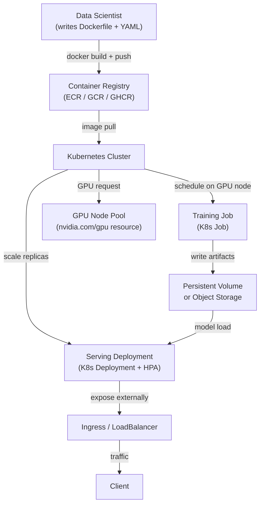

# ML on Kubernetes

## Definition

Kubernetes (K8s) is a container orchestration platform that automates the deployment, scaling, and management of containerized workloads. While Kubernetes was designed for stateless web services, the ML community has adopted it widely as the infrastructure backbone for training jobs, batch scoring, and model serving — because it solves the hardest ML infrastructure problems: resource isolation, reproducible environments, GPU scheduling, and horizontal scaling.

Running ML on vanilla Kubernetes — without a higher-level abstraction like [KubeFlow](/docs/mlops/deployment/kubeflow) — means composing standard Kubernetes primitives: `Job` for one-off training runs, `CronJob` for scheduled retraining, `Deployment` for long-running serving instances, and `HorizontalPodAutoscaler` for autoscaling. This approach gives teams full control over every aspect of their workloads at the cost of more YAML authoring and less ML-specific tooling built in.

The key difference from running ML on bare VMs is that Kubernetes provides declarative resource management: you specify how much CPU, RAM, and GPU a training job needs, and the scheduler places it on an appropriate node automatically. Kubernetes also handles node failures, pod restarts, and rolling deployments without manual intervention. For ML teams that already operate a Kubernetes cluster (or whose organization has one), this is often the pragmatic path to production before investing in a full platform like KubeFlow.

## How it works



### Containerizing ML models

The first step to running ML on Kubernetes is packaging the model code and its dependencies into a Docker image. A well-structured ML Dockerfile uses multi-stage builds to separate the dependency installation layer (which changes rarely and is cacheable) from the application code layer (which changes frequently). The base image should be pinned to a specific version — for GPU workloads, NVIDIA provides `nvcr.io/nvidia/pytorch` and `nvcr.io/nvidia/tensorflow` base images that include CUDA, cuDNN, and NCCL pre-installed and validated together. The resulting image is pushed to a container registry and referenced by name and digest (not `latest`) in Kubernetes manifests, ensuring the exact same environment is used every time.

### GPU scheduling and resource management

Kubernetes supports GPU scheduling through the NVIDIA device plugin, which exposes GPUs as a schedulable resource (`nvidia.com/gpu`). A pod that requests `nvidia.com/gpu: 1` will only be scheduled on a node that has a free GPU, and the GPU is exclusively allocated to that pod for the duration of its lifetime. Node pools are typically configured with different GPU types (T4 for inference, A100 for large training jobs) and labeled accordingly, allowing pods to use `nodeSelector` or `nodeAffinity` to target the appropriate hardware. Resource quotas at the namespace level prevent any single team from monopolizing the cluster's GPU capacity.

### Training jobs

One-off training runs are expressed as Kubernetes `Job` objects. A Job creates one or more pods, waits for them to complete successfully (exit 0), and records the result. For distributed training across multiple GPUs or nodes, the `training-operator` (formerly the Kubeflow Training Operator, but deployable standalone) extends Kubernetes with `PyTorchJob` and `TFJob` custom resources that coordinate multi-node, multi-GPU training with PyTorch DDP or Horovod. Each worker pod is given the same container image but different rank and world-size environment variables, enabling data-parallel training with automatic rendezvous.

### Serving deployments and autoscaling

Model serving is expressed as a Kubernetes `Deployment` with a desired replica count and resource requests/limits. A `Service` of type `ClusterIP` routes traffic between replicas, and an `Ingress` or `LoadBalancer` service exposes the endpoint externally. The `HorizontalPodAutoscaler` (HPA) scales the number of replicas based on CPU utilization, custom metrics (e.g., requests per second from Prometheus), or external metrics (e.g., SQS queue depth for batch workers). For latency-sensitive serving, `PodDisruptionBudgets` ensure that rolling updates never take down more than a configurable fraction of replicas simultaneously.

## When to use / When NOT to use

| Use when | Avoid when |
|---|---|
| Organization already operates a Kubernetes cluster | Your team has no Kubernetes experience and no platform team to support it |
| Full control over infrastructure is required (on-premises, air-gapped) | A managed ML service (SageMaker, Vertex AI) is available and fits the use case |
| ML workloads must share a cluster with other engineering workloads | The simplicity of a VM or a cloud training job is sufficient |
| You need GPU scheduling without the overhead of a full ML platform | Setup and maintenance cost of K8s outweighs the operational benefits |
| Portability across cloud providers is a hard requirement | You need AutoML, experiment tracking, or multi-tenancy (consider KubeFlow) |

## Comparisons

| Criterion | ML on Kubernetes (vanilla) | KubeFlow |
|---|---|---|
| Complexity | Medium — standard K8s objects | High — many CRDs, Istio, Argo, MLMD |
| Features | Manual — build what you need | Built-in pipelines, AutoML (Katib), serving (KServe), notebooks |
| Learning curve | Medium — K8s knowledge sufficient | Steep — requires KubeFlow-specific knowledge on top of K8s |
| Flexibility | High — unrestricted use of K8s primitives | Moderate — bound to KubeFlow abstractions |
| Managed options | EKS, GKE, AKS (any managed K8s) | Vertex AI Pipelines (GKE-based), AWS managed KubeFlow |
| Setup time | Hours to days | Days to weeks |

## Pros and cons

| Pros | Cons |
|---|---|
| Full control — use any K8s resource without framework constraints | All ML-specific tooling (pipeline UI, experiment tracking) must be added separately |
| GPU scheduling and multi-node training with the training-operator | YAML-heavy — manifest authoring can be tedious and error-prone |
| Works on any cloud or on-premises cluster (no vendor lock-in) | GPU debugging on K8s requires familiarity with node taints, limits, and device plugin |
| Rolling deployments and autoscaling with standard K8s HPA | Resource quota and node affinity configuration requires platform team involvement |
| Fits into existing GitOps workflows (Argo CD, Flux) | No built-in model registry, experiment tracker, or pipeline UI |

## Code examples

```dockerfile
# Dockerfile — Multi-stage build for an ML model serving image
# Stage 1: install Python dependencies (cacheable layer)
# Stage 2: copy application code on top

# --- Stage 1: dependency builder ---
FROM python:3.11-slim AS builder

WORKDIR /build

# Install build tools and compile dependencies
RUN apt-get update && apt-get install -y --no-install-recommends \
    gcc \
    libgomp1 \
 && rm -rf /var/lib/apt/lists/*

COPY requirements.txt .
# Install dependencies into an isolated prefix so we can copy only them to the final image
RUN pip install --prefix=/install --no-cache-dir -r requirements.txt


# --- Stage 2: lean runtime image ---
FROM python:3.11-slim AS runtime

WORKDIR /app

# Copy only the installed packages from the builder (keeps image small)
COPY --from=builder /install /usr/local

# Copy application source code
COPY src/ ./src/

# The model artifact is mounted via a Kubernetes PersistentVolumeClaim or downloaded at startup
# It is NOT baked into the image to keep image size manageable
ENV MODEL_PATH=/models/model.joblib
ENV MODEL_VERSION=unknown
ENV PORT=8080

EXPOSE 8080

# Run as non-root for security best practices
RUN useradd -m appuser
USER appuser

CMD ["python", "-m", "uvicorn", "src.fastapi_serving:app", "--host", "0.0.0.0", "--port", "8080"]
```

```yaml
# k8s-manifests.yaml
# Three Kubernetes resources:
#   1. Deployment — runs the model serving pods
#   2. Service — routes traffic to the pods
#   3. HorizontalPodAutoscaler — scales replicas based on CPU usage

---
apiVersion: apps/v1
kind: Deployment
metadata:
  name: fraud-detector
  namespace: ml-serving
  labels:
    app: fraud-detector
    version: v1
spec:
  replicas: 2
  selector:
    matchLabels:
      app: fraud-detector
  strategy:
    type: RollingUpdate
    rollingUpdate:
      maxSurge: 1          # allow one extra pod during rollout
      maxUnavailable: 0    # never take a pod down before a new one is ready
  template:
    metadata:
      labels:
        app: fraud-detector
        version: v1
    spec:
      # Pull the model from an init container instead of baking it into the image
      initContainers:
        - name: download-model
          image: amazon/aws-cli:2.15.0
          command:
            - aws
            - s3
            - cp
            - s3://my-ml-bucket/models/fraud-detector/v1/model.joblib
            - /models/model.joblib
          env:
            - name: AWS_REGION
              value: us-east-1
          volumeMounts:
            - name: model-volume
              mountPath: /models

      containers:
        - name: serving
          image: ghcr.io/org/fraud-detector:sha-abc1234  # pinned by digest, not latest
          ports:
            - containerPort: 8080
          env:
            - name: MODEL_PATH
              value: /models/model.joblib
            - name: MODEL_VERSION
              value: v1
          resources:
            requests:
              cpu: "500m"
              memory: "512Mi"
            limits:
              cpu: "1"
              memory: "1Gi"
              # Uncomment for GPU-based inference:
              # nvidia.com/gpu: "1"
          volumeMounts:
            - name: model-volume
              mountPath: /models
          # Liveness probe — restart if the app hangs
          livenessProbe:
            httpGet:
              path: /health
              port: 8080
            initialDelaySeconds: 15
            periodSeconds: 10
          # Readiness probe — do not send traffic until model is loaded
          readinessProbe:
            httpGet:
              path: /health
              port: 8080
            initialDelaySeconds: 10
            periodSeconds: 5

      volumes:
        - name: model-volume
          emptyDir: {}  # ephemeral volume shared between init and main containers

---
apiVersion: v1
kind: Service
metadata:
  name: fraud-detector
  namespace: ml-serving
spec:
  selector:
    app: fraud-detector
  ports:
    - name: http
      port: 80
      targetPort: 8080
  type: ClusterIP

---
apiVersion: autoscaling/v2
kind: HorizontalPodAutoscaler
metadata:
  name: fraud-detector-hpa
  namespace: ml-serving
spec:
  scaleTargetRef:
    apiVersion: apps/v1
    kind: Deployment
    name: fraud-detector
  minReplicas: 2
  maxReplicas: 10
  metrics:
    - type: Resource
      resource:
        name: cpu
        target:
          type: Utilization
          averageUtilization: 70   # scale out when average CPU exceeds 70%
```

```bash
# Useful kubectl commands for ML workloads on Kubernetes

# Check GPU node availability and allocatable GPUs
kubectl get nodes -l accelerator=nvidia-tesla-t4 -o custom-columns="NODE:.metadata.name,GPU:.status.allocatable.nvidia\.com/gpu"

# Watch pod startup (useful for debugging model download in init containers)
kubectl logs -n ml-serving deploy/fraud-detector -c download-model --follow

# View resource usage of serving pods
kubectl top pods -n ml-serving -l app=fraud-detector

# Scale the deployment manually (overrides HPA temporarily)
kubectl scale deploy/fraud-detector -n ml-serving --replicas=4

# Trigger a rolling update with a new image
kubectl set image deploy/fraud-detector serving=ghcr.io/org/fraud-detector:sha-def5678 -n ml-serving

# Watch rollout status
kubectl rollout status deploy/fraud-detector -n ml-serving
```

## Practical resources

- [Kubernetes official documentation](https://kubernetes.io/docs/) — Comprehensive reference for all Kubernetes concepts and API objects.
- [NVIDIA GPU Operator for Kubernetes](https://docs.nvidia.com/datacenter/cloud-native/gpu-operator/overview.html) — Automates the setup of GPU drivers, device plugins, and monitoring on K8s nodes.
- [Kubeflow Training Operator](https://www.kubeflow.org/docs/components/training/) — Standalone CRDs for PyTorchJob, TFJob, and MPI distributed training (deployable without full KubeFlow).
- [Kubernetes HPA documentation](https://kubernetes.io/docs/tasks/run-application/horizontal-pod-autoscale/) — Official guide for CPU, memory, and custom metric autoscaling.

## See also

- [KubeFlow](/docs/mlops/deployment/kubeflow)
- [Model serving](/docs/mlops/deployment/model-serving)
- [Terraform for ML infrastructure](/docs/mlops/iac/terraform)
