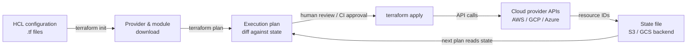

# Terraform

## Definition

Terraform is an open-source Infrastructure as Code (IaC) tool created by HashiCorp that allows you to define, provision, and manage cloud and on-premises infrastructure using a declarative configuration language called HCL (HashiCorp Configuration Language). You describe the desired end state of your infrastructure — which resources should exist, how they should be configured, and how they relate to each other — and Terraform figures out what to create, update, or destroy to reach that state. This declarative model is fundamentally different from imperative scripting approaches where you describe the sequence of steps to execute.

The cornerstone of Terraform's architecture is its **provider** ecosystem. A provider is a plugin that translates HCL resource definitions into API calls against a specific platform: AWS, Google Cloud, Azure, Kubernetes, Datadog, GitHub, and hundreds more. Each provider maintains its own versioned release cycle, and Terraform downloads providers automatically based on `required_providers` blocks. This means a single Terraform configuration can simultaneously provision an AWS GPU training cluster, a GCS bucket for training data, a Kubernetes namespace for model serving, and a Grafana dashboard for monitoring — with consistent tooling across all platforms.

**State management** is what makes Terraform idempotent and plan-able. Terraform maintains a state file that maps each resource in the configuration to its real-world counterpart (identified by cloud provider resource IDs). When you run `terraform plan`, Terraform compares the current state file against your configuration and the live infrastructure, producing a diff that shows exactly what will change before any change is made. For team workflows, state is stored in a shared backend (S3, GCS, Terraform Cloud) with locking to prevent concurrent modifications. This auditability and predictability make Terraform the dominant IaC tool for provisioning ML training and serving infrastructure in regulated and collaborative environments.

## How it works

### Write configuration

Engineers write HCL files (`.tf`) that declare resources, data sources, variables, outputs, and modules. Resources correspond to infrastructure objects (an EC2 instance, an S3 bucket, a Kubernetes deployment). Data sources read existing infrastructure without managing it. Variables parameterize configurations for reuse across environments. Modules encapsulate reusable sets of resources — a "GPU training cluster" module can be instantiated multiple times with different instance types and regions.

### Initialize and plan

Running `terraform init` downloads required providers and modules and initializes the backend. Running `terraform plan` produces a human-readable execution plan: a list of resources to add (+), change (~), or destroy (−). The plan phase is read-only — it makes no changes to infrastructure. Teams typically integrate `terraform plan` into CI pipelines to review changes in pull requests before merging.

### Apply and state management

`terraform apply` executes the plan, calling provider APIs to create, update, or delete resources in dependency order. Terraform resolves the dependency graph automatically based on references between resources (e.g., a subnet that references a VPC ID). After apply, the state file is updated to reflect the new infrastructure state. For ML infrastructure, this means GPU instances, storage buckets, IAM roles, and Kubernetes clusters are all created in the correct order with the correct configurations in a single command.

### Destroy and lifecycle management

`terraform destroy` tears down all resources managed by the configuration — useful for ephemeral training environments that should not run (and cost money) between training jobs. Lifecycle meta-arguments (`create_before_destroy`, `prevent_destroy`, `ignore_changes`) give fine-grained control over how Terraform handles sensitive resources like model artifact storage buckets that must never be accidentally deleted.



## When to use / When NOT to use

| Use when | Avoid when |
|----------|------------|
| Provisioning cloud infrastructure that must be reproducible across environments | Configuring software inside existing instances (use Ansible for that) |
| Managing ML infrastructure at scale: GPU clusters, storage, networking, Kubernetes | Your team has no cloud infrastructure to manage (no servers, no cloud accounts) |
| Multiple team members need to collaborate on the same infrastructure | You need to run arbitrary shell commands or configure OS-level settings on instances |
| You want infrastructure changes reviewed via pull requests before application | Your existing infrastructure was not created with Terraform and migration cost is prohibitive |
| Infrastructure needs to be versioned, audited, and rolled back reliably | You need rapid, iterative changes to application config during development |
| You operate in multiple cloud providers and want a unified workflow | Your organization already standardizes on a competing IaC tool (Pulumi, CDK) with institutional knowledge |

## Comparisons

| Criterion | Terraform | Ansible |
|-----------|-----------|---------|
| Paradigm | Declarative — describe desired state | Procedural — describe steps to reach state |
| State management | Explicit state file; tracks resource IDs | Stateless — no built-in state tracking |
| Primary use case | Cloud resource provisioning (instances, networks, storage) | Configuration management and application deployment on existing instances |
| Cloud provider support | 1,000+ providers via plugin ecosystem | Modules for major clouds; less comprehensive than Terraform |
| Idempotency | Native — plan/apply always converges to desired state | Task-level — each task must be written to be idempotent |
| Learning curve | HCL syntax + state/plan mental model | YAML playbooks; lower initial barrier |
| When to use both | Terraform provisions infrastructure; Ansible configures software on it — they complement each other | See above |

## Pros and cons

| Aspect | Pros | Cons |
|--------|------|------|
| Declarative model | Intent is clear; plan shows exact changes before apply | Cannot easily express conditional logic or complex loops (though HCL has improved) |
| State file | Enables accurate planning and drift detection | State file is sensitive; corruption or loss is a serious incident |
| Provider ecosystem | Covers virtually every cloud service and SaaS tool | Provider quality varies; some community providers are poorly maintained |
| Plan/apply workflow | Changes are reviewable before execution | Slower iteration cycle than imperative scripts for rapid prototyping |
| Module reuse | DRY infrastructure patterns via published or internal modules | Large module graphs can be slow to initialize and plan |
| Idempotency | Safe to run repeatedly; convergent behavior | Destroy/recreate cycles for certain resource changes (e.g., renaming) cause downtime |

## Code examples

```hcl
# ml_infrastructure.tf
# Provisions an AWS GPU training instance and S3 bucket for ML artifacts.
# Prerequisites: AWS CLI configured, Terraform >= 1.5, appropriate IAM permissions.
# Run: terraform init && terraform plan && terraform apply

terraform {
  required_version = ">= 1.5"
  required_providers {
    aws = {
      source  = "hashicorp/aws"
      version = "~> 5.0"
    }
  }
  # Remote state backend — replace with your bucket and key
  backend "s3" {
    bucket         = "my-org-terraform-state"
    key            = "mlops/training/terraform.tfstate"
    region         = "us-east-1"
    dynamodb_table = "terraform-state-lock"
    encrypt        = true
  }
}

provider "aws" {
  region = var.aws_region
}

# --- Variables ---

variable "aws_region" {
  description = "AWS region for all resources"
  type        = string
  default     = "us-east-1"
}

variable "environment" {
  description = "Deployment environment: dev, staging, prod"
  type        = string
  default     = "dev"
}

variable "gpu_instance_type" {
  description = "EC2 instance type for GPU training. p3.2xlarge has 1x V100."
  type        = string
  default     = "p3.2xlarge"
}

variable "key_pair_name" {
  description = "Name of an existing EC2 key pair for SSH access"
  type        = string
}

# --- Data sources ---

# Use the latest Deep Learning AMI (GPU) for the region
data "aws_ami" "dl_ami" {
  most_recent = true
  owners      = ["amazon"]

  filter {
    name   = "name"
    values = ["Deep Learning AMI GPU PyTorch*"]
  }

  filter {
    name   = "architecture"
    values = ["x86_64"]
  }
}

# Default VPC for simplicity — use a dedicated VPC in production
data "aws_vpc" "default" {
  default = true
}

# --- S3 bucket for training artifacts ---

resource "aws_s3_bucket" "ml_artifacts" {
  bucket = "ml-artifacts-${var.environment}-${random_id.suffix.hex}"

  tags = {
    Environment = var.environment
    Purpose     = "ml-training-artifacts"
    ManagedBy   = "terraform"
  }
}

resource "random_id" "suffix" {
  byte_length = 4
}

# Block all public access to the artifacts bucket
resource "aws_s3_bucket_public_access_block" "ml_artifacts" {
  bucket                  = aws_s3_bucket.ml_artifacts.id
  block_public_acls       = true
  block_public_policy     = true
  ignore_public_acls      = true
  restrict_public_buckets = true
}

# Enable versioning so artifact overwrites can be recovered
resource "aws_s3_bucket_versioning" "ml_artifacts" {
  bucket = aws_s3_bucket.ml_artifacts.id
  versioning_configuration {
    status = "Enabled"
  }
}

# --- IAM role for the training instance ---

resource "aws_iam_role" "ml_training" {
  name = "ml-training-role-${var.environment}"

  assume_role_policy = jsonencode({
    Version = "2012-10-17"
    Statement = [{
      Action    = "sts:AssumeRole"
      Effect    = "Allow"
      Principal = { Service = "ec2.amazonaws.com" }
    }]
  })

  tags = {
    Environment = var.environment
    ManagedBy   = "terraform"
  }
}

resource "aws_iam_role_policy" "ml_s3_access" {
  name = "ml-s3-access"
  role = aws_iam_role.ml_training.id

  policy = jsonencode({
    Version = "2012-10-17"
    Statement = [{
      Effect = "Allow"
      Action = [
        "s3:GetObject",
        "s3:PutObject",
        "s3:ListBucket",
        "s3:DeleteObject"
      ]
      Resource = [
        aws_s3_bucket.ml_artifacts.arn,
        "${aws_s3_bucket.ml_artifacts.arn}/*"
      ]
    }]
  })
}

resource "aws_iam_instance_profile" "ml_training" {
  name = "ml-training-profile-${var.environment}"
  role = aws_iam_role.ml_training.name
}

# --- Security group for training instance ---

resource "aws_security_group" "ml_training" {
  name        = "ml-training-sg-${var.environment}"
  description = "Security group for ML GPU training instances"
  vpc_id      = data.aws_vpc.default.id

  # SSH access — restrict to your IP in production
  ingress {
    from_port   = 22
    to_port     = 22
    protocol    = "tcp"
    cidr_blocks = ["0.0.0.0/0"]
    description = "SSH — restrict to known IPs in production"
  }

  # JupyterLab access
  ingress {
    from_port   = 8888
    to_port     = 8888
    protocol    = "tcp"
    cidr_blocks = ["0.0.0.0/0"]
    description = "JupyterLab — restrict to known IPs in production"
  }

  egress {
    from_port   = 0
    to_port     = 0
    protocol    = "-1"
    cidr_blocks = ["0.0.0.0/0"]
    description = "Allow all outbound traffic"
  }

  tags = {
    Environment = var.environment
    ManagedBy   = "terraform"
  }
}

# --- GPU Training EC2 instance ---

resource "aws_instance" "ml_training" {
  ami                    = data.aws_ami.dl_ami.id
  instance_type          = var.gpu_instance_type
  key_name               = var.key_pair_name
  iam_instance_profile   = aws_iam_instance_profile.ml_training.name
  vpc_security_group_ids = [aws_security_group.ml_training.id]

  # 100 GB root volume for datasets and model checkpoints
  root_block_device {
    volume_type           = "gp3"
    volume_size           = 100
    delete_on_termination = true
    encrypted             = true
  }

  # Bootstrap script: export the S3 bucket name as an environment variable
  user_data = <<-EOF
    #!/bin/bash
    echo "export ML_ARTIFACTS_BUCKET=${aws_s3_bucket.ml_artifacts.bucket}" >> /etc/environment
    echo "export AWS_DEFAULT_REGION=${var.aws_region}" >> /etc/environment
  EOF

  tags = {
    Name        = "ml-training-${var.environment}"
    Environment = var.environment
    Purpose     = "gpu-training"
    ManagedBy   = "terraform"
  }

  # Prevent accidental destruction in production
  lifecycle {
    prevent_destroy = false # Set to true for production instances
  }
}

# --- Outputs ---

output "training_instance_id" {
  description = "EC2 instance ID of the GPU training instance"
  value       = aws_instance.ml_training.id
}

output "training_instance_public_ip" {
  description = "Public IP address of the GPU training instance"
  value       = aws_instance.ml_training.public_ip
}

output "ml_artifacts_bucket_name" {
  description = "Name of the S3 bucket for ML artifacts"
  value       = aws_s3_bucket.ml_artifacts.bucket
}

output "ml_artifacts_bucket_arn" {
  description = "ARN of the S3 bucket for ML artifacts"
  value       = aws_s3_bucket.ml_artifacts.arn
}
```

## Practical resources

- [Terraform documentation](https://developer.hashicorp.com/terraform/docs) — Official HashiCorp documentation covering HCL syntax, providers, state, workspaces, and modules.
- [Terraform AWS provider documentation](https://registry.terraform.io/providers/hashicorp/aws/latest/docs) — Comprehensive reference for all AWS resources and data sources available in the Terraform AWS provider.
- [Terraform best practices](https://developer.hashicorp.com/terraform/language/style) — Official style guide covering module structure, naming conventions, and state management patterns.
- [Gruntwork — Terraform: Up and Running](https://www.terraformupandrunning.com/) — Widely recommended book on production Terraform patterns, modules, and testing.
- [Terraform Registry](https://registry.terraform.io/) — Official registry of published providers and modules, including community modules for Kubernetes, EKS, and GPU instance configurations.

## See also

- [Ansible](/docs/mlops/iac/ansible)
- [ML Kubernetes](/docs/mlops/deployment/ml-kubernetes)
- [MLOps](/docs/mlops)
