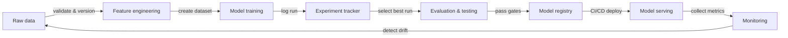

# MLOps

## Definition

MLOps — Machine Learning Operations — is the discipline of applying DevOps principles and practices to the machine learning lifecycle. It provides the tooling, processes, and cultural norms needed to reliably build, deploy, and maintain ML models in production. Without MLOps, teams routinely ship models that work in notebooks but silently degrade in production, cannot be reproduced six months later, or take weeks to update.

The core principles of MLOps are **reproducibility** (every experiment and deployment can be recreated exactly), **automation** (data pipelines, training, evaluation, and deployment are triggered by code, not manual steps), **monitoring** (model performance is tracked continuously in production), and **collaboration** (data scientists, ML engineers, and platform teams share tooling, standards, and ownership). These principles map directly onto DevOps pillars — continuous integration, delivery, and feedback — applied to data and model artifacts rather than just code.

MLOps emerged as teams discovered that the software engineering practices that tame software complexity do not transfer automatically to ML. Code is only one input: data distributions shift, model accuracy decays, experiments proliferate, and a model that performed well on a validation set in January may behave unpredictably by July. MLOps provides the scaffolding to detect and respond to these problems systematically.

## How it works

### Data management

Raw data is ingested, validated, versioned, and stored in a feature store or data lake. Data validation catches schema drift and distribution shift before they corrupt a training run. Versioning ensures that models can be retrained on exactly the data that produced a previous version.

### Experimentation and training

Data scientists run experiments — varying hyperparameters, architectures, and feature sets — and all runs are logged to an experiment tracker. The best run is promoted for further evaluation. Automated training pipelines (triggered by new data or a code commit) remove manual steps and allow continuous retraining.

### Evaluation and validation

Candidate models are evaluated against held-out test sets, fairness checks, and latency budgets before promotion. Evaluation gates prevent regressions from reaching production. A/B testing or shadow deployments can compare candidate and production models on live traffic.

### Deployment and serving

Approved models are packaged, registered in a model registry, and deployed via CI/CD pipelines to serving infrastructure. Canary deployments and rollback mechanisms reduce risk. Infrastructure-as-code ensures serving environments are reproducible.

### Monitoring and feedback

Production metrics — prediction distributions, data drift, latency, error rates — are collected and fed back to the team. Alerts trigger retraining pipelines or model rollbacks. Feedback loops close the ML lifecycle, turning production signals into new training data.



## When to use / When NOT to use

| Use when | Avoid when |
|----------|------------|
| Models are deployed to production and serve real users | The project is a one-off analysis or research prototype |
| Multiple team members collaborate on the same models | The team has fewer than two people and a single model |
| Models require periodic retraining as data drifts | The model is static and will never be updated |
| Regulatory or audit requirements demand reproducibility | Speed of exploration is the only priority and no production deployment is planned |
| You have more than one production model to manage | The overhead of tooling outweighs the project's expected lifespan |

## Code examples

```python
# mlflow_quickstart.py
# Demonstrates basic MLflow experiment tracking for a simple classifier.
# Run: pip install mlflow scikit-learn

import mlflow
import mlflow.sklearn
from sklearn.datasets import load_iris
from sklearn.ensemble import RandomForestClassifier
from sklearn.model_selection import train_test_split
from sklearn.metrics import accuracy_score, f1_score

# Load data
X, y = load_iris(return_X_y=True)
X_train, X_test, y_train, y_test = train_test_split(
    X, y, test_size=0.2, random_state=42
)

# Define hyperparameters to log
params = {
    "n_estimators": 100,
    "max_depth": 5,
    "random_state": 42,
}

# Start an MLflow experiment run
mlflow.set_experiment("iris-classification")

with mlflow.start_run(run_name="random-forest-baseline"):
    # Log hyperparameters
    mlflow.log_params(params)

    # Train the model
    clf = RandomForestClassifier(**params)
    clf.fit(X_train, y_train)

    # Evaluate
    y_pred = clf.predict(X_test)
    accuracy = accuracy_score(y_test, y_pred)
    f1 = f1_score(y_test, y_pred, average="weighted")

    # Log metrics
    mlflow.log_metric("accuracy", accuracy)
    mlflow.log_metric("f1_score", f1)

    # Log the trained model with a registered name
    mlflow.sklearn.log_model(
        clf,
        artifact_path="model",
        registered_model_name="iris-random-forest",
    )

    print(f"Accuracy: {accuracy:.4f} | F1: {f1:.4f}")
    print(f"Run ID: {mlflow.active_run().info.run_id}")
```

## Practical resources

- [Google – Practitioners Guide to MLOps](https://services.google.com/fh/files/misc/practitioners_guide_to_mlops_whitepaper.pdf) — Comprehensive whitepaper covering MLOps maturity levels, tooling choices, and organizational patterns from Google Cloud.
- [MLflow Documentation](https://mlflow.org/docs/latest/index.html) — Official docs for the most widely adopted open-source MLOps platform, covering tracking, registry, projects, and deployment.
- [Made With ML – MLOps Course](https://madewithml.com/) — Free, project-based MLOps course that walks through the full lifecycle with real code.
- [Chip Huyen – Designing Machine Learning Systems](https://www.oreilly.com/library/view/designing-machine-learning/9781098107956/) — O'Reilly book covering production ML system design, data pipelines, feature stores, and monitoring.
- [CD Foundation – MLOps SIG](https://github.com/cdfoundation/sig-mlops) — Community-driven definitions, landscape, and best practices for MLOps.

## See also

- [Experiment tracking](/docs/mlops/experiment-tracking)
- [MLflow](/docs/mlops/mlflow)
- [Weights & Biases](/docs/mlops/wandb)
- [Feature stores](/docs/mlops/feature-stores)
