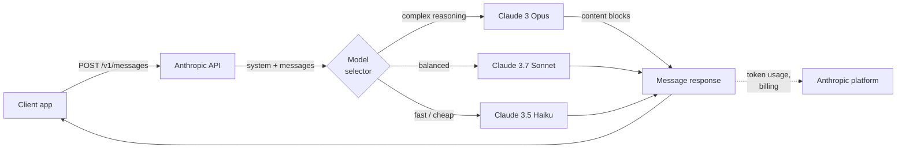
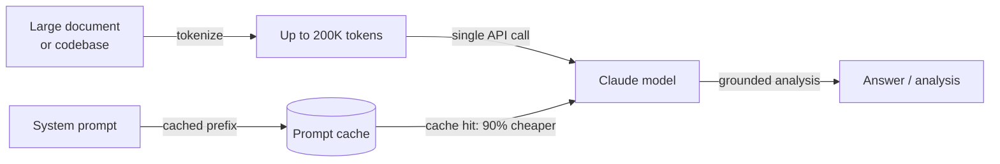

# Anthropic

## Definition

**Anthropic** is an AI safety company and model provider founded in 2021 by former OpenAI researchers. Its core thesis is that building capable AI models and solving the alignment problem are inseparable goals — the company pursues cutting-edge capability alongside safety research such as Constitutional AI, interpretability, and mechanistic understanding of model internals. The commercial product of that research is the **Claude** family of models, available through the Anthropic API and enterprise products.

The Claude model lineup follows a three-tier naming convention reflecting capability and cost trade-offs: **Opus** (highest quality, complex reasoning), **Sonnet** (balanced quality and speed), and **Haiku** (fastest and most cost-efficient). As of 2025 the current generation is **Claude 3.7 Sonnet** — the flagship model with extended thinking capabilities — along with **Claude 3 Opus**, **Claude 3.5 Sonnet**, and **Claude 3.5 Haiku**. All Claude 3+ models support vision input (images), and the entire family is designed around a 200K-token context window that can handle books, large codebases, and long conversation histories without truncation.

From a platform perspective, Anthropic's API centers on the **Messages API** — a clean, purpose-built interface for multi-turn conversations. The platform includes tool use (Anthropic's term for function calling), extended thinking (visible chain-of-thought reasoning), prompt caching (reduces cost and latency for large repeated contexts), and batch processing. The Python SDK (`anthropic`) and TypeScript SDK are the primary client libraries. Claude models are also available through Amazon Bedrock, Google Cloud Vertex AI, and enterprise contracts with data residency options.

## How it works

### Messages API

The Messages API (`POST /v1/messages`) is Anthropic's primary interface. Unlike some APIs that use a flat `prompt` string, the Messages API is conversation-first: you send a `messages` array of alternating `user` and `assistant` turns, with an optional `system` parameter for context and persona. The model returns a `Message` object containing a `content` list — text blocks by default, tool use blocks when the model decides to call a tool. Streaming is supported and recommended for interactive use; the SDK provides both streaming helpers and raw SSE access.



### Tool use

Tool use lets Claude call external functions by emitting structured `tool_use` content blocks. You declare tools as JSON schemas in the `tools` parameter. When Claude decides a tool is needed, the response contains a `tool_use` block with the tool name and input; your code executes the function and returns a `tool_result` in the next user turn. Claude then uses the result to complete its response. This pattern enables agents, code execution environments, database queries, and API integrations without the model needing direct access to any system.


### Extended thinking

Extended thinking is a mode available on Claude 3.7 Sonnet that allows the model to reason at length before producing its final answer. When you set `thinking: {type: "enabled", budget_tokens: N}`, the model emits `thinking` content blocks containing its internal scratchpad — similar to chain-of-thought but native and structured. Extended thinking significantly improves performance on math competitions, complex code, multi-step reasoning, and tasks requiring careful step-by-step analysis. The thinking tokens count toward the token budget but are visible in the response, giving you transparency into how the model arrived at its answer.

### Prompt caching

Prompt caching dramatically reduces cost and latency for workloads that repeatedly use large system prompts or document contexts. You mark prefix sections of your request with `cache_control: {type: "ephemeral"}`. On the first call, Anthropic caches the prompt prefix on their infrastructure; subsequent calls that match the prefix are served from cache at 90% lower input token cost and significantly reduced time-to-first-token. This is especially valuable for RAG pipelines (large context passed with every query), agent loops (large system prompts repeated every turn), and batch document processing.

### Long context (200K tokens)

All Claude 3 and later models support a 200K-token context window — equivalent to roughly 150,000 words or ~500 pages of text. Long context enables entire codebases, legal documents, research papers, or full conversation histories to be processed in a single call without chunking. Anthropic's research on long-context performance ("needle in a haystack" evaluations) shows Claude maintains strong recall accuracy across the full 200K range, making it reliable for document Q&A, contract analysis, and code review over large repositories. This is one of Anthropic's clearest differentiators relative to GPT-4o's 128K window.



## When to use / When NOT to use

| Use Anthropic when | Avoid or consider alternatives when |
|--------------------|--------------------------------------|
| You need a 200K context window to process long documents, codebases, or extended conversations without chunking | Your workload requires image generation, audio transcription, or text-to-speech — Claude is text/vision only; OpenAI covers audio |
| Safety constraints and predictable refusal behavior are critical (compliance, healthcare, finance) | You need open-weights models for self-hosting, fine-tuning, or data residency — Anthropic offers no open-weights option |
| You want extended thinking for deep reasoning tasks (math, complex code, multi-step analysis) | Your primary use case is high-volume embedding generation — Anthropic does not offer an embeddings API |
| Prompt caching will meaningfully reduce cost (large repeated contexts, agent system prompts) | You rely heavily on OpenAI-specific tooling (Assistants API, DALL-E, Whisper) that has no Anthropic equivalent |
| You are building tool use or computer use workflows and want a model well-calibrated for structured outputs | You need the absolute lowest cost-per-token at scale — Claude Haiku competes on price but GPT-4o-mini and open models are cheaper |

## Comparisons

| Criteria | Anthropic | OpenAI | Google Gemini |
|----------|-----------|--------|---------------|
| Flagship model | Claude 3.7 Sonnet | GPT-4o | Gemini 2.5 Pro |
| Context window | 200K (all Claude 3+) | 128K (GPT-4o) | Up to 1M (Gemini 1.5 Pro) |
| Reasoning / thinking | Extended thinking (native CoT) | o1, o3 series | Gemini 2.5 Pro thinking |
| Multimodal input | Text, image | Text, image, audio, video | Text, image, audio, video |
| Audio / speech | No | Yes (Whisper, TTS) | Yes (Gemini) |
| Image generation | No | Yes (DALL-E 3) | Yes (Imagen) |
| Embeddings API | No | Yes | Yes |
| Open-weights | No | No | Gemma (partial) |
| Prompt caching | Yes (native, 90% discount) | Context caching (limited) | Yes (Gemini) |
| Tool use / function calling | Mature, computer use support | Mature, widely adopted | Mature |
| Safety philosophy | Constitutional AI, refusal-tuned | Moderation API, usage policy | Responsible AI guidelines |
| Data residency options | Enterprise contract | Enterprise contract | Google Cloud regions |

## Pros and cons

| Pros | Cons |
|------|------|
| 200K context window across all models — best-in-class for long documents | No audio, speech, or image generation APIs |
| Extended thinking gives transparent chain-of-thought for hard reasoning tasks | No embeddings API — you need a second provider for RAG |
| Prompt caching significantly reduces cost for repeated large contexts | Closed model with no open-weights option |
| Safety-first design with careful refusal calibration and Constitutional AI | Smaller ecosystem than OpenAI — fewer third-party tutorials and integrations |
| Computer use (beta) enables agentic control of desktop GUIs | Pricing can be higher than GPT-4o-mini or open-weights alternatives for simple tasks |

## Code examples

### Messages API — basic completion and system prompt

```python
import anthropic

client = anthropic.Anthropic(api_key="sk-ant-...")  # or set ANTHROPIC_API_KEY env var

# Basic message
message = client.messages.create(
    model="claude-3-7-sonnet-20250219",
    max_tokens=1024,
    system="You are a concise technical assistant. Answer in plain English.",
    messages=[
        {"role": "user", "content": "What is the Anthropic Messages API?"}
    ],
)
print(message.content[0].text)

# Multi-turn conversation
messages = [
    {"role": "user", "content": "What is prompt caching?"},
    {"role": "assistant", "content": "Prompt caching stores repeated large context..."},
    {"role": "user", "content": "How much does it save?"},
]
response = client.messages.create(
    model="claude-3-5-haiku-20241022",
    max_tokens=512,
    messages=messages,
)
print(response.content[0].text)
```

### Tool use

```python
import json
import anthropic

client = anthropic.Anthropic()

# Define tools as JSON schemas
tools = [
    {
        "name": "search_docs",
        "description": "Search the documentation for a given query and return relevant passages.",
        "input_schema": {
            "type": "object",
            "properties": {
                "query": {"type": "string", "description": "Search query"},
                "max_results": {"type": "integer", "default": 3},
            },
            "required": ["query"],
        },
    }
]

messages = [{"role": "user", "content": "How do I enable prompt caching?"}]

# First call — Claude may request a tool
response = client.messages.create(
    model="claude-3-7-sonnet-20250219",
    max_tokens=1024,
    tools=tools,
    messages=messages,
)

# Process tool calls
if response.stop_reason == "tool_use":
    messages.append({"role": "assistant", "content": response.content})

    tool_results = []
    for block in response.content:
        if block.type == "tool_use":
            # Simulated tool execution
            result = f"Prompt caching docs for '{block.input['query']}': use cache_control param..."
            tool_results.append({
                "type": "tool_result",
                "tool_use_id": block.id,
                "content": result,
            })

    messages.append({"role": "user", "content": tool_results})

    # Final call with tool result
    final = client.messages.create(
        model="claude-3-7-sonnet-20250219",
        max_tokens=1024,
        tools=tools,
        messages=messages,
    )
    print(final.content[0].text)
```

### Extended thinking

```python
import anthropic

client = anthropic.Anthropic()

response = client.messages.create(
    model="claude-3-7-sonnet-20250219",
    max_tokens=16000,
    thinking={
        "type": "enabled",
        "budget_tokens": 10000,  # tokens allocated for internal reasoning
    },
    messages=[{
        "role": "user",
        "content": (
            "A train leaves city A at 9am traveling at 80 km/h. "
            "Another train leaves city B (320 km away) at 10am traveling at 100 km/h. "
            "At what time do they meet, and how far from city A?"
        ),
    }],
)

for block in response.content:
    if block.type == "thinking":
        print("=== Model's internal reasoning ===")
        print(block.thinking[:500], "...")  # first 500 chars for brevity
    elif block.type == "text":
        print("=== Final answer ===")
        print(block.text)
```

### Prompt caching for repeated large context

```python
import anthropic

client = anthropic.Anthropic()

# Large document loaded once — cached after first call
large_document = open("contract.txt").read()  # e.g., 50K tokens

response = client.messages.create(
    model="claude-3-5-sonnet-20241022",
    max_tokens=1024,
    system=[
        {
            "type": "text",
            "text": "You are a legal document analyst. Answer questions based solely on the document provided.",
        },
        {
            "type": "text",
            "text": large_document,
            "cache_control": {"type": "ephemeral"},  # mark for caching
        },
    ],
    messages=[{"role": "user", "content": "What are the termination clauses?"}],
)

print(response.content[0].text)
# usage.cache_creation_input_tokens — tokens cached this call (full price)
# usage.cache_read_input_tokens — tokens served from cache (10% price)
print(response.usage)
```

## Practical resources

- [Anthropic API reference](https://docs.anthropic.com/en/api/getting-started) — Complete endpoint documentation with request/response schemas and parameter reference
- [Anthropic prompt engineering guide](https://docs.anthropic.com/en/docs/build-with-claude/prompt-engineering/overview) — Official best practices for system prompts, chain-of-thought, and task-specific techniques
- [Anthropic Cookbook](https://github.com/anthropics/anthropic-cookbook) — Runnable notebooks covering tool use, RAG, multimodal, prompt caching, and agents
- [Claude model overview](https://docs.anthropic.com/en/docs/about-claude/models) — Current model IDs, context windows, capability comparison, and deprecation schedule
- [Anthropic Python SDK on GitHub](https://github.com/anthropics/anthropic-sdk-python) — Source, changelog, type stubs, and migration guides

## See also

- [Model providers](/docs/model-providers) — Overview and comparison of all providers including a 7-provider comparison table
- [Case study: Claude](/docs/case-studies/claude) — For a deeper look at model architecture and training methodology, see the Claude case study
- [OpenAI](/docs/model-providers/openai) — GPT-4o, o-series reasoning, function calling, DALL-E, Whisper
- [Prompt engineering](/docs/prompt-engineering) — Techniques applicable to all Claude models
- [Tools](/docs/tools/claude-code) — Claude Code, Anthropic's AI coding agent built on the Claude API
- [Agents](/docs/agents) — Building agentic workflows with Claude tool use
