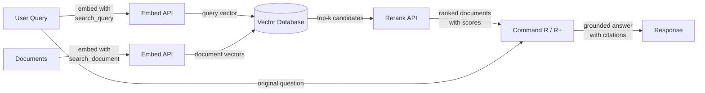

# Cohere

## Definition

**Cohere** is an enterprise AI company that builds language models and APIs purpose-built for business applications, with a distinct focus on search, information retrieval, and retrieval-augmented generation (RAG). Unlike general-purpose providers that offer a broad range of consumer and developer features, Cohere targets enterprise customers who need reliable, production-ready NLP infrastructure — particularly for use cases where *finding and surfacing the right information* is the core problem.

Cohere's model lineup reflects this focus. **Command R** and **Command R+** are conversational and instruction-following models optimized specifically for RAG workflows — they support long context windows and are trained to follow retrieval-grounded prompts reliably. **Embed** provides state-of-the-art multilingual dense vector embeddings across 100+ languages, making it the go-to choice for global enterprise search applications. **Rerank** is a cross-encoder model that takes an initial set of retrieved documents and re-scores them against the original query for precision that sparse and dense retrieval alone cannot achieve.

What differentiates Cohere from general-purpose providers like OpenAI is that its entire product suite is designed around the retrieval pipeline as a first-class workflow. The Embed, Rerank, and Command R models are built to work together as a cohesive stack, and Cohere offers on-premises and private cloud deployment options that meet stringent enterprise data governance and compliance requirements — a critical distinction for regulated industries like finance, healthcare, and government.

## How it works

### Chat and Generate API

The Command R and Command R+ models are accessed via Cohere's Chat API and support both conversational multi-turn interactions and single-turn generation tasks. Command R+ is the larger, more capable variant suited for complex reasoning and document-heavy RAG, while Command R is optimized for lower latency and cost in high-throughput production pipelines. Both models accept a `documents` parameter that allows you to pass retrieved context directly into the prompt, enabling a native RAG mode where the model is instructed to ground its answer in the supplied content and cite sources.

### Embed API (multilingual embeddings)

The Embed API converts text into dense vector representations suitable for semantic similarity search. Cohere's embedding models support over 100 languages in a single model, making cross-lingual search and multilingual document retrieval possible without separate language-specific models. Embeddings can be generated with different `input_type` values — `search_document` for indexing content at rest, and `search_query` for encoding queries at runtime — a distinction that applies asymmetric training signals and typically improves retrieval accuracy compared to symmetric embedding schemes.

### Rerank API

The Rerank API accepts a query and a list of candidate documents (usually the top-k results from a vector or keyword search) and returns each document with a relevance score computed by a cross-encoder. Cross-encoders evaluate the query and document jointly in a single forward pass, giving much higher precision than bi-encoders that encode query and document separately. Reranking is a lightweight but highly effective step that dramatically improves precision@k — it is most valuable when initial retrieval is relatively cheap (BM25 or ANN search) but precision needs to be maximized before passing context to an LLM.

### RAG Integration

Cohere's RAG integration ties Embed, Rerank, and Command R together into a unified pipeline. The typical flow is: embed the query, run approximate nearest neighbor search in a vector database, rerank the top candidates to get the most relevant documents, then pass those documents to Command R with the original query for grounded generation. The model returns an answer along with citation objects that reference specific passages in the retrieved documents, making it straightforward to build auditable, source-cited AI applications.



## When to use / When NOT to use

| Use when | Avoid when |
|----------|------------|
| Building enterprise search or knowledge base Q&A where retrieval precision is critical | You need general-purpose chat assistance with no retrieval component |
| Your content spans multiple languages and you need a single embedding model for all of them | Your use case is primarily image, audio, or multimodal — Cohere is text-only |
| You want to add a reranking step to improve precision after an initial vector or BM25 search | You need highly capable reasoning, math, or coding for standalone tasks (GPT-4o or Claude may outperform) |
| Data governance requirements mandate on-premises or private cloud deployment | Your project is a quick prototype and you want the broadest ecosystem of integrations |
| You need source citations and document grounding natively in the model output | Budget is extremely tight — Cohere's enterprise pricing is higher than some alternatives |

## Comparisons

| Criteria | Cohere | OpenAI | Mistral |
|----------|--------|--------|---------|
| Embedding quality (MTEB) | Top-tier multilingual, 100+ languages | Strong English-first (text-embedding-3-large) | Competitive; mistral-embed available |
| Reranking | Native Rerank API (cross-encoder) | No native reranking endpoint | No native reranking endpoint |
| RAG-native models | Command R/R+ designed for RAG with citations | GPT-4o works well with RAG prompts but not RAG-native | Mixtral/Mistral work with RAG prompts |
| Open weights | No (proprietary API only) | No (proprietary API only) | Yes (Mistral models on Hugging Face) |
| On-premises / private cloud | Yes (enterprise contracts) | Azure OpenAI (limited) | Yes (self-host open weights) |
| Multilingual embedding | Single model, 100+ languages | Separate or limited multilingual support | Limited multilingual embedding support |
| Pricing model | Enterprise / pay-per-token | Pay-per-token, well-documented | Pay-per-token; self-host option free |

## Pros and cons

| Pros | Cons |
|------|------|
| Best-in-class multilingual embeddings in a single model | Smaller general ecosystem compared to OpenAI |
| Native Rerank API significantly improves retrieval precision | No open-weights option for self-hosting |
| Command R/R+ are purpose-built for grounded, cited RAG | Less capable than GPT-4o / Claude for complex standalone reasoning |
| Enterprise-grade deployment options including private cloud | Documentation and community resources thinner than OpenAI |
| RAG pipeline components (Embed + Rerank + Command R) work as a coherent stack | Pricing can be higher for small-scale experiments |

## Code examples

### Chat with Command R

```python
import cohere

co = cohere.Client("YOUR_COHERE_API_KEY")

response = co.chat(
    model="command-r-plus",
    message="Explain retrieval-augmented generation in plain English.",
)
print(response.text)
```

### Embeddings for semantic search

```python
import cohere

co = cohere.Client("YOUR_COHERE_API_KEY")

# Embed documents at indexing time
documents = [
    "Cohere specializes in enterprise NLP and semantic search.",
    "RAG combines retrieval with language model generation.",
    "Multilingual embeddings support over 100 languages.",
]
doc_embeddings = co.embed(
    texts=documents,
    model="embed-multilingual-v3.0",
    input_type="search_document",
).embeddings

# Embed a query at search time
query_embedding = co.embed(
    texts=["What does Cohere specialize in?"],
    model="embed-multilingual-v3.0",
    input_type="search_query",
).embeddings[0]

# Compute cosine similarity (or use a vector DB)
import numpy as np

doc_array = np.array(doc_embeddings)
query_array = np.array(query_embedding)
scores = doc_array @ query_array / (
    np.linalg.norm(doc_array, axis=1) * np.linalg.norm(query_array)
)
top_idx = int(np.argmax(scores))
print(f"Most relevant: '{documents[top_idx]}' (score: {scores[top_idx]:.4f})")
```

### Reranking retrieved candidates

```python
import cohere

co = cohere.Client("YOUR_COHERE_API_KEY")

query = "How does multilingual embedding work?"
candidates = [
    "Cohere Embed supports over 100 languages in a single model.",
    "Command R+ is optimized for RAG workflows with long context.",
    "Rerank re-scores retrieved documents with a cross-encoder.",
    "BM25 is a classic keyword-based retrieval algorithm.",
]

results = co.rerank(
    model="rerank-multilingual-v3.0",
    query=query,
    documents=candidates,
    top_n=3,
)

for hit in results.results:
    print(f"[{hit.relevance_score:.4f}] {candidates[hit.index]}")
```

### Full RAG pipeline with Command R+ citations

```python
import cohere

co = cohere.Client("YOUR_COHERE_API_KEY")

# Documents retrieved from your vector store (simplified)
retrieved_docs = [
    {"id": "doc1", "text": "Cohere Embed supports 100+ languages for multilingual search."},
    {"id": "doc2", "text": "Command R+ is designed for grounded generation with source citations."},
    {"id": "doc3", "text": "Rerank improves precision by re-scoring candidates with a cross-encoder."},
]

response = co.chat(
    model="command-r-plus",
    message="How does Cohere's pipeline improve search quality?",
    documents=retrieved_docs,
)

print(response.text)
print("\n--- Citations ---")
for citation in response.citations:
    print(f"  [{citation.start}:{citation.end}] → {[doc['id'] for doc in citation.documents]}")
```

## Practical resources

- [Cohere API documentation](https://docs.cohere.com/) — Full reference for all Cohere APIs including Chat, Embed, and Rerank
- [Cohere Embed documentation](https://docs.cohere.com/docs/embeddings) — Detailed guide on embedding models, input types, and multilingual support
- [Cohere Rerank documentation](https://docs.cohere.com/docs/reranking) — Guide to the Rerank API with examples and model selection advice
- [Cohere RAG guide](https://docs.cohere.com/docs/retrieval-augmented-generation-rag) — End-to-end walkthrough of building a RAG pipeline with Command R
- [MTEB Leaderboard](https://huggingface.co/spaces/mteb/leaderboard) — Independent benchmark comparing embedding models including Cohere Embed

## See also

- [Model providers](/docs/model-providers)
- [RAG](/docs/rag)
- [Embeddings](/docs/rag/embeddings)
- [Semantic search](/docs/semantic-search)
