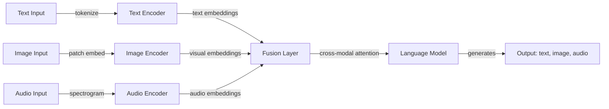

# Multimodal AI

## Definition

Multimodal AI refers to systems that can process, understand, and generate content across multiple data modalities — text, images, audio, video, and more — within a single model or pipeline. Unlike unimodal systems that handle only one type of input, multimodal models learn to align representations across modalities, enabling tasks like image captioning, visual question answering, audio transcription, and cross-modal search.

The field has evolved through several phases. Early approaches used separate encoders for each modality with a fusion layer on top (e.g., CLIP aligning text and image embeddings via contrastive learning). Modern architectures like GPT-4V, Gemini, and Claude integrate multimodal understanding natively into large language models — images, audio, and video are tokenized or projected into the same representation space as text tokens, allowing the model to reason across modalities within a single forward pass.

Multimodal AI is increasingly important as real-world applications demand richer interactions. Document understanding requires processing text, tables, and figures together. Voice assistants combine speech-to-text, language understanding, and text-to-speech. Autonomous systems fuse camera, lidar, and sensor data. As foundation models become natively multimodal, the boundary between "language model" and "vision model" is dissolving into general-purpose multimodal systems.

## How it works

### Encoding and alignment

Each modality requires its own encoding strategy. Text is tokenized into subword tokens. Images are split into patches (e.g., ViT-style patch embeddings) or processed by a convolutional encoder. Audio is converted to spectrograms or mel-frequency features. The key challenge is **alignment** — mapping these different representations into a shared space where semantically similar content across modalities is close together.



### Fusion strategies

There are three main approaches to combining modalities. **Early fusion** concatenates raw or lightly processed inputs before a shared model processes them — this is what modern VLMs do by projecting image patches into the token space. **Late fusion** processes each modality independently and combines them at the decision level — used in retrieval systems like CLIP. **Cross-attention fusion** uses attention mechanisms to let one modality attend to another at intermediate layers — common in encoder-decoder architectures for captioning and translation.

### Generation across modalities

Multimodal generation extends beyond text output. **Image generation** models (DALL-E, Stable Diffusion) produce images from text prompts using diffusion or autoregressive approaches. **Text-to-speech (TTS)** systems convert text to natural-sounding audio. **Speech-to-text (STT)** models like Whisper transcribe audio to text. Some models are becoming truly multimodal in both input and output — generating text, images, and audio from any combination of inputs.

## When to use / When NOT to use

| Use when | Avoid when |
|----------|------------|
| The task inherently involves multiple modalities (e.g., image + text QA, video captioning) | The task is purely text-based and adding vision/audio adds no value |
| You need cross-modal understanding (e.g., "describe this image", "what does this chart show") | You need specialized single-modality performance that a dedicated model does better |
| Building a unified interface that handles text, images, and audio (e.g., a general assistant) | Latency is critical and multimodal encoding adds unacceptable overhead |
| Document understanding requires processing text, tables, figures, and layout together | Your data is structured/tabular — SQL or traditional ML may be more appropriate |
| Accessibility features require modality translation (image→text, text→speech) | Privacy constraints prevent sending images or audio to external APIs |

## Comparisons

| Criteria | Multimodal LLM (GPT-4V, Gemini) | CLIP-style (contrastive) | Diffusion models (DALL-E, SD) |
|----------|----------------------------------|--------------------------|-------------------------------|
| Primary task | Understanding + reasoning | Retrieval + classification | Generation |
| Input modalities | Text, image, audio, video | Text + image | Text (prompt) |
| Output | Text (analysis, answers) | Embeddings (similarity scores) | Images |
| Training objective | Next-token prediction | Contrastive alignment | Denoising |
| Zero-shot capability | Strong | Strong | N/A (generative) |
| Compute cost | High (large model) | Moderate | High (iterative denoising) |

## Pros and cons

| Pros | Cons |
|------|------|
| Single model handles diverse input types without separate pipelines | Higher inference cost and latency than unimodal models |
| Strong zero-shot cross-modal reasoning | Modality-specific fine-tuning may outperform general multimodal models |
| Enables rich, natural interactions (voice + vision + text) | Complex failure modes that are harder to debug than unimodal errors |
| Foundation models transfer well across multimodal tasks | Privacy and compliance concerns multiply across modalities |

## Code examples

### Multimodal chat with OpenAI GPT-4o (Python)

```python
from openai import OpenAI
import base64

client = OpenAI()

# Encode a local image to base64
with open("chart.png", "rb") as f:
    image_data = base64.standard_b64encode(f.read()).decode("utf-8")

response = client.chat.completions.create(
    model="gpt-4o",
    messages=[
        {
            "role": "user",
            "content": [
                {"type": "text", "text": "What trends does this chart show? Summarize the key findings."},
                {
                    "type": "image_url",
                    "image_url": {"url": f"data:image/png;base64,{image_data}"},
                },
            ],
        }
    ],
    max_tokens=500,
)

print(response.choices[0].message.content)
```

### Multimodal with Anthropic Claude (Python)

```python
import anthropic
import base64

client = anthropic.Anthropic()

with open("diagram.png", "rb") as f:
    image_data = base64.standard_b64encode(f.read()).decode("utf-8")

message = client.messages.create(
    model="claude-sonnet-4-20250514",
    max_tokens=1024,
    messages=[
        {
            "role": "user",
            "content": [
                {
                    "type": "image",
                    "source": {"type": "base64", "media_type": "image/png", "data": image_data},
                },
                {
                    "type": "text",
                    "text": "Explain the architecture shown in this diagram. What are the key components?",
                },
            ],
        }
    ],
)

print(message.content[0].text)
```

## Practical resources

- [CLIP paper — Radford et al. (2021)](https://arxiv.org/abs/2103.00020) — Foundational contrastive learning approach for text-image alignment
- [OpenAI Vision guide](https://platform.openai.com/docs/guides/vision) — Using GPT-4o with image inputs
- [Google Gemini multimodal docs](https://ai.google.dev/gemini-api/docs/vision) — Gemini's native multimodal capabilities
- [Hugging Face multimodal models](https://huggingface.co/docs/transformers/main/en/tasks/image_text_to_text) — Open-source VLMs and pipelines
- [Whisper paper — Radford et al. (2022)](https://arxiv.org/abs/2212.04356) — Robust speech recognition via large-scale weak supervision

## See also

- [LLMs](/docs/llms)
- [Computer vision](/docs/cv)
- [NLP](/docs/nlp)
- [Diffusion models](/docs/diffusion-models)
- [Local inference](/docs/local-inference)
- [Edge reasoning](/docs/edge-reasoning)
