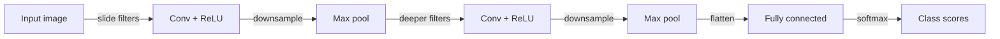

# Convolutional neural networks (CNN)

## Definition

CNNs use convolutional layers to capture local patterns (edges, textures) and build hierarchical features. They are the standard backbone for image classification, detection, and segmentation.

Unlike dense [neural networks](/docs/neural-networks), convolutions share weights across space, so they are translation-equivariant and efficient for images and other grid-like data. They form the backbone of most [computer vision](/docs/cv) systems and are also used in [transformers](/docs/transformers) for patch embedding.

The key insight behind CNNs is **weight sharing**: the same filter is applied at every spatial location, dramatically reducing the number of parameters compared to fully-connected layers while capturing local structure. Early layers learn low-level features (edges, color blobs); deeper layers combine these into progressively higher-level patterns (textures, object parts, whole objects). This hierarchical feature learning, combined with pooling for spatial downsampling, makes CNNs extremely effective for any data where nearby values share semantic meaning — images, video, audio spectrograms, and more.

## How it works



### Convolutional layers

The **image** (or feature map) is fed into **convolutional** layers: each filter (kernel) slides over the input and computes a dot product, producing activation maps that highlight local patterns. Multiple filters learn different patterns in parallel. A nonlinearity (ReLU) follows each convolution.

### Pooling

**Pooling** (e.g. max pooling) downsamples spatially, reducing size and adding slight translation invariance. Strided convolutions are a modern alternative that achieves similar downsampling while keeping more information.

### Classification head

Deeper **conv** layers see larger receptive fields and capture more abstract features (parts, objects). The final **class** (or detection/segmentation) head is usually one or more dense layers applied to the flattened or globally-pooled features. Training uses backprop and gradient descent as in other [deep learning](/docs/fundamentals/deep-learning) models.

## When to use / When NOT to use

| Scenario | Use CNN? | Notes |
|---|---|---|
| Image classification / recognition | Yes | CNNs are the proven standard |
| Object detection and segmentation | Yes | Backbones like ResNet power YOLO, Mask R-CNN |
| Video understanding | Yes | 3D convolutions extend to temporal dimension |
| Variable-length text sequences | No | Transformers handle this better |
| Long-range dependencies in sequences | No | Attention mechanisms are more effective |
| Point cloud or graph data | With caution | Specialized graph/3D variants needed |

## Comparisons

| Aspect | CNN | RNN | Transformer |
|---|---|---|---|
| Primary use case | Images, grids | Sequences | Text, multimodal |
| Handles long-range deps | Poorly (limited receptive field) | Moderate (with LSTM/GRU) | Well (global attention) |
| Parallelizable training | Yes | No (sequential) | Yes |
| Spatial invariance | High (weight sharing) | N/A | Learned (positional encoding) |
| Computational cost (inference) | Low to moderate | Moderate | High at long context |

## Pros and cons

| Pros | Cons |
|---|---|
| Parameter-efficient via weight sharing | Limited to grid-structured data |
| Translation equivariance built-in | Large receptive field requires many layers |
| Very mature ecosystem (ResNet, EfficientNet) | Less effective for sequential/textual tasks |
| Fast inference, easy to quantize | Requires large labeled datasets |

## Code examples

```python
# CNN for image classification with PyTorch (CIFAR-10 style)
import torch
import torch.nn as nn
import torch.optim as optim
from torchvision import datasets, transforms
from torch.utils.data import DataLoader

# Data
transform = transforms.Compose([
    transforms.ToTensor(),
    transforms.Normalize((0.5, 0.5, 0.5), (0.5, 0.5, 0.5)),
])
train_data = datasets.CIFAR10('.', train=True, download=True, transform=transform)
train_loader = DataLoader(train_data, batch_size=64, shuffle=True)

# Model
class SimpleCNN(nn.Module):
    def __init__(self, num_classes: int = 10):
        super().__init__()
        self.features = nn.Sequential(
            nn.Conv2d(3, 32, kernel_size=3, padding=1), nn.ReLU(),
            nn.MaxPool2d(2),
            nn.Conv2d(32, 64, kernel_size=3, padding=1), nn.ReLU(),
            nn.MaxPool2d(2),
            nn.Conv2d(64, 128, kernel_size=3, padding=1), nn.ReLU(),
            nn.AdaptiveAvgPool2d((4, 4)),
        )
        self.classifier = nn.Sequential(
            nn.Flatten(),
            nn.Linear(128 * 4 * 4, 256), nn.ReLU(), nn.Dropout(0.5),
            nn.Linear(256, num_classes),
        )

    def forward(self, x: torch.Tensor) -> torch.Tensor:
        return self.classifier(self.features(x))

device = "cuda" if torch.cuda.is_available() else "cpu"
model  = SimpleCNN().to(device)
opt    = optim.Adam(model.parameters(), lr=1e-3)
loss_fn = nn.CrossEntropyLoss()

# One training epoch
model.train()
for X, y in train_loader:
    X, y = X.to(device), y.to(device)
    opt.zero_grad()
    loss_fn(model(X), y).backward()
    opt.step()

print("Training step complete.")
```

## Practical resources

- [CS231n – CNNs for Visual Recognition](https://cs231n.github.io/convolutional-networks/) — Stanford course notes with clear visual explanations
- [PyTorch – Convolutional neural networks](https://pytorch.org/tutorials/beginner/blitz/neural_networks_tutorial.html#convolutional-nets) — Official hands-on tutorial
- [Papers With Code – Image Classification](https://paperswithcode.com/task/image-classification) — Benchmark leaderboards and reproducible code

## See also

- [Computer vision](/docs/cv)
- [Neural networks](/docs/neural-networks)
- [RNN](/docs/neural-networks/rnn)
