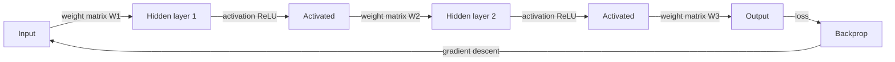

# Neural networks

## Definition

Neural networks are function approximators built from layers of units (neurons) with learnable weights and nonlinear activations. They can approximate complex mappings from inputs to outputs when trained on data.

They are the building blocks of [deep learning](/docs/fundamentals/deep-learning). Variants like [CNNs](/docs/neural-networks/cnn) and [RNNs](/docs/neural-networks/rnn) add inductive biases (e.g. locality, recurrence) for specific data types; the same training machinery (backprop, gradient descent) applies.

The universal approximation theorem guarantees that a sufficiently wide, single-hidden-layer network can approximate any continuous function — but in practice, **depth** (stacking many layers) is far more parameter-efficient than width alone. Each additional layer increases the model's ability to compose simpler features into more complex ones. Modern neural networks range from a few hundred parameters (tiny edge models) to hundreds of billions (frontier LLMs), all sharing the same fundamental building blocks: linear transformations, activation functions, and gradient-based optimization.

## How it works



### Forward pass

**Input** is passed to the first layer. Each **layer** computes a linear combination of its inputs (weights + bias) and then a nonlinear activation (e.g. ReLU, sigmoid, GELU). The output of one layer becomes the input to the next; stacking layers allows the network to learn hierarchical features.

### Loss and backpropagation

The final **output** layer maps to predictions (e.g. class scores or a scalar). A **loss function** (e.g. cross-entropy for classification, MSE for regression) measures how far predictions are from targets. **Backpropagation** computes gradients through the chain rule from output back to input.

### Gradient descent and regularization

**Gradient descent** (or its stochastic variants: SGD, Adam, AdamW) updates weights to minimize the loss. Depth and width determine capacity; regularization (dropout, weight decay, batch normalization) and data size control overfitting.

## When to use / When NOT to use

| Scenario | Use neural networks? | Notes |
|---|---|---|
| Unstructured data (images, text, audio) | Yes | NNs learn features automatically |
| Small tabular datasets | No | Gradient boosting often outperforms |
| Need interpretable model | No | NNs are largely black boxes |
| Abundant labeled data + compute | Yes | NNs scale well with both |
| Real-time inference on constrained hardware | With caution | Quantize or use smaller architectures |
| Transfer learning available for your domain | Yes | Fine-tuning a pretrained NN beats training from scratch |

## Comparisons

| Architecture | Inductive bias | Best for | Key limitation |
|---|---|---|---|
| Feedforward (MLP) | None | Tabular, general | Ignores spatial/temporal structure |
| CNN | Spatial locality | Images, grids | Less effective for long sequences |
| RNN / LSTM | Temporal order | Sequences, time series | Slow to train, vanishing gradients |
| Transformer | Global attention | Text, multimodal | High memory at long context |

## Pros and cons

| Pros | Cons |
|---|---|
| Universal function approximation | Requires significant data |
| Scales with data and compute | Computationally expensive |
| Transfer learning reduces labeled data needs | Difficult to interpret |
| Flexible architecture design | Sensitive to hyperparameters |

## Code examples

```python
# Basic feedforward neural network with PyTorch
import torch
import torch.nn as nn

# Define a simple two-hidden-layer network
class FeedForward(nn.Module):
    def __init__(self, input_dim: int, hidden_dim: int, output_dim: int):
        super().__init__()
        self.layers = nn.Sequential(
            nn.Linear(input_dim, hidden_dim),
            nn.ReLU(),
            nn.Dropout(0.2),
            nn.Linear(hidden_dim, hidden_dim),
            nn.ReLU(),
            nn.Linear(hidden_dim, output_dim),
        )

    def forward(self, x: torch.Tensor) -> torch.Tensor:
        return self.layers(x)

# Instantiate, pass a dummy batch, inspect output shape
model = FeedForward(input_dim=20, hidden_dim=64, output_dim=3)
x = torch.randn(32, 20)          # batch of 32 samples, 20 features
logits = model(x)
print(f"Output shape: {logits.shape}")  # (32, 3)

# Count parameters
n_params = sum(p.numel() for p in model.parameters() if p.requires_grad)
print(f"Trainable parameters: {n_params:,}")
```

## Practical resources

- [Neural Networks and Deep Learning (Nielsen)](http://neuralnetworksanddeeplearning.com/) — Free online book with mathematical depth
- [3Blue1Brown – Neural networks](https://www.youtube.com/playlist?list=PLZHQObOWTQDNU6R1_67000Dx_ZCJB-3pi) — Visual and intuitive introduction
- [PyTorch Tutorials](https://pytorch.org/tutorials/) — Official hands-on tutorials from simple to advanced

## See also

- [CNN](/docs/neural-networks/cnn)
- [RNN](/docs/neural-networks/rnn)
- [Deep learning](/docs/fundamentals/deep-learning)
