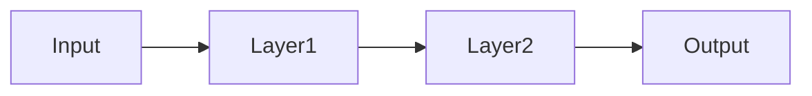

# Neural networks

## Definition

Neural networks are function approximators built from layers of units (neurons) with learnable weights and nonlinear activations. They can approximate complex mappings from inputs to outputs when trained on data.

They are the building blocks of [deep learning](/docs/fundamentals/deep-learning). Variants like [CNNs](/docs/neural-networks/cnn) and [RNNs](/docs/neural-networks/rnn) add inductive biases (e.g. locality, recurrence) for specific data types; the same training machinery (backprop, gradient descent) applies.

## How it works

**Input** is passed to the first layer. Each **layer** computes a linear combination of its inputs (weights) and then a nonlinear activation (e.g. ReLU, sigmoid). The output of one layer becomes the input to the next; stacking layers allows the network to learn hierarchical features. The final **output** layer typically maps to predictions (e.g. class scores or a scalar). Training minimizes a loss by **backpropagation** (computing gradients through the chain rule) and **gradient descent** (updating weights). Depth and width determine capacity; regularization and data size control overfitting.

## Use cases

Neural networks are used wherever you need flexible, data-driven function approximation.

- Regression and classification (e.g. predicting sales, labeling images)
- Feature learning for downstream tasks (embeddings, transfer learning)
- Approximating complex nonlinear functions in control or simulation

## External documentation

- [Neural Networks and Deep Learning (Nielsen)](http://neuralnetworksanddeeplearning.com/) — Free online book
- [3Blue1Brown – Neural networks](https://www.youtube.com/playlist?list=PLZHQObOWTQDNU6R1_67000Dx_ZCJB-3pi) — Visual introduction

## See also

- [CNN](/docs/neural-networks/cnn)
- [RNN](/docs/neural-networks/rnn)
- [Deep learning](/docs/fundamentals/deep-learning)
