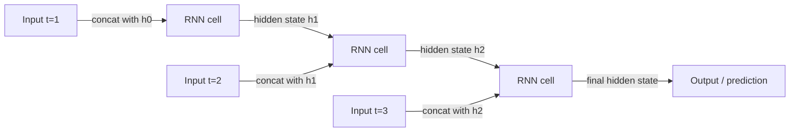

# Recurrent neural networks (RNN)

## Definition

RNNs process sequences by maintaining a hidden state that is updated at each step. They (and variants like LSTM) were the standard for sequence modeling before Transformers.

They are a natural fit for [NLP](/docs/nlp), time series, and any ordered data where context from the past matters. [Transformers](/docs/transformers) have largely replaced them in language modeling due to parallelization and long-range dependency handling, but RNNs still appear in streaming or low-latency settings.

The fundamental idea is to share parameters across time: the same weight matrices are used at every step, making the model equivariant to input length. **LSTM** (Long Short-Term Memory) and **GRU** (Gated Recurrent Unit) variants address the vanishing gradient problem of plain RNNs with gating mechanisms that control what information is stored, forgotten, or passed forward. These architectures remain competitive in resource-constrained settings, online learning scenarios, and any use case where a compact sequential model with bounded memory is preferable to the quadratic attention of transformers.

## How it works



### Recurrent computation

At each **step**, the model receives the current input (e.g. a token or frame) and the previous **hidden** state. It computes a new hidden state: `h_t = tanh(W_h * h_{t-1} + W_x * x_t + b)`. The hidden state summarizes all information from the beginning of the sequence up to step t.

### LSTM gating

**LSTM** and **GRU** variants replace the simple tanh cell with gating units. The forget gate decides what to discard from the cell state; the input gate controls what new information to store; the output gate determines what to expose as the hidden state. This allows the network to learn long-range dependencies that plain RNNs cannot.

### Training: backprop through time

The recurrence is unrolled in time for training (**backpropagation through time**, BPTT). At inference, the hidden state is passed forward step by step. Inputs and outputs can be one-to-one, one-to-many, or many-to-one depending on the task (e.g. sequence labeling vs. classification).

## When to use / When NOT to use

| Scenario | Use RNN? | Notes |
|---|---|---|
| Streaming inference with low memory | Yes | RNNs process step-by-step with bounded state |
| Very long sequences with global context | No | Transformers handle this better |
| Time-series forecasting (moderate length) | Yes | LSTMs are competitive with lower compute |
| Parallelizable training required | No | RNNs are inherently sequential |
| NLP tasks at scale | No | Transformers dominate modern NLP |
| Embedded / edge devices | Yes | Small LSTM/GRU models are inference-efficient |

## Comparisons

| Aspect | RNN / LSTM | CNN | Transformer |
|---|---|---|---|
| Primary use case | Sequences, time series | Images, grids | Text, multimodal |
| Parallelizable training | No (sequential) | Yes | Yes |
| Long-range dependencies | Moderate (with LSTM) | Poor | Excellent |
| Memory footprint (inference) | Very low (fixed state) | Low | High (KV cache) |
| Streaming / online inference | Excellent | N/A | Difficult |
| State-of-the-art NLP performance | No | No | Yes |

## Pros and cons

| Pros | Cons |
|---|---|
| Natural fit for sequential data | Cannot be parallelized during training |
| Fixed memory footprint at inference | Struggles with very long dependencies |
| Efficient for streaming / online use cases | Largely superseded by transformers for NLP |
| Compact models for edge deployment | Vanishing gradient (mitigated by LSTM/GRU) |

## Code examples

```python
# LSTM for sentiment classification with PyTorch
import torch
import torch.nn as nn

class LSTMClassifier(nn.Module):
    def __init__(self, vocab_size: int, embed_dim: int, hidden_dim: int, num_classes: int):
        super().__init__()
        self.embedding = nn.Embedding(vocab_size, embed_dim, padding_idx=0)
        self.lstm = nn.LSTM(embed_dim, hidden_dim, batch_first=True, num_layers=2, dropout=0.3)
        self.classifier = nn.Linear(hidden_dim, num_classes)

    def forward(self, token_ids: torch.Tensor) -> torch.Tensor:
        x = self.embedding(token_ids)           # (batch, seq_len, embed_dim)
        _, (h_n, _) = self.lstm(x)              # h_n: (num_layers, batch, hidden_dim)
        return self.classifier(h_n[-1])         # use last layer's final hidden state

# Dummy batch: 8 sequences, each 20 tokens, vocab of 5000
model   = LSTMClassifier(vocab_size=5000, embed_dim=64, hidden_dim=128, num_classes=2)
tokens  = torch.randint(0, 5000, (8, 20))
logits  = model(tokens)
print(f"Output shape: {logits.shape}")          # (8, 2)

n_params = sum(p.numel() for p in model.parameters() if p.requires_grad)
print(f"Trainable parameters: {n_params:,}")
```

## Practical resources

- [Understanding LSTM networks (Olah)](https://colah.github.io/posts/2015-08-Understanding-LSTMs/) — Clear visual explanation of LSTM gates
- [PyTorch – Sequence models and RNNs](https://pytorch.org/tutorials/beginner/sequence_models_tutorial.html) — Official tutorial with a POS tagging example
- [The Unreasonable Effectiveness of Recurrent Neural Networks (Karpathy)](http://karpathy.github.io/2015/05/21/rnn-effectiveness/) — Classic blog post with character-level RNN examples

## See also

- [Transformers](/docs/transformers)
- [NLP](/docs/nlp)
- [CNN](/docs/neural-networks/cnn)
