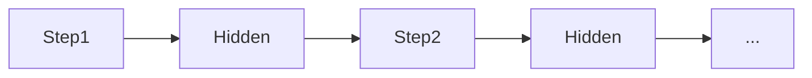

# Recurrent neural networks (RNN)

## Definition

RNNs process sequences by maintaining a hidden state that is updated at each step. They (and variants like LSTM) were the standard for sequence modeling before Transformers.

They are a natural fit for [NLP](/docs/nlp), time series, and any ordered data where context from the past matters. [Transformers](/docs/transformers) have largely replaced them in language modeling due to parallelization and long-range dependency handling, but RNNs still appear in streaming or low-latency settings.

## How it works

At each **step**, the model receives the current input (e.g. a token or frame) and the previous **hidden** state. It computes an output (e.g. a prediction or next hidden representation) and updates the hidden state for the next step. The recurrence is unrolled in time for training (backprop through time); at inference, the hidden state is passed forward step by step. **LSTM** and **GRU** variants add gating to mitigate vanishing gradients. Inputs and outputs can be one-to-one, one-to-many, or many-to-one depending on the task (e.g. sequence labeling vs sequence-to-sequence).

## Use cases

RNNs fit problems with sequential input or output where order and context over time matter.

- Sequence labeling (e.g. named entity recognition, part-of-speech tagging)
- Time-series forecasting and anomaly detection
- Speech and text sequence modeling (before Transformers dominated)

## External documentation

- [Understanding LSTM networks (Olah)](https://colah.github.io/posts/2015-08-Understanding-LSTMs/)
- [PyTorch – Sequence models and RNNs](https://pytorch.org/tutorials/beginner/sequence_models_tutorial.html)

## See also

- [Transformers](/docs/transformers)
- [NLP](/docs/nlp)
